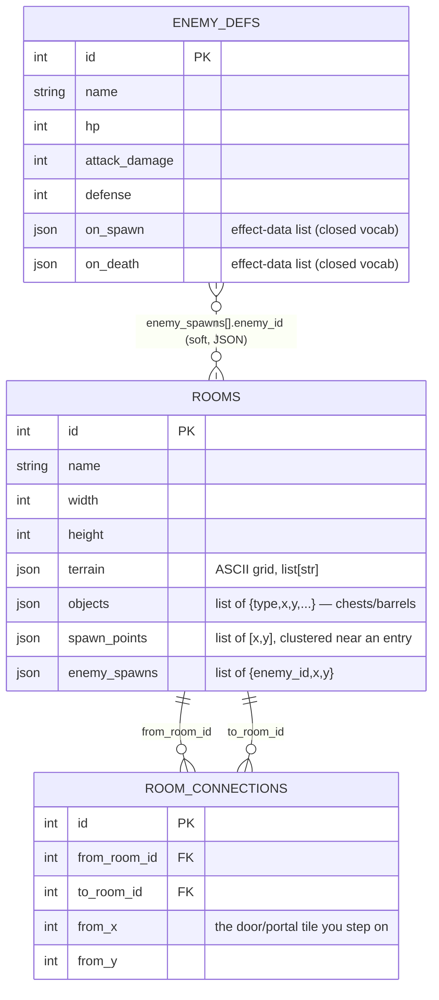
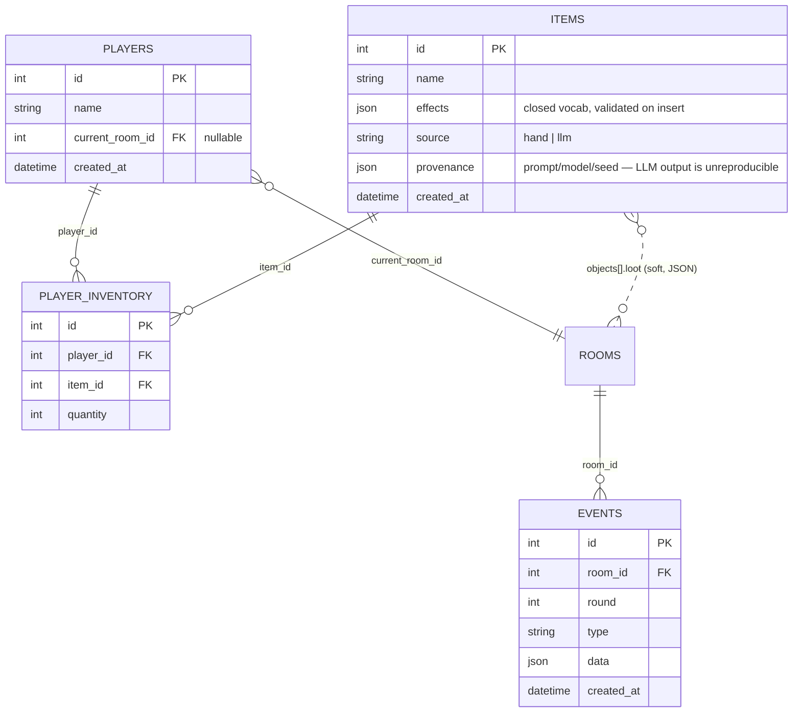

# Database — Schema & ER Diagram

The concrete schema that backs the persistence strategy in [`BACKEND.md`](BACKEND.md).
`BACKEND.md` is the *why* (three storage tiers, DB-at-the-edges); this is the
*what* (tables, columns, relationships) and *where it's going*.

> **Keep this current:** the diagrams are hand-maintained, not generated. When a
> model in `backend/models.py` changes, update the matching block here in the
> same PR. Each table notes the issue that introduced it.

---

## Current schema — as of M1 (#19–#21)

Three tables: the world graph (`rooms` + `room_connections`) and the reusable
enemy catalog (`enemy_defs`). Variable-shape content lives in `JSON` columns,
validated on insert by `backend/level_validation.py` (the DB can't enforce
their shape — see "JSON columns" below).

**Relationships**

- `room_connections.from_room_id` / `to_room_id` → `rooms.id` — **real foreign
  keys**. The world graph as an adjacency-list edge table (a door/portal in one
  room leads to another). Two FKs to the same table = a directed edge.
- `rooms.enemy_spawns[].enemy_id` → `enemy_defs.id` — a **soft reference**: it
  lives inside a JSON column, so the database does *not* enforce it. We validate
  it in app code (`validate_enemy_refs`). This is the deliberate trade noted
  below.

**Table notes**

| Table | Role | Notes |
|---|---|---|
| `rooms` | a level as data | `terrain` is the ASCII grid (LLM draws it); `capacity` is derived in code = `len(spawn_points)`, not a column |
| `room_connections` | the world graph | store + link only; *traversal* (walking through) is M3 |
| `enemy_defs` | reusable enemy catalog | stats defined once, referenced by many rooms; `on_spawn`/`on_death` are the behavior-hook seam |

---

## Planned schema — M1 (#22–#24) and beyond

Illustrative, not final — each table is pinned down by its own issue. The items
table is the **LLM seam**: AI-generated content lands here as validated
effect-data, never as live code.

| Table | Issue | Purpose |
|---|---|---|
| `items` | #22 | item definitions; chest `loot` strings become real records; the AI-content contract |
| `players` | #23 | persistent identity (vs. today's anonymous, in-memory join) |
| `player_inventory` | #23/#24 | join table: which player holds which items (minimal inventory) |
| `events` | later | append-only log; lets a room's `WorldState` be reconstructed/replayed |

---

## Future considerations & design additions

Ordered roughly by when they'll matter.

1. **Template vs. session state (the big one).** `rooms` is *authored template
   content* — the level as designed. Runtime mutations (a chest opened, an enemy
   dead, an item dropped on the floor) are **session state** and must **not** be
   written back into the `rooms` row, or every game would corrupt the template.
   When live object state arrives (chest opened?), it belongs in a per-session
   table (e.g. `object_instances` / `room_sessions`), keyed by room + game
   session — not in the room definition.

2. **Soft JSON references vs. join tables.** `enemy_spawns.enemy_id` (and later
   `objects[].loot`) are unenforced because they sit in JSON. That keeps the
   room a single self-contained blob (LLM-friendly), at the cost of integrity —
   a dangling `enemy_id` is only caught by validation, not the DB. If integrity
   becomes critical, promote them to real join tables (`room_enemy_spawns`,
   `room_object_loot`) with FKs. Trade: normalization + safety vs. blob
   simplicity. We're choosing blob-now, normalize-if-it-hurts.

3. **JSON vs. JSONB on Postgres.** We use SQLAlchemy's generic `JSON` for
   SQLite/Postgres portability. In prod, switch the hot ones to **`JSONB`** and
   add **GIN indexes** if we ever query *into* the JSON (e.g. "all items with a
   `burn` effect"). SQLite tests won't exercise this — a known portability gap.

4. **Migrations (Alembic).** None yet — dev uses *recreate-from-models* (drop
   the SQLite file). The moment we have data worth keeping across a schema
   change (real players, generated items), add Alembic. The `NOT NULL` insert
   error from dropping `seed`/`version` was the dev-time symptom of this gap.

5. **Items = the AI seam + provenance.** LLM output is **not reproducible**
   (determinism covers the engine RNG, not the model). So generated items are
   stored as *output*, never regenerated — and we keep `provenance` (prompt,
   model, any seed) so content is auditable and traceable. `effects` is
   validated against the closed vocabulary on insert: "AI proposes, engine
   disposes."

6. **Event sourcing.** An append-only `events` table lets a worker rebuild a
   room's in-memory `WorldState` after a crash/restart (`BACKEND.md`: worker
   memory is reconstructible from the log). Implies ordering (`room_id`,
   `round`, `id`) and an index on `(room_id, round)`.

7. **Connections grow for traversal (M3).** Add `to_x`/`to_y` (arrival tile in
   the destination room) so a player materialises somewhere sensible, and maybe
   a `kind` column to distinguish door vs. portal behavior. Today we only store
   the origin tile.

8. **Identity & reconnection.** `players` needs a stable id and a way to resume
   a dropped WebSocket (today a disconnect removes the player for good). Auth is
   out of MVP scope, but the column shape should not preclude it.

9. **Indexes.** As tables grow: FKs (`from_room_id`, `to_room_id`, `room_id`,
   `player_id`, `item_id`) and the event-replay key `(room_id, round)`.

10. **What stays OUT of Postgres.** Live coordination (room→worker routing,
    presence, pub/sub fan-out) is **Redis**, never a table here. Bright line:
    durable → Postgres, ephemeral → Redis (`BACKEND.md`).
