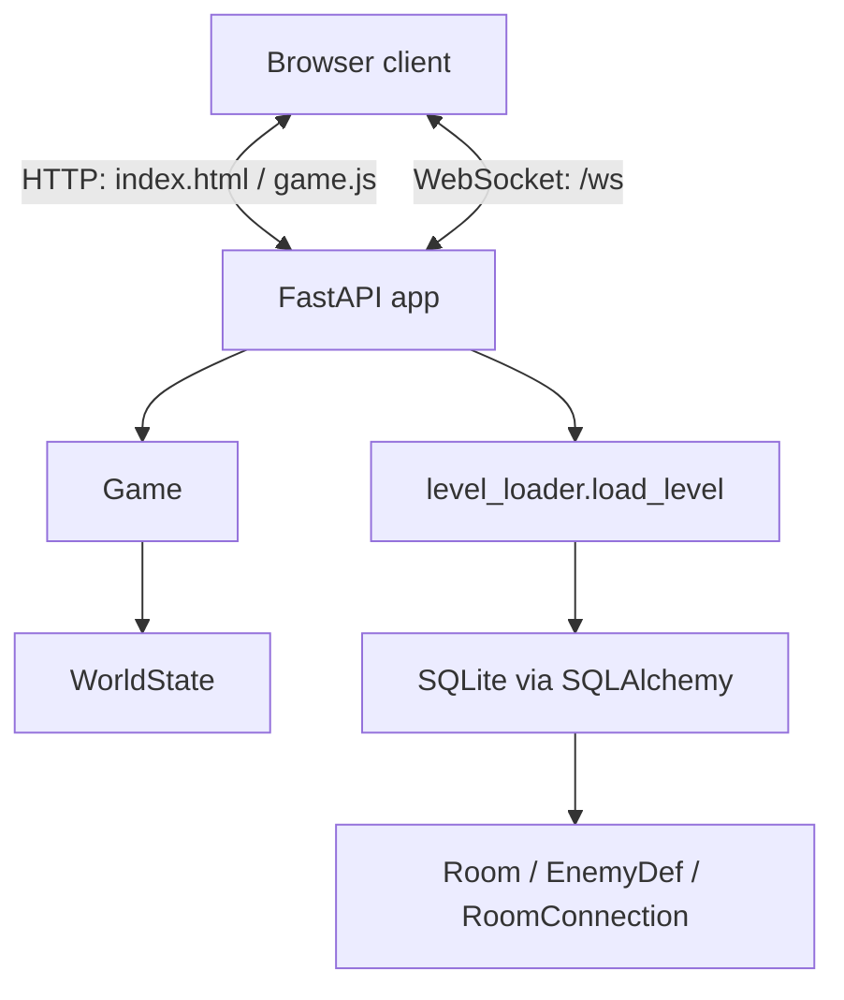
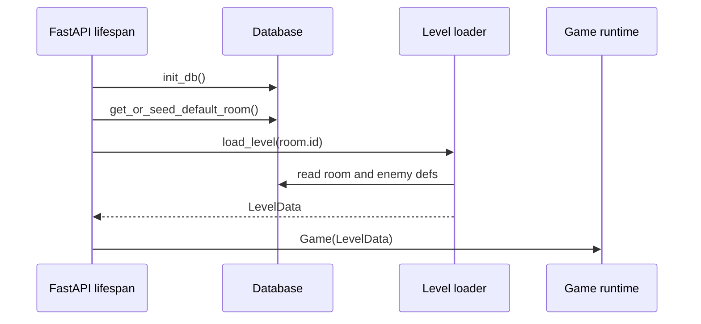
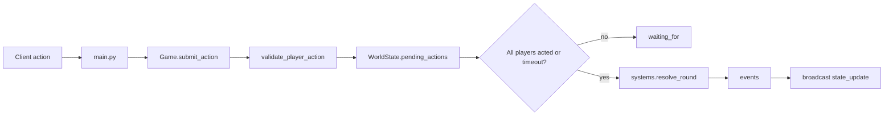
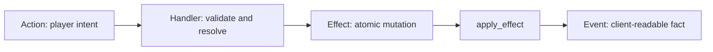
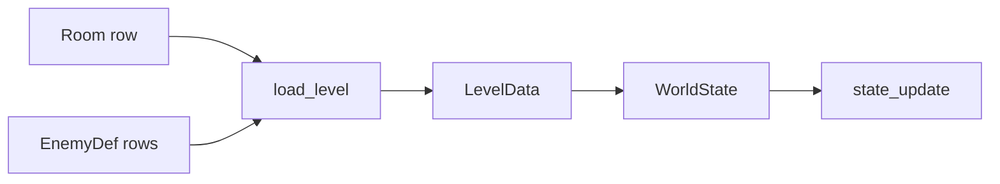

# Current Architecture

This document describes how the project works today. For gameplay direction see
[Game Design](GAME_DESIGN.md). For near-term build order see
[Roadmap](ROADMAP.md) and [World Exploration Plan](WORLD_EXPLORATION_PLAN.md).
For multi-process backend ideas see [Future Backend](FUTURE_BACKEND.md).

## Current Runtime

The app is currently one process:

- FastAPI serves the static frontend.
- FastAPI owns one WebSocket endpoint at `/ws`.
- One global `Game` is created at startup.
- `Game` wraps one in-memory `WorldState`.
- One `asyncio.Lock` serializes live state mutation.
- SQLAlchemy loads room definitions from the local SQLite database.



This is a good shape for the current prototype. It is not production MMO
infrastructure, and it does not need to be yet.

## Current Startup Flow

At startup, the server:

1. Creates database tables if they do not exist.
2. Seeds the default rooms if the database is empty.
3. Loads the starting room from the database.
4. Builds a `Game(level)`.
5. Accepts WebSocket joins.



## Dependency Layers

The combat engine has a useful one-way dependency shape:

```text
config / entities / actions / events
              |
              v
world.py      WorldState, source of truth
              |
              v
effects.py    atomic mutations
              |
              v
handlers.py   one handler per action type
              |
              v
systems.py    round resolution and enemy phase
              |
              v
game.py       round lifecycle
              |
              v
main.py       WebSocket and FastAPI boundary
```

Rule of thumb: if a lower layer needs something from a higher layer, move the
shared concept down instead of creating an import cycle.

## Combat Model

Combat is server-authoritative. The client sends intent; the server validates,
resolves, mutates state, and broadcasts the result.



The round order is:

1. Player actions are collected.
2. Movement actions resolve first.
3. Attack/bomb/wait actions resolve next.
4. Enemy phase resolves.
5. Game-over checks run.
6. The round increments.
7. A full state update and event list are sent to clients.

## Actions, Handlers, Effects, Events

This is the core extension pattern:



| Concept | Role | Example |
|---|---|---|
| Action | A player's requested intent | move north, attack enemy, throw bomb |
| Handler | Validates and resolves one action type | `AttackHandler`, `BombHandler` |
| Effect | Atomic state mutation | `Damage(target, amount)` |
| Event | Record of what happened | `player_attacked`, `enemy_died` |

Adding a combat action should usually mean:

1. Add an `ActionType`.
2. Extend action parsing.
3. Add a handler.
4. Register the handler.
5. Reuse existing effects where possible.

Do not widen `WorldState` or `resolve_round` just because a new action is
flavorful. Push variety to handlers and effect data.

## Validation Pattern

Validation happens twice:

- Submission-time validation gives quick feedback.
- Resolution-time validation is authoritative.

This matters because the world can change between submission and resolution. A
target may move, die, or become invalid before the action resolves.

## Data Loading Boundary

Room definitions live in the database. Live combat state lives in memory.



The database provides template data:

- Room width and height.
- Terrain.
- Spawn points.
- Object definitions.
- Enemy placements.
- Room connections.

`WorldState` owns live runtime state:

- Player positions and HP.
- Enemy positions and HP.
- Occupancy grid.
- Pending actions.
- Current round.

Do not write live mutations back into the room template. A chest being opened or
an enemy dying is session state, not a change to the authored room definition.

## Current Limitations

These are accepted constraints for the current prototype:

- Only one global game is active.
- The frontend currently assumes a 10x10 grid.
- The backend can load variable-size rooms.
- Room connections exist but traversal is not implemented.
- Objects are stored in room data but not rendered/interacted with yet.
- Disconnect removes the player.
- Restart drops the live game state.
- There is no player account or persistent inventory.

These are not failures. They are the correct next set of engineering choices to
make as exploration becomes real.

## Next Architectural Move

The next architectural move should be small:

```text
current Game + WorldState
        |
        v
explicit current room identity
        |
        v
load another room on traversal
        |
        v
later, only if needed: RoomSession / RoomManager
```

Avoid jumping straight to workers, Redis, gateway routing, or full account
systems. First prove room traversal and exploration in one process.
