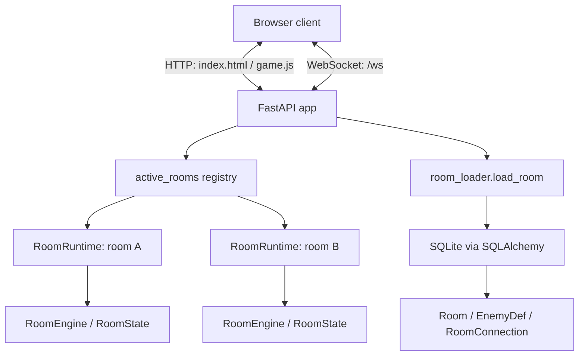
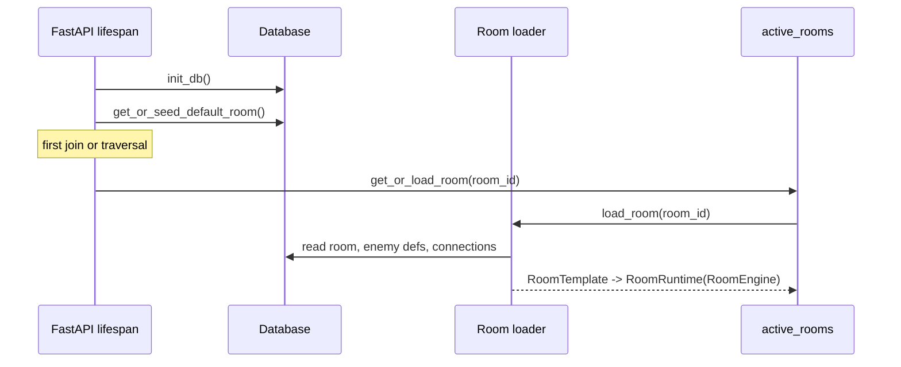
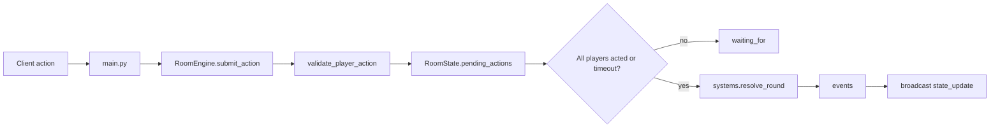
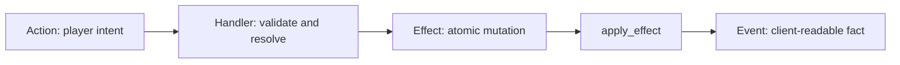
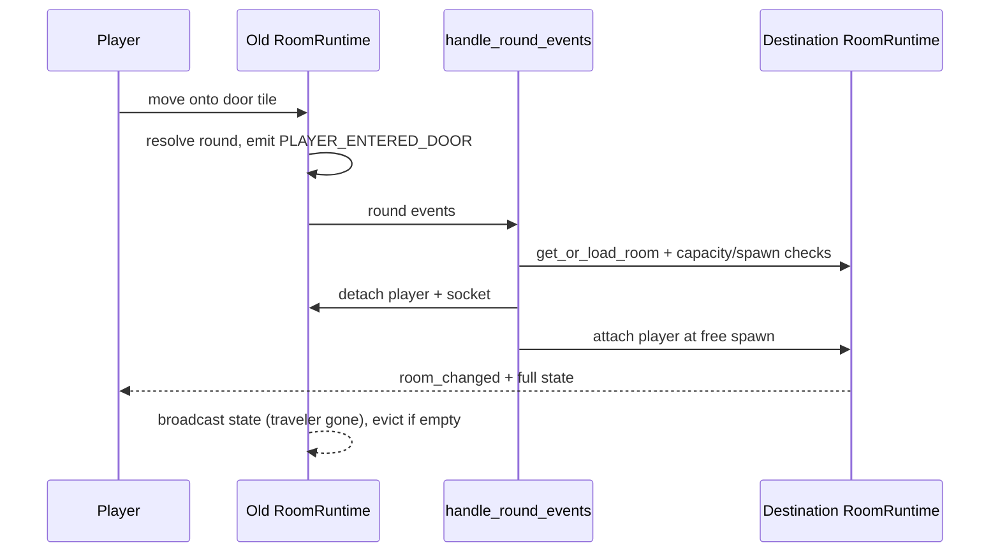
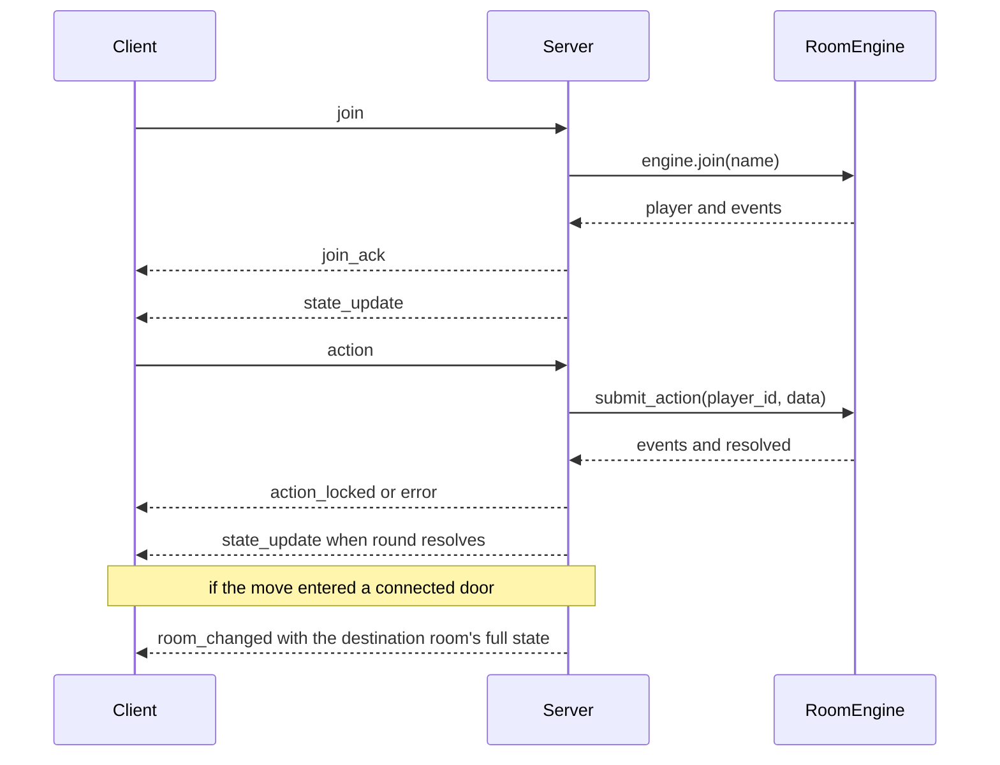
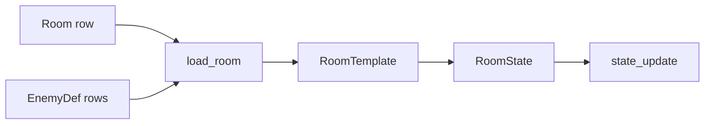

# Current Architecture

This document is the single source of truth for how the project works today —
runtime, backend boundaries, and persistence. For gameplay direction see
[Game Design](GAME_DESIGN.md). For near-term build order see
[Roadmap](ROADMAP.md). For deferred architecture ideas see
[Future Ideas](FUTURE.md).

## Current Runtime

The app is currently one process:

- FastAPI serves the static frontend.
- FastAPI owns one WebSocket endpoint at `/ws`.
- `active_rooms` is a registry of live `RoomRuntime`s. Each runtime owns one
  room's `RoomEngine`/`RoomState`, the WebSockets of the players inside it, and
  that room's round timer. `player_room` maps each player to their room.
- Rooms load lazily: the first player to enter a room triggers `load_room`
  (template) plus `load_npcs` (individuals); when the last player leaves, the
  runtime is evicted. Eviction is "save individuals, unload" (NPCS.md
  Decision 10): NPC rows are written back, fungible enemy state is
  deliberately forgotten — the next visit reseeds enemies from the template
  and reloads NPCs from their rows.
- One global `asyncio.Lock` still serializes all live state mutation. Helpers
  never acquire it themselves (asyncio locks are not reentrant) — only the
  top-level WebSocket handlers and the round-timeout task do.
- SQLAlchemy loads room definitions from the local SQLite database.



This is a good shape for the current prototype. It is not production MMO
infrastructure, and it does not need to be yet.

## Current Startup Flow

At startup, the server:

1. Creates database tables if they do not exist.
2. Seeds the default rooms if the database is empty (and backfills seed NPCs
   into a database created before the `npcs` table existed).
3. Remembers the default room id.
4. Accepts WebSocket joins.

On shutdown it saves the individuals of every still-live room — rooms with
players connected never went through eviction, and a restart must not be the
one remaining way to destroy an NPC's state.

No `RoomEngine` is built at startup — the first join loads the default room through
the same `get_or_load_room` path traversal uses.



## Dependency Layers

The combat engine has a useful one-way dependency shape:

```text
config / entities / actions / events
              |
              v
room_state.py RoomState, source of truth
              |
              v
effects.py    atomic mutations
              |
              v
handlers.py   one handler per action type
              |
              v
systems.py    round resolution and enemy phase
              |
              v
modes.py      RoomMode: WHEN actions resolve (buffered vs immediate)
              |
              v
room_engine.py round lifecycle
              |
              v
main.py       WebSocket and FastAPI boundary
```

Rule of thumb: if a lower layer needs something from a higher layer, move the
shared concept down instead of creating an import cycle.

Three modules sit beside this stack at the `main.py` edge, not inside it:
`npc_store.py` (rows ↔ NPC entities, the individual-persistence twin of
`room_loader.py`), `persona.py` (the validation gate for persona documents),
and `dialogue.py` (the `DialogueProvider` seam). The engine never imports
them — an NPC inside `RoomState` is just an `Actor`.

In memory there is one actor shape (`entities.Actor`; NPCS.md Decision 4):
`Player`, `Enemy`, and `NPC` are thin dataclass subclasses, and combat,
bombs, and occupancy target `Actor` without caring which one they hit.
Disposition (`hostile | neutral | friendly`) is a field, not a class — a
shopkeeper turning hostile is a field write.

## Room Modes

Every room runs one of two timing models (the `RoomMode` seam, implemented in
`backend/modes.py`):

| Mode | Resolution | Allowed actions |
|---|---|---|
| `combat` (`TurnBasedMode`) | buffer actions, resolve when all players submit or the timeout fires | move, attack, bomb, wait |
| `exploration` (`ExplorationMode`) | validate and resolve immediately, per action | move |

The mode decides *when* an action resolves, never *how*: both modes validate
and resolve through the same `HANDLERS`, so movement rules, door traversal,
effects, and events are one rules engine. Exploration rooms have no rounds,
no round timers, no `waiting_for` broadcasts, and no enemy phase.

Talking to an NPC is not an action in either mode — like `inspect_object`,
it is a request outside the action economy (NPCS.md Decision 1): it never
consumes a turn and never pauses the round timer, so it works mid-combat and
cannot be used to stall a round.

A room's mode is currently inferred at load time in `load_room` — a room
with enemy spawns is `combat`, a peaceful room is `exploration` — and is sent
to the client in `state.room.mode`. Promote the inference to a real `rooms`
column once authored content needs to override it.

## Combat Model

Combat is server-authoritative. The client sends intent; the server validates,
resolves, mutates state, and broadcasts the result.



The round order is:

1. Player actions are collected.
2. Movement actions resolve first.
3. Attack/bomb/wait actions resolve next.
4. Enemy phase resolves.
5. Game-over checks run.
6. The round increments.
7. A full state update and event list are sent to clients.

## Actions, Handlers, Effects, Events

This is the core extension pattern:



| Concept | Role | Example |
|---|---|---|
| Action | A player's requested intent | move north, attack enemy, throw bomb |
| Handler | Validates and resolves one action type | `AttackHandler`, `BombHandler` |
| Effect | Atomic state mutation | `Damage(target, amount)` |
| Event | Record of what happened | `player_attacked`, `enemy_died` |

Adding a combat action should usually mean:

1. Add an `ActionType`.
2. Extend action parsing.
3. Add a handler.
4. Register the handler.
5. Reuse existing effects where possible.

Do not widen `RoomState` or `resolve_round` just because a new action is
flavorful. Push variety to handlers and effect data.

## Traversal Model

Traversal splits cleanly between the pure engine and the async edge:

1. A MOVE resolves onto a door/portal tile that has a `room_connections`
   entry (`RoomTemplate.connections`, loaded with the room).
2. `MoveHandler` appends a `PLAYER_ENTERED_DOOR` event — the engine stays
   sync and DB-free; it only announces intent.
3. After the round resolves, `handle_round_events` in `main.py` reacts:
   validate the destination fully (load it if dormant, check capacity and a
   free spawn), and only then mutate — detach the player from the old
   runtime, move their socket, attach them at the destination spawn.
4. The traveler gets a `room_changed` message; the old room's remaining
   players see them slip away in the normal `state_update`.
5. A denied traversal (room full, no free spawn, load failure) changes
   nothing: the player stays on the door tile and gets an error.



This runs at all three round-resolution sites: action submission, round
timeout, and the auto-resolve that fires when a pending player disconnects.

## WebSocket Message Shape



Broadcasts are room-scoped: a `state_update` only reaches the players in that
room. A traversing player receives `room_changed` instead of the old room's
final `state_update`. Two request/reply pairs bypass the action pipeline
entirely: `inspect_object` → `object_inspection` and `talk` → `npc_dialogue`
(see "NPC Dialogue Flow").

The client should remain a renderer and input collector. The server decides
what is legal.

## NPC Dialogue Flow (M4)

A `talk` message is validated under the room lock (NPC exists, alive,
adjacent — the attack targeting rule), but the dialogue provider runs
OUTSIDE the lock: never generate dialogue while holding the room lock.
Rounds keep resolving during a slow LLM call; when the response arrives the
handler re-acquires the lock and re-validates (the room may have evicted,
the NPC may have died) before appending to the NPC's bounded transcript and
replying — dialogue is one-on-one, so `npc_dialogue` goes only to the
talking player.

```mermaid
sequenceDiagram
    participant C as Client
    participant M as main.handle_talk
    participant P as DialogueProvider

    C->>M: talk {npc_id, text}
    Note over M: under state_lock: validate npc, adjacency
    M->>P: reply(npc, player, text)  [lock released]
    Note over P: GridProvider: LLM call, hard timeout;<br/>any failure -> CannedProvider line
    P-->>M: response text
    Note over M: re-acquire lock, RE-validate,<br/>append bounded transcript
    M-->>C: npc_dialogue (talker only)
```

The provider seam (`dialogue.py`) has both implementations live:
`GridProvider` (AI Power Grid chat completions; key/model from env) wrapping
`CannedProvider` (deterministic persona lines) as its fallback — timeout,
rate limit, or provider-down all degrade to a canned line and the request is
dropped, never queued. Player text reaches the prompt only inside a
delimited untrusted block; M4 is text-only, so nothing an LLM says can
mutate game state. The effect channel (closed vocabulary, engine-validated)
is the next slice — see NPCS.md "Dialogue: Two Channels".

## Validation Pattern

Validation happens twice:

- Submission-time validation gives quick feedback.
- Resolution-time validation is authoritative.

This matters because the world can change between submission and resolution. A
target may move, die, or become invalid before the action resolves.

## Data Loading Boundary

Room definitions live in the database. Live combat state lives in memory.



The database provides template data:

- Room id and name.
- Room width and height.
- Terrain.
- Spawn points.
- Object definitions.
- Enemy placements.
- Room connections.

`RoomState` owns live runtime state:

- Player positions and HP.
- Enemy positions and HP.
- NPC entities (loaded from `npcs` rows — the second occupant source).
- Occupancy grid.
- Client-safe object summaries.
- Pending actions.
- Current round.

Do not write live mutations back into the room template. A chest being opened or
an enemy dying is session state, not a change to the authored room definition.
NPCs are the exception that proves the rule: their live state IS durable, but
it writes back to their own instance rows, never to the template.

Keep this boundary bright:

| Kind | Examples | Lives In |
|---|---|---|
| Template data | terrain, spawn points, enemy definitions, room objects | database |
| Live fungible state | player HP, enemy HP, positions, pending actions, current round | memory |
| Individual state | NPC hp/position/disposition/persona/transcript | memory while loaded, `npcs` rows at rest (saved on eviction/shutdown) |
| Future durable player data | account, inventory, current room, progression | database later |

## Persistence Strategy

The database (SQLite through SQLAlchemy async sessions) is touched only at
the edges — room load, room eviction, shutdown — never during rounds. It
stores room template data (`rooms`, `room_connections`, `enemy_defs`) and
NPC instance rows (`npcs`) — see [Database Schema](DB_SCHEMA.md). This is
real persistence for rooms and NPCs, not yet for players.

SQLite is good enough while the project is one process and local development is
fluid. SQLAlchemy is the useful abstraction: tests get lightweight databases,
model definitions stay in one place, and a later move to Postgres means less
rewriting. Postgres earns its place when there is real durable player/generated
data, more than one process, or production deployment pressure.

Migration policy while local data is disposable: recreate the SQLite database
from models, keep seed data idempotent, let tests prove the schema and loader.
Once real data matters, add Alembic and stop dropping tables.

## Current Limitations

These are accepted constraints for the current prototype:

- Room mode is inferred from content (enemies → combat); there is no authored
  `mode` column to override it yet. NPCs do not affect the inference, and
  nothing reads `disposition` yet — a hostile NPC neither fights nor flips
  the room to combat until the escalation slice lands.
- Exploration rooms only accept movement as an *action* — examining
  (`inspect_object`) and talking (`talk`) are requests outside the action
  economy.
- Dialogue is text-only: no effect channel yet, so nothing said to an NPC
  can change game state. NPCs have no brain — they stand still, in both
  modes.
- Evicted rooms reset their fungible state — enemies respawn from the seed
  on the next visit; NPCs persist as individuals.
- One global lock serializes all rooms (per-room locks are a later
  optimization; the single lock also guarantees rooms are never double-loaded).
- An enemy standing on a door tile blocks traversal until it moves.
- Objects can be inspected for text, but object effects and inventory are not
  implemented yet.
- Disconnect removes the player.
- Restart drops the live game state.
- There is no player account or persistent inventory.

These are not failures. They are the correct next set of engineering choices to
make as exploration becomes real.

## Next Architectural Move

The next architectural move should be small:

```text
room registry + traversal (done)
        |
        v
exploration movement timing (RoomMode seam, done)
        |
        v
basic NPC dialogue + individual persistence (Milestone 4, done)
        |
        v
dialogue effects: closed vocabulary, set_disposition first (Milestone 5)
        |
        v
escalation + party members (Milestones 6-7)
        |
        v
later, only if needed: per-room locks, workers, Redis
```

Avoid jumping straight to workers, Redis, gateway routing, or full account
systems. Dialogue is proven text-only against a live LLM; next, open the
effect channel so what an NPC agrees to can actually happen — through
engine validation, never directly.
