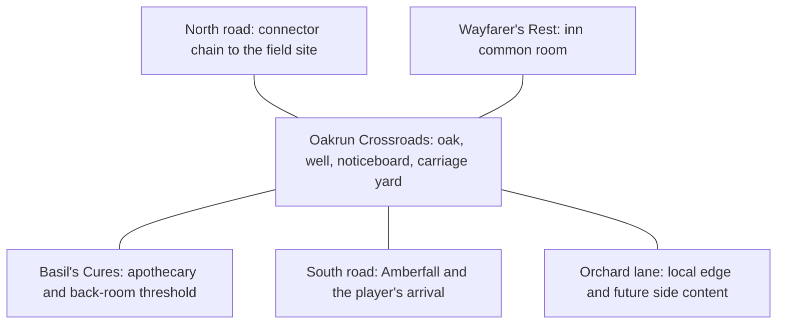

# Art Direction and Oakrun Asset Plan

Status: first playable slice implemented; this remains the production brief.
This document defines what should become a
raster asset, what should stay renderer-owned, and the first handcrafted town
region used to prove the approach.

## Visual north star

Oakrun is warm, practical, and slightly worn: an English-pastoral waystation
seen in a high three-quarter view. Its materials are weathered timber, lime
plaster, slate, honey-coloured local stone, packed earth, hedgerows, orchard
green, faded cloth, and firelight.

The mystery should not dominate the starting town visually. Oakrun must first
feel safe and ordinary enough to miss. The black rot, alchemical signs, and
unnatural colour enter later as controlled exceptions.

## Renderer contract: neutral tiles, authored occupants

The live game uses an orthogonal square grid and its default blank-tile design
is the shared visual language for authored and generated rooms. Ground, roads,
ordinary floors, and walls do not need generated raster art.

Generated art enters only as a placed occupant with a gameplay identity: an
actor, enemy, landmark, building entrance, pillar, chest, noticeboard, evidence
prop, or other meaningful object. This keeps an AI-generated level from looking
like a visibly different class of content from a hand-authored one. Both are
assembled from the same neutral grid and the same accepted object library.

Objects may visually rise beyond their cell, but their gameplay footprint
remains a server-owned grid mask. Large landmarks declare multi-cell footprints
separately from their image bounds. The asset itself should be a clean isolated
sprite, not a terrain tile or a piece of painted ground.

The implemented placement and rendering contract is documented in
[World Object Assets](OBJECT_ASSETS.md).

## What becomes an art asset

### High-value generated assets

- Actors: a world figure for each important NPC and each readable enemy family.
- Dialogue portraits: important named NPCs can use a closer crop or a dedicated
  portrait after their world appearance is locked.
- Landmarks: the Great Oak, inn exterior, Basil's apothecary, stable, carriage,
  well, and later the field-site entrance.
- Interactive objects: noticeboard, chest, door, shelves, herb rack, counter,
  fireplace, tables, evidence objects, and quest-specific props.
- Item icons: one clean icon per item definition or visually shared item family.
- Rot variants and decals: blackened roots, residue, corrupted growth, and
  damaged versions of otherwise familiar landmarks.
- Illustrative moments: login art, season key art, and major discovery images.

### Small reusable object families

- Structural objects: pillar, hedge, fence, low wall, gate, doorway, and sign.
- Restrained clutter: crate, barrel, sack, basket, bench, stool, bucket, log
  pile, hitching post, and sign bracket.
- Narrative or stateful variants only when they matter: intact/broken,
  ordinary/rotted, closed/open, lit/unlit.

### Renderer-owned rather than generated

- Grid selection, target range, health, disposition, party, and interaction
  indicators.
- Lighting tint, fog, weather, hover states, and combat-state emphasis.
- The blank tile and wall presentation shared by every room.
- Labels, quantities, rarity rims, and all other readable UI.
- Procedural room layouts. A generated room is assembled from assets; it is not
  one pre-rendered background image.

### Deliberately avoid

- Generated ground, road, grass, dirt, floor, or wall surfaces.
- One-off art for statistically different enemies that share the same body and
  silhouette.
- Generated sprite sheets containing unrelated subjects. Generate isolated
  assets, then build atlases deterministically if performance ever requires it.
- Full movement animation sets before a static world figure proves readable at
  game scale.
- Baking text into world art.

## First production asset batch

Generate these individually, in this order:

1. Great Oak, the town's silhouette anchor, with a roughly 4x4-cell visual footprint.
2. Wayfarer's Rest exterior marker and its hanging sign, with a clear entrance.
3. Basil's Cures exterior marker, deliberately trustworthy and unremarkable.
4. Covered carriage, well, noticeboard, hitching post, crate, barrel, and pillar.
5. Basil world figure and dialogue portrait.
6. One courier/refugee figure who delivers the first distant rumour.
7. The first homunculus family anchor: recognisably human at first glance,
   anatomically wrong on inspection, tragic rather than demonic.
8. One mundane evidence prop from the field site.

The Great Oak is the best first production test because it exercises a large
transparent silhouette, multi-cell footprint, occlusion, and pastoral material
language without requiring character consistency.

Generated asset: `great-oak-v2.png`. Its trunk anchors to the current
one-tile object contract while its canopy has a four-cell visual footprint.

The first batch is now playable in the production client. Oakrun uses the
accepted Great Oak, Wayfarer's Rest, Basil's Cures, well, carriage,
noticeboard, hitching post, yard stores, resident figures, and North Road
enemy figures. The live pass also proved the intended separation: images can
overhang several cells while collision and movement remain tied to explicit
logical footprints.

## Oakrun first region

Oakrun should grow as several authored rooms rather than one enormous map. The
current playable slice implements the Crossroads and North Road first; the inn
and apothecary are exterior landmarks until their interiors are built:

### Oakrun Crossroads

Suggested footprint: approximately 26x20 cells. It is the navigational hub and
the only large exterior room needed for the first slice.

- Great Oak at the centre, fenced but walkable around all sides.
- Wayfarer's Rest on the west side.
- Basil's Cures on the east side.
- Stable and carriage yard toward the north-east road.
- Well and noticeboard near, but not on, the main walking lanes.
- Orchard and hedgerow along the quieter edge.
- South arrival road from Amberfall; north road toward the first connector.
- No hostile spawns. Oakrun's safety must be mechanically legible.

### Wayfarer's Rest

Suggested footprint: approximately 14x10 cells. This is the information hub:
hearth, tables, innkeeper, courier/refugee, noticeboard overflow, and overheard
rumours. It should carry more narrative density than physical complexity.

### Basil's Cures

Suggested footprint: approximately 12x9 cells. Shelves, counter, herb rack,
locked-looking storage, and one initially meaningless reagent clue. The shop
must reward repeated visits and survive rereading after Basil is exposed.

### North-road connector

The first connector begins outside Oakrun rather than making the town map huge.
It introduces travel, hunger preparation, and the first change in atmosphere.
It uses the same neutral tiles as Oakrun, with its identity coming from placed
wild-growth objects, boundary props, NPCs, enemies, and field-site evidence.

## Asset file conventions

- Concepts: `public/art/concepts/<subject>-concept-vN.png`
- World actors: `public/art/world/actors/<id>-world-vN.png`
- Landmarks: `public/art/world/landmarks/<id>-vN.png`
- Objects: `public/art/world/objects/<id>-vN.png`
- Item icons: `public/art/items/<item-id>-icon-vN.png`
- Dialogue portraits: `public/art/portraits/<npc-id>-portrait-vN.png`

Keep generated sources and final game-ready cutouts distinct. Final filenames
are versioned; do not silently overwrite an accepted asset.

## Generation workflow

1. Establish the subject using the Oakrun concept as the style reference.
2. Generate one isolated subject at a time on a removable flat background.
3. Remove the background and inspect the alpha edge.
4. Downscale a copy to actual game size and judge silhouette there.
5. Record the accepted prompt and footprint metadata beside the asset.
6. Only then generate related variants using the accepted asset as a visual
   reference.

An asset is not accepted merely because it is attractive at full resolution.
It must remain readable inside the live grid, fit its declared footprint, and
belong to Oakrun's grounded material language.
