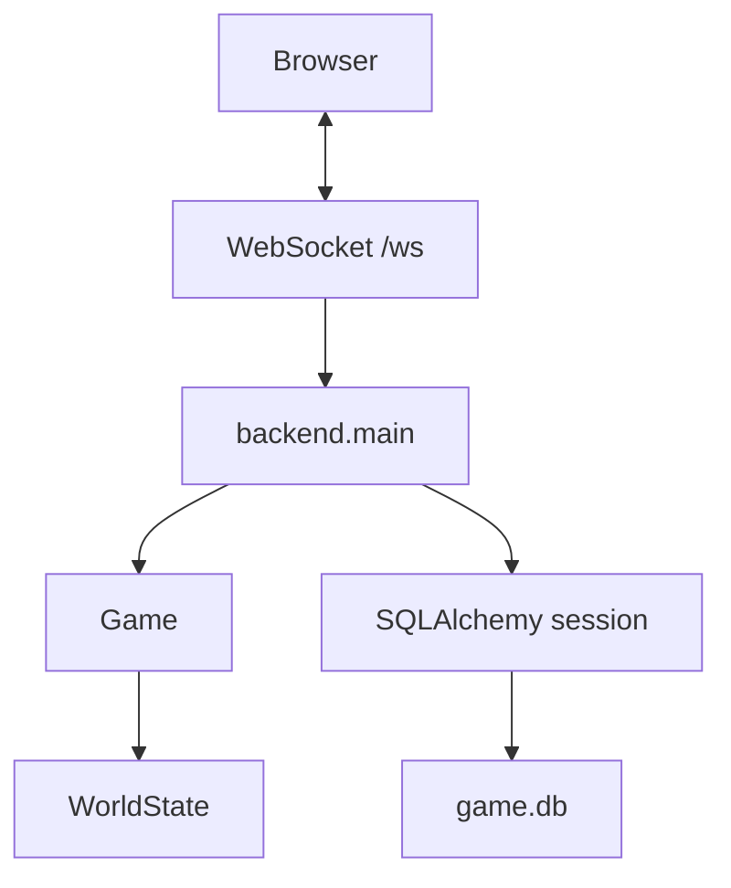
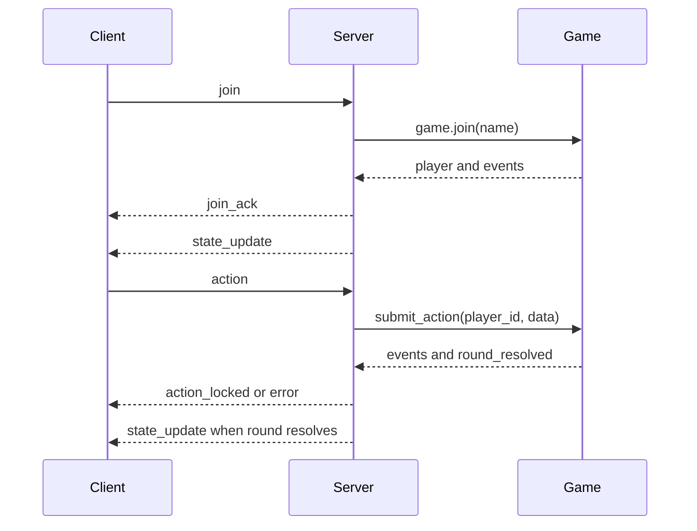

# Backend Notes

This document covers the backend as it exists today and the boundaries to keep
while building the next exploration milestone.

For long-term multi-process architecture, see [Future Backend](FUTURE_BACKEND.md).

## Current Backend

The backend is intentionally simple:

- FastAPI app.
- Static frontend routes for `/` and `/game.js`.
- One WebSocket endpoint at `/ws`.
- One global in-memory `Game`.
- One `asyncio.Lock` around live game mutation.
- SQLite database through SQLAlchemy async sessions.
- Startup seeding for default room data.

## What The Database Stores Today

The database stores room template data:

- `rooms`
- `room_connections`
- `enemy_defs`

This is already real persistence, but it is not yet player persistence. The
database tells the server what a room is. It does not yet preserve the live
state of a running session.

## Runtime State Vs Template Data

Keep this boundary bright:

| Kind | Examples | Lives In |
|---|---|---|
| Template data | terrain, spawn points, enemy definitions, room objects | database |
| Live state | player HP, enemy HP, positions, pending actions, current round | memory |
| Future durable player data | account, inventory, current room, progression | database later |

Do not mutate the `rooms` row because something happened during play. If a
player opens a chest, kills an enemy, or drops an item, that belongs to future
session/player state, not to the room template.

## WebSocket Message Shape

Current high-level flow:

The client should remain a renderer and input collector. The server decides what
is legal.

## Persistence Strategy For The Next Milestone

Use the database for:

- Loading existing rooms.
- Looking up door/portal connections.
- Eventually storing newly generated room templates.

Keep in memory for now:

- Active room state.
- Connected players.
- Combat rounds.
- Exploration positions.

This keeps the next exploration work understandable while preserving the path to
future persistence.

## SQLite, SQLAlchemy, And Postgres Later

SQLite is good enough right now because the project is one process and local
development is still fluid.

SQLAlchemy is the useful abstraction:

- Tests can use lightweight SQLite databases.
- The app can later move to Postgres with less rewriting.
- Model definitions stay in one place.

Postgres becomes worth it when there is real durable player/generated data, more
than one process, or production deployment pressure. It is not required before
room traversal.

## Migration Policy

For disposable local data:

- Recreate the SQLite database from models.
- Keep seed data idempotent.
- Let tests prove the schema and loader.

Once real data matters:

- Add Alembic or another migration tool.
- Stop relying on dropping/recreating tables.
- Treat generated content as user-value data.

## What Not To Add Yet

Do not add these for the first exploration milestone:

- Redis.
- Gateway service.
- Multiple workers.
- Distributed locks.
- Full auth.
- Reconnect routing.
- Event sourcing.

They are valid future ideas, but they will slow down the work that matters next:
making the world explorable.
