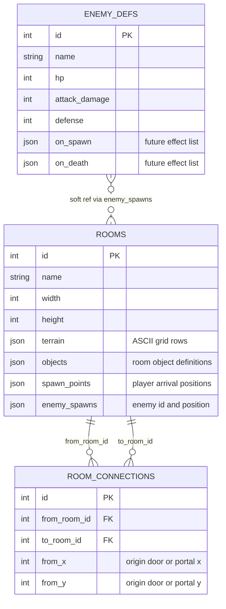
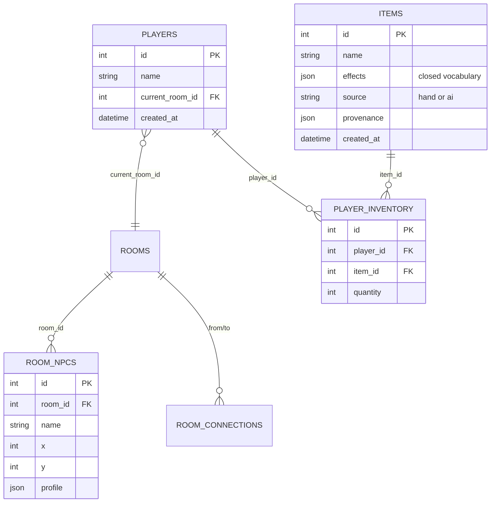

# Database Schema

This document describes the current SQLAlchemy data model and the likely next
tables. It is about durable data shape, not live runtime state.

Related docs:

- [Current Architecture](ARCHITECTURE.md): how the backend uses the database
  today, including the template-data vs. live-state boundary.
- [Future Ideas](FUTURE.md): Postgres, Redis, workers, and scale-out.

## Current Schema

The current database stores room templates, directed room connections, and
reusable enemy definitions.



## Current Tables

| Table | Current role | Notes |
|---|---|---|
| `rooms` | Room template data | Terrain, objects, spawns, and enemy placements. This is not live session state. |
| `room_connections` | Directed world graph edges | Traversal uses these: `load_room` reads a room's outgoing edges into `RoomTemplate.connections`, and stepping onto a connected tile transfers the player. Arrival uses the destination's first free spawn (`to_x`/`to_y` are still future columns). |
| `enemy_defs` | Reusable enemy catalog | Rooms reference enemy ids from JSON and load stats from this table. |

## Important Boundary

`rooms` is authored/generated template data. It should not be edited because
something happened during play.

Examples:

- Enemy died: live/session state.
- Chest opened: live/session state.
- Player moved: live/session state.
- Room terrain generated and accepted: template data.
- New door connection generated and accepted: template data.

This boundary prevents one player's session from accidentally corrupting the
canonical room definition for everyone.

## JSON Columns

The schema uses JSON for variable-shape content:

- `rooms.terrain`
- `rooms.objects`
- `rooms.spawn_points`
- `rooms.enemy_spawns`
- `enemy_defs.on_spawn`
- `enemy_defs.on_death`

The database cannot fully enforce the shape inside these JSON blobs. Validation
therefore happens in app code before insert/load.

Current validation checks include:

- Required fields.
- Terrain dimensions.
- Valid tile characters.
- Walkable placements.
- No overlapping spawns/enemies/objects.
- Enemy references point to known enemy definitions.
- Spawns are near an entry.
- Required objects and entries are reachable.

This is the right trade for now: room data stays easy for humans and future AI
to generate, while the server still rejects malformed content.

## Soft References

`rooms.enemy_spawns[].enemy_id` is a soft reference because it lives inside JSON.
The database does not enforce it as a foreign key.

The app validates it with known enemy ids before storing seed room data, and
`load_room` fails if a room references an unknown enemy.

If this becomes painful, promote enemy spawns to a real join table:

```text
room_enemy_spawns(room_id, enemy_def_id, x, y)
```

Do that only when integrity and queryability matter more than keeping room data
as a compact blob.

## Near-Term Schema Additions

These are likely to matter for exploration.



| Addition | Why it may be needed |
|---|---|
| `room_connections.to_x`, `to_y` | Place players at a specific destination tile after traversal. |
| `room_connections.kind` | Distinguish door, portal, path, stairs, etc. |
| `room_npcs` | Store basic NPCs for dialogue and room presence. |
| `items` | Store generated or hand-authored item definitions. |
| `players` | Give inventory/progression a stable owner. |
| `player_inventory` | Let items follow players between rooms. |

Do not add all of these at once. Add the smallest table/column needed by the
next milestone.

## Future Tables

These belong later:

| Table | Purpose |
|---|---|
| `events` | Append-only room/player event log for replay and debugging. |
| `room_sessions` | Distinguish live mutable session state from room templates. |
| `object_instances` | Track opened chests, destroyed barrels, dropped items, etc. |
| `npc_memory` | Store durable NPC/player relationship summaries. |

## SQLite Now, Postgres Later

The current app uses SQLAlchemy, so the model layer can survive a later move
from SQLite to Postgres.

Stay on SQLite while:

- Data is disposable.
- The app is one process.
- The goal is fast local iteration.

Move to Postgres when:

- Real players or generated content must be preserved.
- More than one process writes data.
- Production deployment needs stronger concurrency guarantees.

## Keep This Doc Current

When `backend/models.py` changes, update this file in the same change.

For each schema change, record:

- What changed.
- Whether it is current or planned.
- Whether the data is template, live/session, or player-owned.
