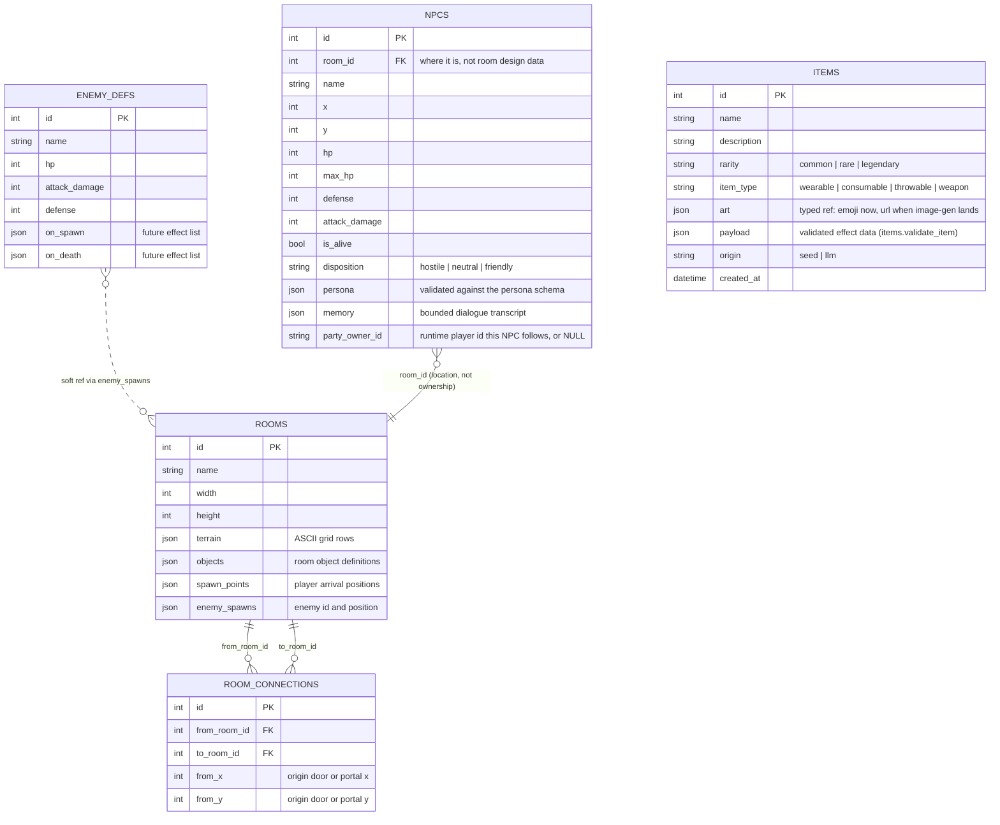
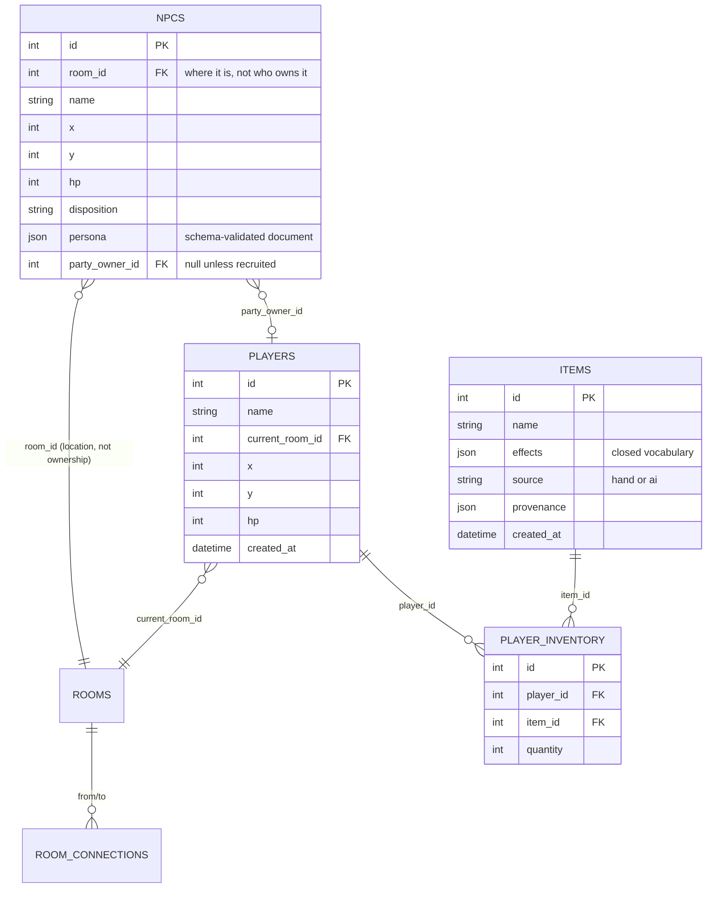

# Database Schema

This document describes the current SQLAlchemy data model and the likely next
tables. It is about durable data shape, not live runtime state.

Related docs:

- [Current Architecture](ARCHITECTURE.md): how the backend uses the database
  today, including the template-data vs. live-state boundary.
- [Future Ideas](FUTURE.md): Postgres, Redis, workers, and scale-out.

## Current Schema

The current database stores room templates, directed room connections,
reusable enemy definitions, and NPC instance rows (the first individual
state — see NPCS.md Decisions 9–10).



`items` (docs/LOOT.md) is the **global item pool** — no relationships on
purpose: chests roll from it at open time, and held copies are denormalized
snapshots inside `players.inventory`, so nothing joins against it at play
time. Rows are immutable once minted (editing one would fork it from every
held copy); both provenances pass the same `validate_item` gate.

## Current Tables

| Table | Current role | Notes |
|---|---|---|
| `rooms` | Room template data | Terrain, objects, spawns, and enemy placements. This is not live session state. |
| `room_connections` | Directed world graph edges | Traversal uses these: `load_room` reads a room's outgoing edges into `RoomTemplate.connections`, and stepping onto a connected tile transfers the player. Arrival uses the destination's first free spawn (`to_x`/`to_y` are still future columns). |
| `enemy_defs` | Reusable enemy catalog | Rooms reference enemy ids from JSON and load stats from this table. Planned: runtime-appendable by LLM world generation, gated by schema/bounds validation (stat ranges; effect lists drawn from the closed vocabulary). |
| `npcs` | NPC instance rows (individuals) | One row per NPC that exists in the world; play edits it (hp, position, disposition, memory, party membership) and it survives room resets and restarts. Loaded/saved by `npc_store.py`; eviction is "save individuals, unload". Full stats are columns because an individual's wounds and buffs are instance state. `persona` is validated by `persona.validate_persona` on insert *and* load. `party_owner_id` (M6) is a nullable String holding the `players.id` of the account this NPC follows (M8) — stable across sessions, so followers rebind on the next login. Still a plain String, not a FK: promotion waits one milestone, until eviction ordering provably never saves an NPC before its owner exists (ACCOUNTS.md). |
| `players` | Account + character rows (individuals) | One row per account, and the row *is* the character (ACCOUNTS.md Decision 1). `id` is an opaque `player_<uuid>` string everything else references; `username`/`password_hash` (bcrypt)/`email` are the auth columns, never sent to clients. Game state (`room_id`, `x`, `y`, `hp`, `inventory`, `hunger`) is written at the edges — disconnect and shutdown — by `player_store.py`, the `npc_store` rhythm. NULL `room_id` means "spawn at the default room", the fallback whenever a saved location stops making sense. `inventory` is the 10-slot pack as JSON (docs/LOOT.md): a list of `{item, quantity, equipped}` where `item` is a full snapshot, so restoring a pack never queries `items`. `hunger` is the 0–100 meter (LOOT.md Decision 5), stored as the raw float; it only drains while connected, so a returning player resumes as hungry as they left. |
| `object_instances` | Per-object play state (individuals) | What play did to one object in one room, layered over `Room.objects` design data on load — the object half of the `npcs` pattern. Today: chest lifecycle (`opened` + un-carried `contents` as item_view snapshots), written through at each open/take by `object_store.py`. A row exists only once play touches the object. `object_id` is the runtime id derived from the object's index in `Room.objects`, so design lists must never be reordered in place. Destroyed barrels / dropped items would join this table, not get new ones. |
| `items` | The global item pool (docs/LOOT.md) | Hand-authored seeds (`origin="seed"`, backfilled once when the table has never held a row) plus premium-LLM inventions minted at chest-open (`origin="llm"`). Append-only in practice: play draws from it and adds to it, never edits it. `payload` is validated by `items.validate_item` — the DB can't check JSON, so the gate lives in code, like rooms. |

## Important Boundary

Durable data now splits three ways, per NPCS.md's "a row exists to
remember something":

- **Template data** (`rooms`, `room_connections`, `enemy_defs`): authored or
  generated definitions. Never edited because something happened during
  play. Generation (human or LLM) may *append* — a new room, a new enemy
  def — through validation, but play never mutates.
- **Individual state** (`npcs`, `players`): instance rows that *are* edited
  by play (hp, position, room, party membership) and survive room resets and
  restarts.
- **Ephemeral state** (fungible enemy hp/positions, round counters): lives
  only in memory and is deliberately forgotten on room reset — enemy
  respawn is a feature, not a persistence gap.

Examples:

- Fungible enemy died: ephemeral — respawns on next room load.
- Player moved or took damage: individual state — persists.
- NPC joined a party: individual state — persists.
- Player looted or equipped an item: individual state (`players.inventory`)
  — persists.
- LLM minted a new item at a chest: template-ish pool data — appends to
  `items` through the validation gate, exactly like an LLM room.
- Chest opened: individual state (`object_instances`) — persists. Written
  through at the open/take edges by `object_store.py`, overlaid on room
  load, so a looted chest stays looted across evictions and restarts.
- Room terrain generated and accepted: template data.
- LLM invents a new enemy type: template data (append to `enemy_defs`
  through the validation gate).

This boundary prevents one player's session from corrupting canonical
definitions, while letting individuals accumulate history.

## JSON Columns

The schema uses JSON for variable-shape content:

- `rooms.terrain`
- `rooms.objects`
- `rooms.spawn_points`
- `rooms.enemy_spawns`
- `enemy_defs.on_spawn`
- `enemy_defs.on_death`

The database cannot fully enforce the shape inside these JSON blobs. Validation
therefore happens in app code before insert/load.

Current validation checks include:

- Required fields.
- Terrain dimensions.
- Valid tile characters.
- Walkable placements.
- No overlapping spawns/enemies/objects.
- Enemy references point to known enemy definitions.
- Spawns are near an entry.
- Required objects and entries are reachable.

This is the right trade for now: room data stays easy for humans and future AI
to generate, while the server still rejects malformed content.

## Soft References

`rooms.enemy_spawns[].enemy_id` is a soft reference because it lives inside JSON.
The database does not enforce it as a foreign key.

The app validates it with known enemy ids before storing seed room data, and
`load_room` fails if a room references an unknown enemy.

If this becomes painful, promote enemy spawns to a real join table:

```text
room_enemy_spawns(room_id, enemy_def_id, x, y)
```

Do that only when integrity and queryability matter more than keeping room data
as a compact blob.

## Near-Term Schema Additions

These are likely to matter for exploration.



| Addition | Why it may be needed |
|---|---|
| `room_connections.to_x`, `to_y` | Place players at a specific destination tile after traversal. |
| `room_connections.kind` | Distinguish door, portal, path, stairs, etc. |
| `npcs` | **Done**, now including `party_owner_id` (M6), which since M8 holds a real `players.id`. Promoting it to a FK waits until eviction ordering provably never saves an NPC before its owner exists. |
| `players` | **Done** (M8): username + password login resolves to the row, everything references its opaque id, state survives disconnect and restart — see [Accounts & Identity](archive/ACCOUNTS.md). |
| `items` | **Done** (loot system): the global pool, seed + LLM provenance behind one validation gate — see [Loot](LOOT.md). |
| `player_inventory` | **Superseded**: the pack landed as `players.inventory` JSON (snapshots, no joins at play time — LOOT.md). A join table returns only if cross-player item queries ("who holds the Dragonfang?") ever matter more than snapshot simplicity. |

Do not add all of these at once. Add the smallest table/column needed by the
next milestone.

## Future Tables

These belong later:

| Table | Purpose |
|---|---|
| `events` | Append-only room/player event log for replay and debugging. |
| `room_sessions` | Distinguish live mutable session state from room templates. |
| `npc_memory` | Store durable NPC/player relationship summaries. |

## SQLite Now, Postgres Later

The current app uses SQLAlchemy, so the model layer can survive a later move
from SQLite to Postgres.

Stay on SQLite while:

- Data is disposable.
- The app is one process.
- The goal is fast local iteration.

Move to Postgres when:

- Real players or generated content must be preserved.
- More than one process writes data.
- Production deployment needs stronger concurrency guarantees.

## Keep This Doc Current

When `backend/models.py` changes, update this file in the same change.

For each schema change, record:

- What changed.
- Whether it is current or planned.
- Whether the data is template, live/session, or player-owned.
