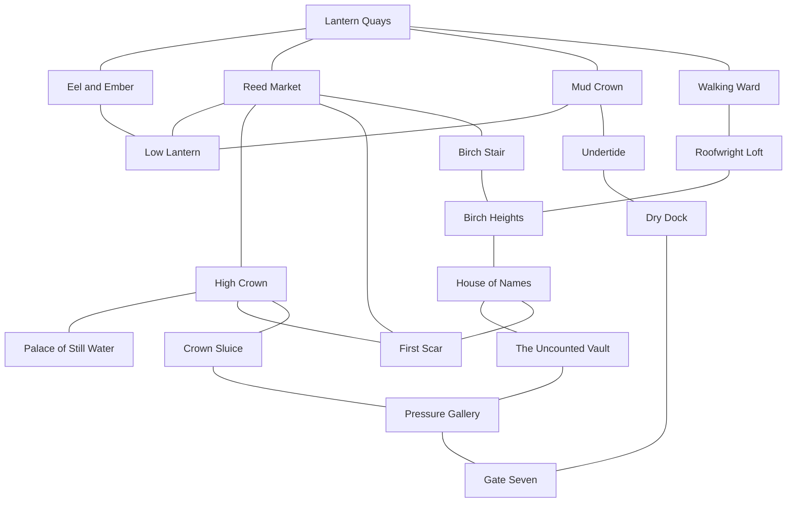

# Drazna Kingdom Chapter

Drazna is a playable nineteen-room lake-city region. It is the kingdom with
the first verified public record of the black rot. Nothing in the chapter
establishes that the rot began there. Its strongest evidence instead shows
several routes by which contaminated water or cargo may have passed through
the city before the proclamation.

## Regional shape

The authored room graph has twenty-five reciprocal links and several loops.
Every room can be reached from every other room without using the development
bridge to Oakrun.

Lantern Quays reserves two west-wall entries:

- `(0, 6)` is the real procedural-frontier gateway.
- `(0, 9)` is the temporary development bridge to Oakrun's Severed
  Fieldsite.

The temporary bridge is deliberately outside Drazna's regional manifest.
Removing that runtime connection leaves Drazna internally complete and ready
to be discovered through generated frontier travel.

The Mudwheel has physical, inspectable landings at Lantern Quays, High Crown,
and Birch Heights. All three stops, their Tuesday/Friday uphill and return
schedule, and the Grey Heron road to Oakrun remain closed while Drazna is
reachable only through the temporary bridge. Resolving Drazna's procedural
frontier gateway opens that authored service group atomically; it does not
create generic nearest-stop links. The full Mudwheel ride costs three coin,
takes eighty moving minutes plus one forty-five-minute High Crown layover, and
preserves the route's guarded/safe danger ratings.

The dangerous Grey Heron connection between Oakrun and Lantern Quays costs
twenty-four coin and advances the world by thirty hours: twenty-seven hours
across the two authored road segments plus the three-hour Hollowmere layover.
Until Hollowmere has its own physical stop, Oakrun Exchange is the playable
terminal alias for the Pilgrim's Hollow departure. A new traveller can
therefore use it from the thirty-coin starting purse and arrive with six.
Teo's Salvage Counter buys carried common, rare, and legendary finds for four,
twelve, and forty coin. Five common finds therefore leave that first traveller
with twenty-six coin, enough for the return crossing without making the long
road cheap. Those offers remain below the minimum same-rarity purchase prices,
preventing shop arbitrage.

## Districts and interiors

| Area | Function and evidence |
|---|---|
| Lantern Quays | Ferry arrival, Mudwheel stop, provisions, public notices, refugee bundles, the procedural gateway, and temporary Oakrun bridge |
| Eel and Ember | Drina's inn, the uncensored arrival book, and a concealed path into the Low Lantern |
| Reed Market | Salvage trade, Teo's fence operation, false provenance, and three routes into the city's upper and hidden layers |
| Mud Crown | Crane platforms, skiffs, dry-line access, and an alternate thieves' lift |
| Low Lantern | Drazna's underbelly: stolen manifests, false seals, hidden names, and a cache reached from three businesses |
| Walking Ward | Moving bridge houses, a flooded nursery, household memorials, and pressure damage that can change offscreen |
| Roofwright Loft | Bridge braces, rescue lines, Sima's work, and a high-risk shortcut to Birch Heights |
| Birch Stair | Memorial ascent, flood heights, and public copies that can survive a suppressed hearing |
| Birch Heights | Dry civic ward connecting the Mudwheel landing, roof route, and archive |
| House of Names | Public rolls, omitted tablets, Lina's letters, and Nera's supplemental archive |
| The Uncounted Vault | Scraped records, pre-proclamation residue, and a maintenance cut into the pressure system |
| High Crown | Political crossroads between market, palace, scar, and sluice |
| Palace of Still Water | Mara and Alin's contested offices, the sealed flood order, and reverse-water evidence |
| Crown Sluice | Floodwarden shifts, control wheel, tools, gauges, and Rada's route below |
| Pressure Gallery | Live machinery, palace-facing scoring, a vault shortcut, and the approach to Gate Seven |
| First Scar | The first publicly dated breach, presented as a record rather than an origin site |
| Undertide | Low-water roofs, changing chalk, expedition staging, black silt, and answering knocks |
| Dry Dock | Survivor bunks, a cut dive rope, a breakable expedition window, and Gate Seven access |
| Gate Seven | Fourteen-beat chain drum and the persistent regional climax with Odran |

The fifty authored regional exits plus the two reserved Lantern Quays
gateways all have unobstructed, engine-tested approaches. Fifteen chests are
spread across civic, hidden, and dangerous rooms, while the three Mudwheel
landings remain reachable from every entrance in their district. Large
landmarks are positioned wholly inside the playable grid so their artwork
does not crop or conceal exits, arrival tiles, residents, or enemies.

The delivery art set now contains forty alpha WebP cutouts. Every room has at
least one illustrated environmental anchor, all thirty-one initial NPC and
enemy placements resolve to character art, and fifty-six of the 101 authored
object placements use full artwork. The Palace's open crown ledger and the
First Scar's cracked black-glass record memorial have unique focal assets.
Remaining documentary and architectural clues use specific semantic symbols
instead of a generic sparkle, so an unillustrated rope, drain, bunk, or
listening pipe is still readable at a glance.

Regional combat is tuned around a visible equipment step. A fresh, healthy
traveller can clear each ordinary Drazna encounter, but the four bespoke flood
enemies each take two unarmed strikes. A steel sword can finish any of them in
one, making found or purchased equipment materially useful before Gate Seven.
A standalone full-health unarmed Gate Seven audit is also survivable, but a
bare, no-heal traversal of the representative first-clear hostile loop is
expected to fail at the climax. One Floodwarden Repair Kit or a common
equipment upgrade makes that cumulative audit survivable.

Amber Quay Provisions uses Lantern Quays as its loot context. Its daily stock
can therefore include Smoked Eel & Blackbread and the other Drazna items,
rather than silently drawing only from the generic world pool. Together with
the fifteen regional chests, this keeps food in the regional survival economy
without making hunger irrelevant.

Five early civic locations—Birch Heights, Eel and Ember, House of Names, Reed
Market, and Walking Ward—each hold at least one chest. Every generated frontier
room also contains one to four chests, so the salvage loop remains repeatable
after the authored caches are exhausted. A database-backed 64-seed route audit
found Drazna in every world: the median discovery took 17 frontier expansions,
the maximum took 30, and even the least generous path exposed 11 chests before
the regional gateway.

## People

Nine established Draznans now begin in their own districts and interiors:
Mara and Alin in the palace, Ilya at Crown Sluice, Nera in the House of Names,
Olek at Mud Crown, Pava in Walking Ward, Vasko in Undertide, Vesna at the dry
dock, and Lina at Lantern Quays.

Six additional persistent people complete the local web:

- **Drina Sable**, innkeeper and keeper of an uncensored arrival book.
- **Teo Latch**, market broker, fence, and reluctant floodwarden informant.
- **Rada Velic**, senior floodwarden who knows the Gate Seven memorial is
  incomplete.
- **Sima Dren**, roofwright and rescue runner whose injuries affect the
  Walking Ward.
- **Luka Nen**, closure-crew survivor and witness to five omitted names.
- **Odran, the Sluicebound**, the former Third Bell floodwarden at Gate Seven.
  He is not the dead Draznan king whose name he shares.

Each person has three to five daily deliberation windows. Schedule movement,
work, repair, sleep, patrol, and travel remain deterministic between those
windows.

All fifteen dialogue personas also carry explicit named relationships. The
connected web crosses the Vey and Mirek families, Rada and Ilya's mentorship,
Nera and Luka's archive testimony, Olek's salvage contracts, Lina and Vesna's
carriage work, and Teo and Drina's Low Lantern information market. These ties
shape conversation context while durable relationship changes still come from
witnessed exchanges and authored consequences.

## Intertwined situations

The chapter now has thirty-one Drazna-centered authored triggers: seven
scheduled meetings and twenty-four story turns. These are world events and
private-goal consequences, not tracked player objectives.

| Situation | Possible development |
|---|---|
| Passenger list | Teo sells four names to avert a raid; a third hand adds three arrest marks, Drina turns against him, and Luka forces him to face the omitted bunks |
| Mudwheel names | Lina's trips move letters and uncounted names between the quay, Drina's book, and Nera's archive |
| Bridge failure | Sima may save a household and be injured, miss the Undertide descent, or later face a wider ward collapse |
| Undertide expedition | Pava, Vasko, Vesna, and Luka can launch a low-water descent; missing it leaves Luka wounded and opens a permanently missable fatal return |
| Vasko's return | Vasko can return with the fourteen-name payroll and a marked survivor route, or surface injured after losing both |
| Tablet theft | Teo may steal Nera's comparison tablet to erase his betrayal, while a hidden rubbing preserves the evidence |
| Mara and Alin | Luka's testimony can open a public hearing that breaks Mara's control, or the hearing can be suppressed and Alin injured |
| Gate Seven | Odran activates as a persistent hostile actor while pressure rises beneath Walking Ward |

After a finite window closes, or after an unresolved Gate Seven failure
becomes inevitable, evidence remains in the relevant room: altered receipts,
wet footprints, blood-marked slings, unused rescue rope, empty witness stools,
scraped tablets, changed chain tension, and survivor knocks. Players can
therefore reconstruct events they did not witness without a quest log or map
marker.

## Gate Seven outcomes

Odran is a persistent NPC rather than a disposable enemy spawn. This lets his
health, hostility, memories, and death survive room reloads and appear in the
People and Chronicle systems.

The climax has four durable outcome paths. All four compete for one immutable
resolution fact, so a player answer, Odran's defeat, and an offscreen pressure
failure cannot split the world even if separate server processes resolve them
at the same time:

1. Luka speaks all fourteen closure names in the correct cadence; Rada vents
   the gate and Odran becomes neutral.
2. A player who has read both the pressure gauge and the crown flood order can
   brace the counterpressure. Odran remains alive, the gate is contained, and
   Walking Ward is stabilized, but none of the omitted names are restored.
3. Odran is killed; his body leaves the chain in its emergency notch and the
   pressure problem remains unresolved.
4. If the descent never reaches the gate, or an engaged confrontation remains
   unanswered past its cadence window, the gate floods and jams. Odran stays
   hostile, Rada is injured, and the pressure surge can partly collapse
   Walking Ward.

The unattended failure path cannot overwrite a completed pacified, contained,
or Odran-killed resolution.

The automatic fourteen-name path requires Odran, Rada, and Luka to be alive,
and Odran to remain at Gate Seven. Its atomic story turn gathers Rada and Luka
at the gate. Active-room authority defers the entire turn while any
participant's room or Gate Seven is being observed, preventing an offscreen
update from moving a visible witness or allowing a dead participant to act.

Once a flooded or cadence-expired failure is durable, the chain drum reports
that terminal state and no longer offers the earlier pacification or brace
choices. Killing Odran afterward remains a persistent NPC death, but it cannot
rewrite the flooded branch or emit a second, contradictory climax aftermath.

The confrontation explains the omitted closure crew and an institutional
cover-up. It does not identify the rot's origin.

The Gate Seven chest uses the ordinary functional loot system and therefore
benefits from Drazna-biased regional draws. A nearby fourteen-notched object,
known below as **Odran's Black Key**, is an inspectable Chronicle discovery and
piece of material evidence. It deliberately does not pretend to be a usable
key item before non-consumable key inventory support exists.

## Evidence discipline

Five added rumors distinguish authored truth from belief:

- The salt barge is precisely dated but has a cut cargo line.
- Palace-drain scoring proves passage through the palace system, not source or
  original direction.
- Teo's sold list and its later alteration are confirmed by matching errors
  and receipts.
- The Mudwheel's uncounted names are corroborated across letters, arrivals,
  and supplemental tablets.
- Gate Seven's fourteen workers are confirmed, while Odran's condition and
  the source of the black material remain separate questions.

The noticeboard, room descriptions, NPC knowledge, rumor truth accounts, and
climax facts all repeat the same epistemic boundary: **first verified public
record is not proven birthplace**.

## Release validation

The final source passed the complete 866-test backend suite and the production
TypeScript/Vite build. All forty Drazna WebPs also decoded cleanly with
transparency and non-cropping alpha margins. At the content-complete
simulation checkpoint, a paired seed-42 audit ran two independently created
worlds for 180 days, including a close/reopen at day 90. Both branches produced
the same canonical hashes:

- Day 90:
  `4c464b50d24e79a1083b48caff9d3be734d2b0c4c6e16416a5d7f11f1ccd1d3c`
- Day 180:
  `61e6f7dee3d1c71e1225aeef2b1d96c1e8c1d01c3ee2b12cf9c20d074e175c9a`

Historical replay, exact trigger replay, and exact service replay generated
no duplicate work. At day 180 the world held 19,987 deliberations, or
3.965675 per living NPC-day; 5,760 conversation turns; thirty-five pending
events with none overdue; 15,515 memories; and 31,063 Chronicle entries.
The scenario launched the Undertide expedition, returned Vasko with the
closure payroll, opened the fourteen-name hearing without resolving the
First Scar's origin, pacified Gate Seven, and stabilized Walking Ward.
Fresh seeds 7 and 314159 also ran for sixty days apiece with a day-thirty
close/reopen and exact day-sixty service and trigger replay. Both kept every
Draznan within three to five daily deliberations, held thirty-five future
events with none overdue, and reached coherent major outcomes. Their row
counts matched while 2,692 of 5,365 memory rows and 1,856 of 10,508 Chronicle
rows differed per seed, confirming deterministic replay without flattening
the seed-dependent social history.

A third fresh world, seed 271828, ran for ninety days with a day-forty-five
database close, copy, and reopen. Its independent replay reproduced all
forty-five later daily service and trigger results and the complete final
semantic snapshot. The run ended with 9,997 deliberations—3.967 per
NPC-day, with every individual day between three and five—2,880
conversations, 7,903 memories, 15,647 Chronicle entries, maximum rumor
cascade depth three, and the same thirty-five pending future events with none
overdue. Final exact and historical no-op replays changed no rows; the day-90
semantic hash was
`1e8cb1a839d389f94120606062a1fc32b7403b0ba541e8a970dced0aea1d96b2`.

An additional property audit exercised 144 isolated Gate Seven timelines,
covering all twenty-four orderings of pacification, containment, Odran's
defeat, and the flood deadline. It produced forty-two pacified, thirty-two
contained, thirty-four Odran-killed, and thirty-six flooded outcomes. Across
428 database reopens, 435 replay passes, forty-five guaranteed active-room
deferrals, moved or dead witnesses, and concurrent retries, every timeline
committed exactly one resolution and one matching aftermath. Exact logical
database hashes were unchanged by every final replay.

Long-history performance remains a watch item rather than a correctness
failure. Days 1–90 averaged 5.66 seconds per simulated day, while days 91–180
averaged 12.38 seconds, a 2.19× slowdown as per-NPC memory histories nearly
doubled. The live queue stayed flat and overdue-free. A follow-up
semantics-equivalence pass moved expiry, shareability, and cascade filtering
into the database; projected listener provenance instead of hydrating its
history; and fetched only the selected speaker row. On synthetic
1,200-memory speaker and listener histories this reduced one conversation
turn from 53.51 to 30.08 milliseconds, a 1.78× improvement. Selection remains
linear in relevant history, but a second 5,000-memory-per-person audit still
reduced a turn from 301.99 to 83.27 milliseconds, or 3.63×. One hundred and
twenty randomized semantic-equivalence fixtures found no selection mismatch.
Bounded indexed candidate ranking remains future profiling work.
Conversation throughput also sat continuously at its configured
thirty-two-turn daily cap and merits telemetry before further population
growth.

## Runtime integration

- Physical maps: `content/world/drazna/`
- Persistent people: `content/npcs.json`
- Schedules and private goals: `content/living_world/npc_profiles.json`
- Routes and carriage integration: `content/living_world/world.json`
- Conflicting accounts: `content/living_world/rumors.json`
- Meetings and consequences: `content/living_world/triggers.json`
- Services and landmarks: `content/shops.json`,
  `content/noticeboards.json`, `content/objects.json`, and
  `content/buildings.json`
- Enemy ecology: `content/enemies.json`

The dedicated regression suite checks room validity, reciprocal strong
connectivity, reserved frontier gates, services, enemy references, schedule
locations, persistent Odran identity, missable consequences, climax outcomes,
First Scar truth discipline, renderer bounds, landmark visibility, and
combat-path survivability. Deterministic frontier audits have reached Drazna
in 30,000 selection-level worlds and 768 fully generated wilderness worlds,
including depth-first runs where Rouvray appeared first and Drazna was found
later by backtracking.
