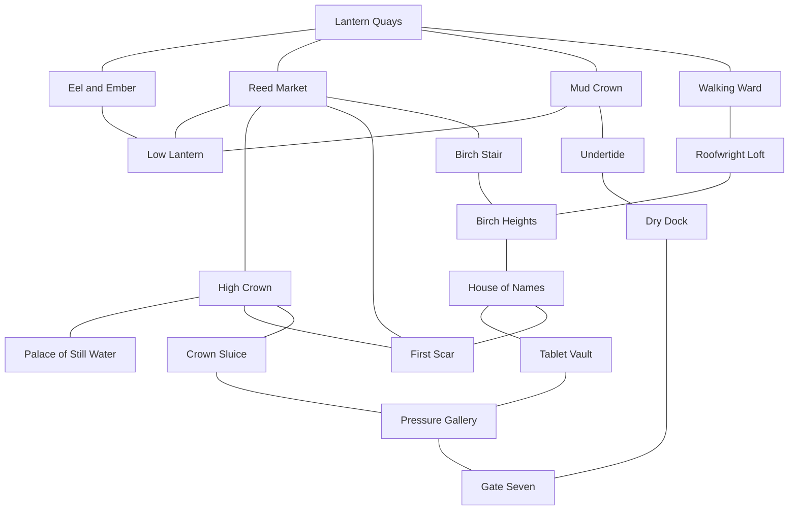

# Drazna Kingdom Chapter

Drazna is a playable nineteen-room lake-city region. It is the kingdom with
the oldest verified public record of the black rot. Nothing in the chapter
establishes that the rot began there. Its strongest evidence instead shows
several routes by which contaminated water or cargo may have passed through
the city before the proclamation.

## Regional shape

The authored room graph has twenty-five reciprocal links and several loops.
Every room can be reached from every other room without using the development
bridge to Oakrun.

Lantern Quays reserves two west-wall entries:

- `(0, 6)` is the real procedural-frontier gateway.
- `(0, 9)` is the temporary development bridge to Oakrun's Severed
  Fieldsite.

The temporary bridge is deliberately outside Drazna's regional manifest.
Removing that runtime connection leaves Drazna internally complete and ready
to be discovered through generated frontier travel.

The Mudwheel has physical, inspectable landings at Lantern Quays, High Crown,
and Birch Heights. All three stops, their Tuesday/Friday uphill and return
schedule, and the Grey Heron road to Oakrun remain closed while Drazna is
reachable only through the temporary bridge. Resolving Drazna's procedural
frontier gateway opens that authored service group atomically; it does not
create generic nearest-stop links. The full Mudwheel ride costs three coin,
takes eighty moving minutes plus one forty-five-minute High Crown layover, and
preserves the route's guarded/safe danger ratings.

## Districts and interiors

| Area | Function and evidence |
|---|---|
| Lantern Quays | Ferry arrival, Mudwheel stop, provisions, public notices, refugee bundles, and the temporary frontier entries |
| Eel and Ember | Drina's inn, the uncensored arrival book, and a concealed path into the Low Lantern |
| Reed Market | Salvage trade, Teo's fence operation, false provenance, and three routes into the city's upper and hidden layers |
| Mud Crown | Crane platforms, skiffs, dry-line access, and an alternate thieves' lift |
| Low Lantern | Drazna's underbelly: stolen manifests, false seals, hidden names, and a cache reached from three businesses |
| Walking Ward | Moving bridge houses, a flooded nursery, household memorials, and pressure damage that can change offscreen |
| Roofwright Loft | Bridge braces, rescue lines, Sima's work, and a high-risk shortcut to Birch Heights |
| Birch Stair | Memorial ascent, carriage landing, flood heights, and public copies that can survive a suppressed hearing |
| Birch Heights | Dry civic ward connecting the Mudwheel, roof route, and archive |
| House of Names | Public rolls, omitted tablets, Lina's letters, and Nera's supplemental archive |
| Tablet Vault | Scraped records, pre-proclamation residue, and a maintenance cut into the pressure system |
| High Crown | Political crossroads between market, palace, scar, and sluice |
| Palace of Still Water | Mara and Alin's contested offices, the sealed flood order, and reverse-water evidence |
| Crown Sluice | Floodwarden shifts, control wheel, tools, gauges, and Rada's route below |
| Pressure Gallery | Live machinery, palace-facing scoring, a vault shortcut, and the approach to Gate Seven |
| First Scar | The first publicly dated breach, presented as a record rather than an origin site |
| Undertide | Low-water roofs, changing chalk, expedition staging, black silt, and answering knocks |
| Dry Dock | Survivor bunks, a cut dive rope, a breakable expedition window, and Gate Seven access |
| Gate Seven | Fourteen-beat chain drum and the persistent regional climax with Odran |

## People

Nine established Draznans now begin in their own districts and interiors:
Mara and Alin in the palace, Ilya at Crown Sluice, Nera in the House of Names,
Olek at Mud Crown, Pava in Walking Ward, Vasko in Undertide, Vesna at the dry
dock, and Lina at Lantern Quays.

Six additional persistent people complete the local web:

- **Drina Sable**, innkeeper and keeper of an uncensored arrival book.
- **Teo Latch**, market broker, fence, and reluctant floodwarden informant.
- **Rada Velic**, senior floodwarden who knows the Gate Seven memorial is
  incomplete.
- **Sima Dren**, roofwright and rescue runner whose injuries affect the
  Walking Ward.
- **Luka Nen**, closure-crew survivor and witness to five omitted names.
- **Odran, the Sluicebound**, the former Third Bell floodwarden at Gate Seven.
  He is not the dead Draznan king whose name he shares.

Each person has three to five daily deliberation windows. Schedule movement,
work, repair, sleep, patrol, and travel remain deterministic between those
windows.

## Intertwined situations

The chapter adds twenty-two authored triggers. These are world events and
private-goal consequences, not tracked player objectives.

| Situation | Possible development |
|---|---|
| Passenger list | Teo sells four names to avert a raid; a third hand adds three arrest marks, Drina turns against him, and Luka forces him to face the omitted bunks |
| Mudwheel names | Lina's trips move letters and uncounted names between the quay, Drina's book, and Nera's archive |
| Bridge failure | Sima may save a household and be injured, miss the Undertide descent, or later face a wider ward collapse |
| Undertide expedition | Pava, Vasko, Vesna, and Luka can launch a low-water descent; missing it leaves Luka wounded and opens a permanently missable fatal return |
| Vasko's return | Vasko can return with the fourteen-name payroll and a marked survivor route, or surface injured after losing both |
| Tablet theft | Teo may steal Nera's comparison tablet to erase his betrayal, while a hidden rubbing preserves the evidence |
| Mara and Alin | Luka's testimony can open a public hearing that breaks Mara's control, or the hearing can be suppressed and Alin injured |
| Gate Seven | Odran activates as a persistent hostile actor while pressure rises beneath Walking Ward |

After a finite window closes, or after an unresolved Gate Seven failure
becomes inevitable, evidence remains in the relevant room: altered receipts,
wet footprints, blood-marked slings, unused rescue rope, empty witness stools,
scraped tablets, changed chain tension, and survivor knocks. Players can
therefore reconstruct events they did not witness without a quest log or map
marker.

## Gate Seven outcomes

Odran is a persistent NPC rather than a disposable enemy spawn. This lets his
health, hostility, memories, and death survive room reloads and appear in the
People and Chronicle systems.

The climax has four durable outcome paths. Three write explicit resolution
facts, while the last records what happens when nobody resolves the pressure:

1. Luka speaks all fourteen closure names in the correct cadence; Rada vents
   the gate and Odran becomes neutral.
2. A player who has read both the pressure gauge and the crown flood order can
   brace the counterpressure. Odran remains alive, the gate is contained, and
   Walking Ward is stabilized, but none of the omitted names are restored.
3. Odran is killed; his body leaves the chain in its emergency notch and the
   pressure problem remains unresolved.
4. If the descent never reaches the gate, or an engaged confrontation remains
   unanswered past its cadence window, the gate floods and jams. Odran stays
   hostile, Rada is injured, and the pressure surge can partly collapse
   Walking Ward.

The unattended failure path cannot overwrite a completed pacified, contained,
or Odran-killed resolution.

The confrontation explains the omitted closure crew and an institutional
cover-up. It does not identify the rot's origin.

The Gate Seven chest uses the ordinary functional loot system and therefore
benefits from Drazna-biased regional draws. A nearby fourteen-notched object,
known below as **Odran's Black Key**, is an inspectable Chronicle discovery and
reward landmark. It deliberately does not pretend to be a usable key item
before non-consumable key inventory support exists.

## Evidence discipline

Five added rumors distinguish authored truth from belief:

- The salt barge is precisely dated but has a cut cargo line.
- Palace-drain scoring proves passage through the palace system, not source or
  original direction.
- Teo's sold list and its later alteration are confirmed by matching errors
  and receipts.
- The Mudwheel's uncounted names are corroborated across letters, arrivals,
  and supplemental tablets.
- Gate Seven's fourteen workers are confirmed, while Odran's condition and
  the source of the black material remain separate questions.

The noticeboard, room descriptions, NPC knowledge, rumor truth accounts, and
climax facts all repeat the same epistemic boundary: **first verified public
record is not proven birthplace**.

## Runtime integration

- Physical maps: `content/world/drazna/`
- Persistent people: `content/npcs.json`
- Schedules and private goals: `content/living_world/npc_profiles.json`
- Routes and carriage integration: `content/living_world/world.json`
- Conflicting accounts: `content/living_world/rumors.json`
- Meetings and consequences: `content/living_world/triggers.json`
- Services and landmarks: `content/shops.json`,
  `content/noticeboards.json`, `content/objects.json`, and
  `content/buildings.json`
- Enemy ecology: `content/enemies.json`

The dedicated regression suite checks room validity, reciprocal strong
connectivity, reserved frontier gates, services, enemy references, schedule
locations, persistent Odran identity, missable consequences, climax outcomes,
and First Scar truth discipline.
