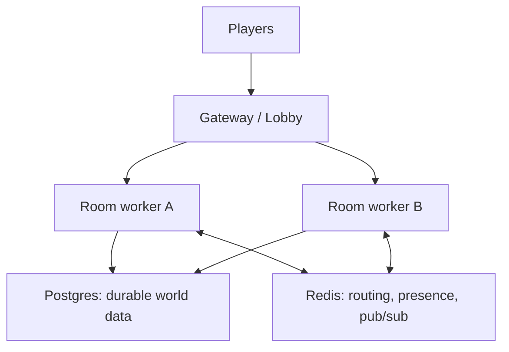

# Future Ideas

The parking lot for everything deferred: architecture the project may grow
into, and the scale-out backend it may eventually need. Nothing here is the
next milestone. Consult this when a future item is about to be promoted to a
milestone — then extract it into its own plan.

Condensed from the earlier World Architecture Proposal and Future Backend docs
(originals in [archive](archive/)). The parts of those proposals that shipped —
the `active_rooms` registry, `RoomMode`, door traversal — are documented in
[Current Architecture](ARCHITECTURE.md).

## Core Principles (apply even to future work)

1. **One grid model, two timing models.** Exploration and combat share terrain,
   entities, validation, effects, and events; they differ only in when actions
   resolve.
2. **Room is the unit of runtime ownership** — the natural boundary for
   locking, loading, dormancy, generation, and future worker ownership.
3. **AI proposes data, the engine validates.** AI never mutates live state
   directly.
4. **Do not simulate empty rooms** unless a persisted scheduled event exists.
5. **Build the small version first.**

## Per-Room Locks

The current global `asyncio.Lock` is fine at this scale and guarantees rooms
are never double-loaded. Once lock contention is real, each room should own its
own lock: combat in room A must not block exploration in room B, a room's
state still mutates serially, and timed work acquires its room's lock. No
distributed locks until there is a proven multi-process ownership problem.

## Richer Traversal

The current schema stores only the origin tile; arrivals use the first free
spawn. When authored content needs it, add to `room_connections`:

- `to_x`, `to_y` — explicit arrival coordinates.
- `kind` — `door`, `portal`, `stairs`, `path`.

Longer-term, traversal can become a formal `Transition` effect routed through a
`RoomManager` (the registry in `backend/main.py` is already the in-process
version of that contract — scaling later swaps the wiring, not the game rules).

## Timed Work

No global heartbeat. Prefer lazy, room-owned scheduling:

- Timed work belongs to a room; dormant rooms cancel in-memory timers.
- Timer callbacks re-enter the same validated action/effect/event path.
- Durable scheduled events need database support — do not fake that with
  in-memory timers.

## AI Seams

AI appears at content boundaries first, and its output becomes structured data
before it affects mechanics:

| Seam | Trigger | Output | Validation |
|---|---|---|---|
| Room generation (**in progress** on a parallel track, see [Roadmap](ROADMAP.md)) | reaching an ungenerated exit | terrain, objects, spawns, lore, connections | room validation |
| NPC dialogue | player talks to NPC | text response, memory summary | dialogue policy and state rules |
| NPC action | NPC decides to act | normal `Action` | same action validation as players |
| Item generation | loot/reward creation | item definition and effect data | closed effect vocabulary |

NPC design specifics (actor axes, two-channel dialogue) live in
[NPC And Actor Design](NPCS.md). Behavior beyond dialogue can eventually use a
`Brain.decide(view) -> Action | None` strategy — an LLM-driven NPC is just
another action submitter from the engine's perspective. NPC-to-NPC behavior
comes only after cost and debugging are understood.

## Client Rebuild

A React/TypeScript/Vite DOM client becomes worth it when UI state gets hard to
reason about or panels (dialogue, inventory, map, journal) multiply. Keep the
renderer DOM-based; canvas only with a proven DOM performance problem. Details
in [Frontend Design](FRONTEND_DESIGN.md).

## Scale-Out Parking Lot

Move toward this only when one of these is true: a single process cannot hold
the players, players need stable accounts and reconnects, generated content
becomes data worth preserving, or deploys/crashes must not wipe active play.

| Tier | Data | Likely Tool |
|---|---|---|
| Durable source of truth | rooms, generated items, players, inventory, event log | Postgres |
| Live room state | active `RoomState` for one room | worker memory |
| Coordination | room-to-worker routing, presence, pub/sub | Redis |

Rules of the shape:

- An active room is owned by exactly one worker; combat runs from memory and
  persists outcomes at the edges — never put the per-round hot loop in
  Postgres.
- Redis is for routing/presence/pub-sub only, never the durable source of
  truth.
- The gateway gives players one stable endpoint: identify, find the player's
  room, route the socket to the owning worker, handle reconnect grace windows.
- An append-only event log (with snapshots) can eventually rebuild a room
  after a crash.

Migration path, in order — each step only when the previous one hurts:

1. Persist the minimum data players care about.
2. Add account identity when inventory/progression needs an owner.
3. Move SQLite → Postgres when real durable data exists.
4. Split room workers across processes only when one process is a real limit.
5. Add Redis and gateway routing when cross-worker messaging is unavoidable.

Main risk: distributed systems create bugs that look nothing like game bugs —
stale routing, split ownership, duplicated messages, reconnect edge cases. Pay
that cost only after the exploration loop is fun.

## Things To Avoid

- Rewriting combat to make names prettier.
- Adding `RoomManager`, Redis, or workers before their trigger conditions.
- Rebuilding the frontend before the existing client blocks progress.
- Calling LLMs while holding a room lock.
- Letting AI output bypass validation.
- Writing live session changes back into `rooms`.

## Open Questions

- Should object effects open the inventory path immediately, or stay
  descriptive until dialogue works?
- How much NPC memory is needed before dialogue feels coherent?
