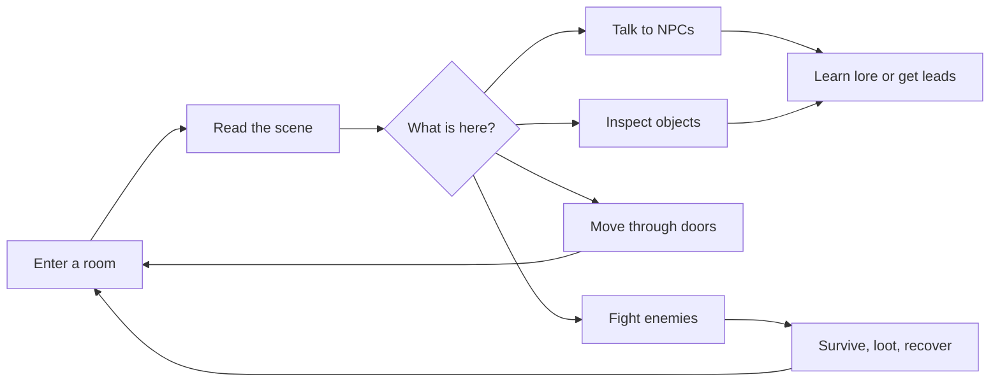
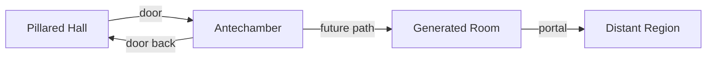
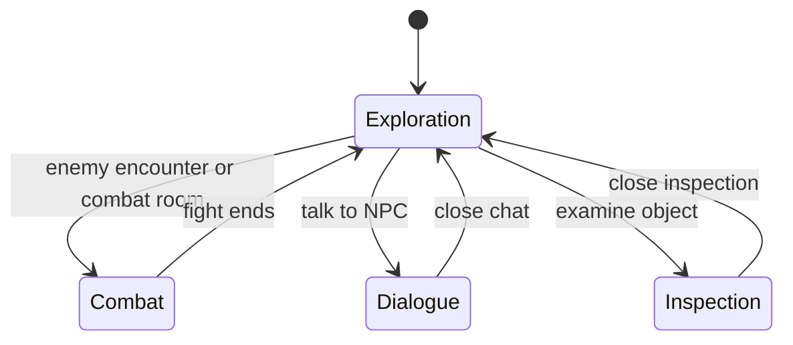

# Game Design

This is the product and gameplay source of truth. It describes the game we are
building, without mixing in backend scaling plans or implementation tickets.

## North Star

A shared browser roguelike where players explore a connected grid world and the
world's content is partly generated by AI: rooms, lore, factions, NPCs, objects,
and encounters.

The engine remains deterministic and server-owned. AI can propose content, but
the game only accepts validated data.

> AI proposes. The engine disposes.

That rule is the spine of the project. AI should create flavorful content, not
gain the power to mutate live game state directly.

## Player Fantasy

You spawn into a strange room in a persistent world. Around you may be other
players, NPCs, doors, portals, objects, enemies, hazards, or clues about the
larger world.

The main loop is not a fixed authored story. It is discovery:

**There is no end state.** This is an open-ended, infinitely (and eventually
procedurally) generated world, not a match — there is no win screen and no
game-over. Clearing a room of hostiles is progress, not victory (the room
simply becomes peaceable again). A death is a setback to recover from, not a
terminal loss. The loop above never terminates; it only grows.

## World Model

The world is divided into rooms because the browser grid can only show so much
at once. A room is a bounded map with terrain, entities, objects, and exits.

Rooms are connected by doors, portals, or paths:

When a player moves through an exit:

- If the destination room exists, load it.
- If it does not exist yet, generate it, validate it, store it, then load it.
- The generated result becomes canonical data. Do not rely on regenerating the
  same LLM output later.

## Core Loops

### Exploration

Exploration shipped in its first form (see [ARCHITECTURE.md](ARCHITECTURE.md)).

Players can:

- Move freely inside non-combat rooms.
- See other players in the same room.
- Inspect objects for descriptions or simple rewards.
- Talk to NPCs one-on-one.
- Move through doors or portals into connected rooms.

Exploration should stay simple at first. The first version does not need a rich
inventory, autonomous NPC schedules, traps everywhere, or full procedural world
simulation.

### Combat

Combat already exists and should be preserved.

Combat happens on the same grid model, but it uses turn-based rules:

- Players submit actions.
- The server waits for all living players or a timeout.
- Movement resolves before attacks.
- Enemy/world actions resolve after player actions.
- The server broadcasts the resulting state and events.

Combat rooms should eventually feel like a mode switch inside the world, not a
separate game.

## AI's Role

AI is part of the content layer, not the rules engine.

Good AI responsibilities:

- Generate room descriptions and layouts.
- Propose NPC personality, dialogue, goals, and lore.
- Propose item definitions using the closed effect vocabulary.
- Generate clues, rumors, factions, and environmental flavor.
- Repair invalid generated data after validation feedback.

Bad AI responsibilities:

- Directly changing `RoomState`.
- Deciding combat outcomes.
- Inventing new effect semantics at runtime.
- Bypassing validation because the prose sounds plausible.

Every AI output that affects gameplay should become structured data first, then
pass validation before the server uses it.

## NPCs

- NPCs exist in rooms.
- A player can talk to one NPC at a time.
- The NPC has a description, personality, memory (embeddings stored in db), and dialogue context.
- Dialogue may reveal lore, hints, relationships, or simple goals.

NPCs may:

- Move between rooms.
- Become friendly or hostile to a player.
- Join a player's party and Follow a player through room transitions .
- Die and lose the friendship/follower state.

Later:
- Interact with other NPCs or players when the server chooses to spend AI calls.

Do not start with autonomous background NPC simulation. It is expensive, harder
to debug, and not required to prove the game loop.

## Objects And Items

Near-term object interaction should be intentionally small:

- Examine an object.
- Show a description.
- Optionally reveal or grant a simple item.

Items should mostly support combat at first: bombs, healing, defense, damage, or
status effects. The useful design constraint is the same as combat actions:
items can be varied, but their effects should come from a small closed set.

## Events, Hazards, And Fairness

World events, traps, hazards, and disasters fit the long-term fantasy, but they
need telegraphing. If lightning, eruption, poison gas, or a trap can hurt a
player, the room should give the player a warning or environmental clue first.

The rule of thumb:

- Surprise is fine.
- Unreadable punishment is not.

## Current Scope Decision

The next build should prove the room-to-room exploration loop before trying to
prove the full MMO backend.

Focus next:

- Door/portal traversal.
- Exploration movement.
- Basic NPC dialogue.
- Combat rooms that reuse the existing combat engine.

Defer:

- Redis and multi-worker routing.
- Full authentication.
- Persistent player inventory.
- Autonomous NPC background scripts.
- Complex item crafting or object-use puzzles.
- World-ending multi-day simulation.

Current foundation already includes variable-size room rendering and first-pass
object inspection. Next work should make movement through the world real.
