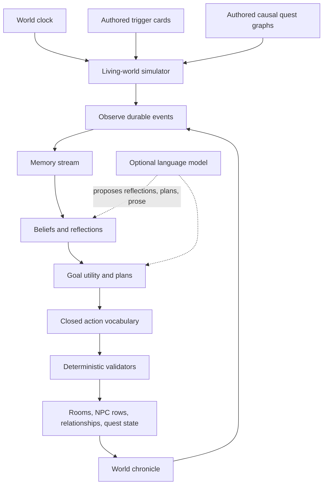

# Living World And NPC Ecosystem

This document is the source of truth for the autonomous NPC, memory,
relationship, trigger, and quest systems. It extends [NPC And Actor
Design](NPCS.md): `NPCS.md` defines what an individual actor is, while this
document defines what individuals do across rooms and across time.

The goal is not a collection of chatbots. The goal is a causal world whose
people have enough continuity that the player can infer what happened while
they were elsewhere.

## Product Laws

1. **The simulation is authoritative; language models are advisers.** An LLM
   may phrase dialogue, score the importance of a memory, or propose a plan
   from a closed vocabulary. Only deterministic validators mutate the world.
2. **NPCs act without an audience.** Important individuals keep schedules,
   travel, meet, exchange information, pursue goals, and trigger consequences
   while their rooms are dormant.
3. **Author causes, simulate consequences.** Authors specify motives,
   capabilities, secrets, dependencies, and irreversible thresholds. They do
   not script every step after an intervention.
4. **Information has a location and a carrier.** An NPC knows a fact only
   because they observed it, inferred it, read it, or heard it from someone.
   Rumours move at the speed of people and can distort as they travel.
5. **Quests are causal graphs, not task lists.** A quest node can be advanced
   by a player, an NPC, a faction, time, or another world event. Its result can
   unlock, invalidate, transform, or conceal other nodes.
6. **Absence creates evidence, not arbitrary punishment.** Off-screen failures
   leave warnings and aftermath: changed routines, witnesses, objects,
   notices, tracks, letters, and dialogue. A meaningful loss is discoverable.
7. **Simulation fidelity follows attention.** Active rooms use exact grid
   movement. Dormant rooms use room-level travel and event resolution. Both
   produce the same durable world events.
8. **Every autonomous action is inspectable.** Development builds retain a
   world chronicle containing the triggering facts, chosen goal, action,
   outcome, and state changes.

## Inspiration Translated Into Mechanics

The Generative Agents architecture contributes:

- an append-only memory stream of observations;
- retrieval scored by recency, importance, and relevance;
- reflection that synthesizes observations into beliefs;
- hierarchical planning that turns a daily intention into executable steps;
- observation and reaction that can interrupt a plan.

The game adapts those ideas rather than reproducing an LLM call for every
decision. Retrieval and goal selection are deterministic and cheap. An LLM is
reserved for high-value reflection or dialogue, and every generated result is
validated against a closed schema.

Baldur's Gate contributes companion convictions, approval with reasons,
interjections, personal breaking points, and relationships that are not all
about the player.

Dark Souls contributes intersecting journeys, characters who relocate for
their own reasons, discoverable aftermath, and quest states that are not
presented as a checklist of correct answers.

FictionLab-style story cards become typed trigger definitions. A card is
eligible because world-state predicates are true, not merely because the LLM
noticed a keyword.

## Runtime Shape



There is one simulator for the world, not one asynchronous task per NPC. It
runs under the same top-level mutation lock as the room ticker.

The simulator must also be the authority boundary between the two existing
representations of an NPC:

- while a room is active, its in-memory `NPC` is authoritative and the
  database row may be stale until save;
- while a room is dormant, the persistent row is authoritative.

A background database worker must never mutate an NPC whose room is active.
The coordinator resolves the authority first, then changes the correct
representation under the world lock. Narrative-critical changes write through
immediately.

### Simulation cadence

- One **world minute** is the canonical unit for schedules and travel.
- The time scale is configuration, not content. The initial tuning target is
  one real minute to five world minutes.
- The hot loop wakes coarsely. It advances from the last committed world time
  to the current target time in bounded slices.
- On restart, catch-up is capped. The default candidate is eight world hours
  per real absence, with the remainder represented as a quiet interval rather
  than silently playing an entire season.
- A catch-up pass commits atomically after each slice and is deterministic for
  the same world seed, time range, and starting state.

The final time scale and catch-up cap are player-experience decisions and stay
configurable.

### Two simulation fidelities

**Active room**

- The NPC has a concrete tile, destination tile, and path.
- Locomotion uses the existing collision rules and room connections.
- Players see movement through ordinary state broadcasts.
- Combat, dialogue, and player obstruction can interrupt the plan.

**Dormant room**

- Movement inside a room is abstracted.
- Cross-room travel consumes authored connection travel time.
- Meetings and actions resolve against durable rows.
- Entering an active room materializes the NPC at a valid entry tile.

Moving between fidelities must not duplicate an action. Each planned action
has a stable id and a committed lifecycle: `planned -> travelling -> resolved`
or `cancelled`.

## NPC State

The existing `npcs` row remains the actor's physical state. New concerns use
separate tables so an existing save can gain the living world through
`create_all` without rewriting the established row.

### Authored ecosystem profile

Stored in version-controlled content and keyed by stable persona id:

- traits and convictions;
- needs and their preferred satisfiers;
- occupations and home/work/social locations;
- weekly schedule anchors;
- capabilities from a closed vocabulary;
- private secrets and initial beliefs;
- long-term goals;
- relationship seeds;
- trigger-card subscriptions;
- mortality and relocation policy;
- dialogue boundaries and companion breaking points.

Authored knowledge in `npcs.json` remains the seed for known facts. Dynamic
knowledge is stored as memory and belief state.

### Persistent runtime records

**World state**

- world seed;
- simulated timestamp and last real timestamp;
- calendar/day phase;
- global variables and faction resources;
- simulation revision.

NPC references in every new record use the authored persona id, not the
numeric database id or runtime `npc_<row>` id. Resetting seed data can replace
row ids; story identity must survive it. The first persistence migration adds
and backfills a unique, indexed `npcs.content_id`.

**Memories**

- observer NPC;
- kind: observation, conversation, rumour, reflection, promise, plan, outcome;
- normalized subject/object identifiers;
- short natural-language summary;
- structured tags and source chain;
- importance and confidence;
- world timestamp;
- last recalled timestamp;
- optional expiry or superseding memory.

**Relationships**

Directional NPC-to-NPC and NPC-to-player records:

- affinity;
- trust;
- fear;
- respect;
- obligation/debt;
- intimacy;
- grievance;
- familiarity;
- last meaningful interaction;
- authored flags such as family, oath, employer, or rival.

These are separate axes. A character may love, fear, and distrust the same
person.

**Goals and plans**

- goal kind and authored origin;
- target identifiers;
- priority and urgency;
- preconditions;
- progress;
- deadline;
- status and failure reason;
- current closed-vocabulary plan steps;
- last reconsidered time.

**World events / chronicle**

- stable event kind;
- actor, witnesses, room, and related quest;
- public summary and private structured payload;
- world timestamp;
- visibility and discovery state.

**Quest state**

- arc and node id;
- dormant, available, active, resolved, failed, transformed;
- activator and resolution cause;
- timestamps;
- per-player discovery separate from global truth.

## Perception, Memory, And Reflection

Events declare their possible observers. Perception filters them by room,
line-of-sight where relevant, relationship, attention, and senses. Observers
receive memories; nobody receives a global transcript.

Retrieval uses a bounded deterministic score:

```text
score =
    relevance(query tags, memory tags)
  + recency(world time, last recalled)
  + importance
  + relationship salience
  + unresolved-promise bonus
```

Importance has engine defaults: death, betrayal, violence, identity
revelation, a broken promise, a faction order, and a quest threshold are high
importance. Mundane routine is low importance and may be compacted.

Reflection occurs when accumulated importance crosses a threshold, after a
major event, or during an authored quiet schedule block. A reflection is a
belief with supporting memory ids, confidence, and possible goal changes.
The deterministic fallback creates templated beliefs. A model may propose a
more nuanced reflection, but it must cite existing memories and pass schema
validation.

## Decision Model

NPC behavior is utility selection over a closed set of goals and actions.

```text
goal utility =
    authored priority
  + need pressure
  + conviction pressure
  + relationship pressure
  + deadline urgency
  + situational opportunity
  - risk
  - travel cost
  - conflicting commitment cost
```

The winning goal yields a short plan. Schedule anchors are commitments, not
rails: illness, danger, a promise, a faction order, a loved one in distress,
or a player intervention can outweigh work.

Initial autonomous actions:

- wait / sleep / work / eat;
- travel to a room or authored location;
- seek or avoid an individual;
- converse and share a selected fact;
- inspect, collect, deliver, hide, or destroy a quest object;
- post or remove an authored notice;
- help, guard, treat, threaten, flee, or report;
- advance a capability-gated quest node;
- join or leave a party through the existing validated effect path.

The model never invents an executable verb. New verbs enter through code,
tests, and validators.

## Typed Trigger Cards

Trigger definitions live in authored JSON. Each contains:

- stable id and priority;
- scope: NPC, room, faction, quest, or world;
- all/any/not predicates;
- cooldown and maximum firings;
- visibility and witness rules;
- deterministic effect proposals;
- memory/dialogue context unlocked after firing;
- optional follow-up triggers.

Predicate vocabulary includes:

- world time, day, and elapsed duration;
- NPC room, life state, schedule, goal, party, need, or relationship threshold;
- possession or condition of an item/object;
- observed or believed fact with confidence;
- world-event occurrence or absence;
- quest-node state;
- faction resource or suspicion threshold;
- player proximity and discovered evidence.

Effects use a separate closed vocabulary:

- add memory or belief;
- change a relationship axis within bounds;
- add/cancel/reprioritize a goal;
- move or begin travel;
- reveal or transform a quest node;
- set a bounded world/faction variable;
- create a chronicle event;
- hand control to an existing validated item, dialogue, combat, or party effect.

Trigger evaluation records why a card did or did not fire in development
mode. This is essential for authoring a web of consequences without guesswork.

Durable future actions use a scheduled-event table with due time, status,
attempt count, and a unique deduplication key. They do not use one `asyncio`
timer per NPC. Deterministic ordering is `(due time, priority, stable id)`.

## Quest Graphs

Authored quest content separates **truth**, **discovery**, and **resolution**:

- Truth is global world state: Basil received the order.
- Discovery is per player: this player read the reagent invoice.
- Resolution is causal: Basil refused the order because his family, fear, and
  trust crossed defined thresholds.

A quest arc contains nodes and typed edges:

- `requires`: all prerequisites must resolve;
- `opens`: makes another node available;
- `excludes`: closes a mutually exclusive node;
- `transforms`: replaces a node with a consequence variant;
- `accelerates` / `delays`: changes a deadline;
- `reveals`: adds per-player discovery;
- `echoes`: affects another character's arc without making it a prerequisite.

Nodes can be resolved by NPC action. The player does not own the plot.
However, irreversible steps require foreshadowing events so the result feels
caused rather than random.

## First Arc: The Eighth Wheel

The hidden convergence is also known as **The Still-Water Order**. The initial
living-world arc uses the cast already embedded in Oakrun:

- Basil receives a dormant-cell activation order to prepare the well.
- Rowan notices the order's courier chronology does not fit the road.
- Fen's duplicate tally can identify the impossible carriage.
- Edda's map can expose the dead route used to deliver it.
- Wren's memory fragments identify Basil's memory-wiping reagent.
- Maud observes the same reagent's effect on treated roots.
- Elowen reconstructs the order of arrivals from inn records.
- Alys chooses between public calm, protective custody, and arrest.
- Hester and Tom provide physical evidence from horses, wheels, and mud.

The arc is a mesh. Losing one witness closes a route but creates aftermath;
it does not reduce the story to a broken quest marker.

Five player-visible strands can awaken in different orders:

1. **Eight Wheels, Seven Entries** — Fen and Rowan's duplicate tally.
2. **Rest for the Uncounted** — the barrow revenants are old tally-keepers
   guarding an unpaid passage; simply killing them removes the ward that keeps
   the hidden tally safe.
3. **A Root Without Scent** — Maud and Wren connect the orchard cure to
   deliberate suppression of memory and identity.
4. **The Road That Wasn't** — Edda and Hester reconstruct the erased route
   used by the impossible carriage.
5. **Red Glass at Midnight** — the hidden activation plot converges on the
   well.

Two new people close important social gaps:

- **Clara Reed**, Basil's wife and Oakrun's copyist, bridges Rowan's dated
  dispatches, Elowen's records, and Basil's shop books. Love does not make her
  a morality switch: she supports defection only after learning the truth and
  believing her children can survive the escape.
- **Orren Vask**, a courteous Draznan glass factor and the Red King's auditor,
  delivered the order through the dead road. He first discredits Edda and Fen,
  then steals evidence, and resorts to murder only when cornered. If he
  escapes, he becomes a recurring antagonist.

Turning Basil is a stateful consequence, never a persuasion roll. Clara must
know the truth, the family needs a viable evacuation route, and Basil's
attachment, shame, fear, and confidence must cross authored thresholds.

The final outcome is produced from accumulated state:

- Basil obeys and escapes with his family;
- Basil obeys but is caught;
- Basil refuses and asks for protection;
- Basil sabotages the order while pretending obedience;
- Basil is killed, preventing the local experiment but alerting his handlers;
- the order is intercepted before Basil reads it;
- another agent completes part of the experiment after Basil fails.

If Basil obeys, Wren recognizes the first contamination and opens a six-hour
purge window. This preserves consequence without making an off-screen instant
loss opaque. If Basil dies before activation, Orren does not replace him at
the well: Basil's choice remains the experiment's human trigger.

## Player-Facing Surfaces

The default presentation is restrained:

- a **Threads** journal records people, evidence, promises, and open questions,
  not objective GPS markers;
- NPC dialogue and inspection reveal schedule changes and aftermath;
- a compact “recent changes” feed reports only events the character could
  plausibly know;
- an optional **World Chronicle** exposes the full causal log for development
  and players who explicitly opt into it;
- companions can interject when a choice crosses a conviction or relationship
  threshold.

NPCs who are elsewhere remain listed as “last known” only after the player has
learned their routine or received fresh information.

The existing transient event list becomes **Here & Now**. A separate,
player-private **World** drawer contains Threads, Chronicle, and People.
Private discoveries, relationships, and last-seen knowledge must never ride
the current shared room broadcast; they synchronize one-to-one on join and as
private deltas. Normal players see bond words and reasons, not raw scores.

## Implementation Slices

1. Stable authored NPC identity, persistence migrations, and authored-data
   validators: world state, events, memories, relationships, goals, profiles,
   triggers, and quests.
2. Deterministic simulator: time advance, schedules, room-level travel,
   needs, goal selection, durable scheduled events, triggers, and chronicle.
3. Active-room locomotion and safe handoff between exact and coarse
   simulation.
4. Perception, rumour propagation, memory retrieval, reflection, and dialogue
   context.
5. Quest runtime and the Still-Water Order content.
6. Player Threads/Chronicle UI and NPC movement cues.
7. Companion convictions, reactions, and richer relationship effects.
8. Catch-up, balance, simulation replay tests, end-to-end playtests, and
   authoring documentation.

## Test Invariants

- Replaying the same interval from the same database snapshot yields the same
  durable state.
- No NPC can be in two rooms, run two actions, or resolve one action twice.
- A dormant-to-active handoff does not teleport past unpaid travel time.
- NPCs cannot learn events they had no perception or source chain for.
- Relationship values remain bounded and directional.
- Trigger cards cannot execute effects outside the closed vocabulary.
- Quest truth never leaks through a per-player discovery payload.
- Model failure produces deterministic fallback behavior and never pauses the
  simulation.
- Catch-up respects its cap and records the skipped quiet interval.
- Active-room player actions win conflict arbitration over an uncommitted
  off-screen action.
