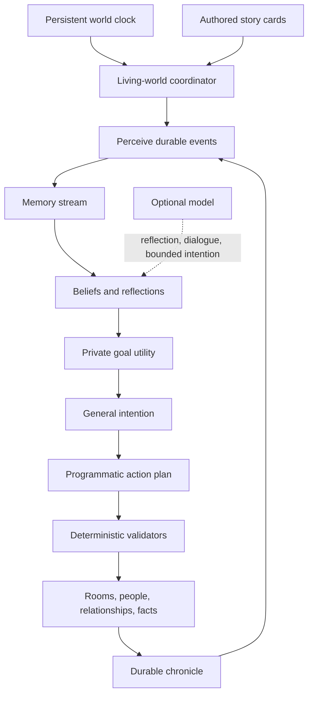

# Living World And NPC Ecosystem

This document is the source of truth for autonomous NPCs, memory,
relationships, rumours, travel, and story triggers. It extends
[NPC And Actor Design](NPCS.md): `NPCS.md` defines what an individual actor is;
this document defines what individuals do across rooms and across time.

The goal is not a collection of chatbots or quest dispensers. The goal is a
causal world whose people have enough continuity that the player can infer
what happened while they were elsewhere.

## Product Laws

1. **The simulation is authoritative; language models are advisers.** A model
   may phrase dialogue, synthesize a reflection, or propose a general
   intention from a closed vocabulary. Only deterministic validators mutate
   world state.
2. **NPCs act without an audience.** Important individuals keep schedules,
   travel, meet, exchange information, pursue private goals, and trigger
   consequences while their rooms are dormant.
3. **There is no quest ontology.** NPCs live according to their own will.
   Players may call an unresolved situation a quest, but the game stores
   facts, promises, relationships, possessions, rumours, and consequences—not
   objectives, quest stages, or completion flags.
4. **Author causes, simulate consequences.** Authors specify motives,
   capabilities, secrets, pressures, and irreversible thresholds. They do not
   script every step after an intervention.
5. **Information has a location and a carrier.** An NPC knows a fact only
   because they observed it, inferred it, read it, or heard it from somebody.
   Rumours move at the speed of people and can distort as they travel.
6. **Dark Souls permanence applies.** Characters may leave, die, reconcile,
   betray somebody, or permanently miss an encounter off-screen. Opportunity
   windows are generous, but the world never waits indefinitely for a player.
7. **Absence creates evidence.** Off-screen changes leave aftermath: altered
   routines, witnesses, possessions, notices, tracks, letters, graves, and
   dialogue. A meaningful loss is discoverable even when it is irreversible.
8. **Simulation fidelity follows attention.** Active rooms use exact grid
   movement. Dormant rooms use room-level travel and event resolution. Both
   produce the same durable world events.
9. **Every autonomous action is inspectable.** Development builds retain the
   triggering facts, chosen goal, intention, programmatic steps, outcome, and
   state changes.

## Inspiration Translated Into Mechanics

The Generative Agents architecture contributes:

- an append-only memory stream of observations;
- retrieval scored by recency, importance, and relevance;
- reflection that synthesizes observations into beliefs;
- hierarchical planning that turns an intention into executable steps;
- observation and reaction that can interrupt a plan.

The game adapts these ideas rather than making a model call for every
decision. Retrieval, utility selection, schedules, travel, and actions are
deterministic and cheap. A model is reserved for high-value reflection and
dialogue; every generated proposal passes a closed schema.

Baldur's Gate contributes companion convictions, approval with reasons,
interjections, breaking points, and relationships that are not all about the
player.

Dark Souls contributes intersecting journeys, permanently missed encounters,
characters who relocate for their own reasons, and discoverable aftermath
without a checklist of correct answers.

FictionLab-style story cards become typed trigger definitions. A card is
eligible because world-state predicates are true, not merely because a model
noticed a keyword.

## Runtime Shape



There is one simulator for the world, not one asynchronous task per NPC. It
runs through the same top-level authority boundary as active rooms.

### Active and dormant authority

The same individual has two possible authoritative representations:

- while their room is active, the in-memory `NPC` is authoritative;
- while their room is dormant, the persistent row is authoritative.

A database worker must never mutate an NPC currently loaded in `RoomState`.
The coordinator resolves authority first, changes the correct representation,
and writes through narrative-critical outcomes immediately.

### Cadence and cost

- One **world minute** is the canonical unit for schedules and travel.
- Time scale is configuration, not authored content.
- Each NPC receives only **three to six meaningful deliberation windows per
  world day**.
- A deliberation chooses or revises a general intention. It is deterministic
  by default and may optionally request a validated model proposal.
- An active schedule commitment is charged only when a private intention
  conflicts with that schedule's destination. The first daily schedule anchor
  is restored by a deterministic, coalesced dormant-room action when needed,
  without adding another deliberation or a permanent per-NPC polling event.
  Its durable scheduled-event record is sufficient for debugging; ordinary
  sleep/hide returns do not become shareable memories or Chronicle chatter.
- Ordinary schedule journeys use their durable scheduled route and final
  position as the audit trail, without Chronicle or shareable-memory chatter.
  A fully dormant route is one timed action whose due minute is the sum of its
  edges; it revalidates every edge and defers if any traversed room becomes
  active. Only private-goal and trigger journeys remain edgewise and add
  witnessed arrival stories plus departure/plan evidence.
- While an arrival action is pending, the NPC row records the last reached
  room for recovery but the person is treated as physically in transit. They
  are excluded from active-room loads, People observation, place-bound
  situations, roommate conversations, and authored `npc_at`/`co_located`
  predicates until arrival or cancellation makes their location authoritative
  again.
- The synchronization fingerprint includes goal definitions, deliberation
  windows, schedule anchors, and relocation policy. A live content revision
  therefore updates goals and replaces any pending return to an obsolete
  overnight anchor without duplicating events.
- One-shot directions authored by situation triggers override ordinary
  routine commitments, then complete when their travel destination is reached.
- Pathfinding, waiting, eating, working, boarding, and approaching a target
  execute programmatically without further model calls.
- Danger, a high-importance observation, or a direct conversation may force
  an unscheduled reconsideration.
- Conversations may cascade: exchanged knowledge can change trust, fear,
  obligation, and the next intention of either participant.
- A recorded death atomically cancels every pending action owned by, or
  addressed to, that NPC. Authored conversations, rumours, travel directions,
  and carriage boarding also recheck life state immediately before applying,
  so a same-minute death cannot leave a posthumous action behind.
- The hot loop advances to due boundaries rather than polling every NPC every
  world minute.
- Restart catch-up is bounded and coalesces routine schedules. It never
  silently simulates an entire season in one pass.

The initial tuning target is one real minute to five world minutes, four
deliberations per ordinary NPC per day, and at most eight hours of narrative
catch-up after an absence. All remain configurable.

### Two simulation fidelities

**Active room**

- the durable intention supplies only a person or destination room;
- deterministic room-graph routing chooses the next visible doorway;
- local steering owns concrete tiles, collision, pauses, and interruption;
- existing collision, occupancy, and connection rules;
- visible movement through normal state broadcasts;
- player obstruction, dialogue, and combat can interrupt a plan.

**Dormant room**

- movement within a room is abstracted;
- cross-room travel consumes authored edge time;
- meetings and actions resolve against durable state;
- entering an active room materializes the NPC at a valid entry anchor.

Each action has a stable id and lifecycle:
`planned -> travelling -> resolved | cancelled`. Changing fidelity cannot
resolve an action twice.

## NPC State

The existing `npcs` row remains physical state. New concerns use additive
tables so existing saves can gain the living world safely.

### Stable identity

Story records use the authored persona id, never the numeric row id or runtime
`npc_<row>` id. Resetting seed data may replace row ids; identity must survive
it. `npcs.content_id` is unique, indexed, and backfilled from `persona.id`.

### Authored ecosystem profile

Version-controlled and keyed by stable identity:

- traits, convictions, and risk tolerance;
- needs and preferred satisfiers;
- occupation, home, work, and social anchors;
- weekly schedule commitments;
- three to six daily deliberation windows;
- capabilities from a closed vocabulary;
- private secrets and initial beliefs;
- private long-term goals;
- relationship seeds;
- trigger-card subscriptions;
- mortality and relocation policy;
- dialogue boundaries and companion breaking points.

### Persistent runtime records

**World state**

- world seed and simulated minute;
- last real timestamp and catch-up checkpoint;
- time scale and simulation revision;
- bounded global/faction facts.

**Memories**

- observer;
- kind: observation, conversation, rumour, reflection, promise, plan, outcome;
- subject/object identifiers and structured tags;
- concise natural-language summary;
- source chain;
- importance, confidence, and valence;
- occurred and last-recalled times;
- optional expiry or superseding memory.

**Relationships**

Directional NPC-to-NPC and NPC-to-player axes:

- affinity;
- trust;
- fear;
- respect;
- obligation;
- intimacy;
- grievance;
- familiarity;
- authored flags such as family, oath, employer, rival.

A person may love, fear, and distrust the same individual. Values never mirror
automatically.

**Private goals and plans**

- goal kind, target, and authored origin;
- priority, urgency, preconditions, and deadline;
- progress and failure reason;
- current bounded intention;
- programmatic plan steps;
- last and next deliberation times.

**World events / chronicle**

- stable event kind and idempotency key;
- actor, targets, witnesses, room, and situation tags;
- private payload and player-safe summary;
- world time, cause, visibility, and provenance.

**Scheduled events**

- due time, priority, stable id, payload;
- status, attempts, and unique deduplication key.

Future actions never use one `asyncio` timer per NPC. Due work resolves in
deterministic order: `(due time, priority, stable id)`.

## Perception, Memory, And Reflection

Events declare possible observers. Perception filters by room, line of sight
where relevant, relationship, attention, and senses. Nobody receives a global
transcript.

Retrieval uses a bounded deterministic score:

```text
score =
    relevance(query tags, memory tags)
  + recency(world time, last recalled)
  + importance
  + relationship salience
  + unresolved-promise bonus
```

Death, betrayal, violence, identity revelation, a broken promise, a faction
order, and an irreversible departure are high importance. Routine is low
importance and may be compacted.

Reflection occurs when accumulated importance crosses a threshold, after a
major event, or during a quiet schedule block. A reflection is a belief with
supporting memory ids and confidence. The deterministic fallback creates
tagged beliefs. A model may propose nuance, but it must cite existing memories
and cannot create mechanics. Deterministic reflection reads only its four
highest-ranked evidence rows and excerpts each cited summary to a fixed bound.
This keeps long-running worlds linear even when one NPC retells another NPC's
conclusion and that retelling later informs a new belief.

## Deliberation And Execution

Goal utility is deterministic:

```text
utility =
    authored priority
  + need pressure
  + conviction pressure
  + relationship pressure
  + deadline urgency
  + situational opportunity
  - risk
  - travel cost
  - conflicting commitment cost
```

The winning goal yields a general intention such as “find Rowan,” “take the
noon carriage east,” “avoid the crossroads,” or “ask Maud about the water.”
Schedule anchors are commitments, not rails.

Initial autonomous actions:

- wait, sleep, work, eat;
- travel to a room or location anchor;
- board or leave a scheduled carriage; a player journey advances the same
  shared clock by its full route duration rather than teleporting the world;
- seek or avoid an individual;
- converse and share a selected belief;
- inspect, collect, deliver, hide, or destroy a meaningful object;
- post or remove a notice;
- help, guard, treat, threaten, flee, or report;
- act on a capability-gated situation;
- join or leave a party through existing validated effects.

A model never invents an executable verb.

## Conversations And Rumours

Truth, belief, and rumour remain separate:

- **truth** is what actually happened;
- **belief** is what one individual currently thinks, with confidence and a
  source;
- **rumour** is a belief transmitted to another person.

When two NPCs converse, a deterministic selector chooses a few salient,
shareable memories based on goals, secrecy, relationship, urgency, and recent
events. The receiver gains a sourced rumour memory with adjusted confidence.
Some speakers copy precisely; others simplify, dramatize, conceal, or plant
misinformation according to authored traits.

The exchange may change relationships or satisfy a `seek_person` intention.
If new information makes another private goal urgent, a bounded follow-up
conversation or unscheduled deliberation may fire. Cascades have depth and
daily budgets so one rumour cannot create an infinite loop. Once a simulation
slice reaches its conversation budget, later deliberations do not enqueue
additional conversation roots for that same slice.

## Typed Story Cards

Each authored card has:

- stable id, priority, scope, cooldown, and maximum firings;
- all/any/not predicates;
- visibility and witness rules;
- closed deterministic effects;
- an optional, bounded `chronicle_summary` describing the local evidence
  left by a story turn, without exposing private causes or hidden state;
- an optional, closed `chronicle_location_id` that binds that evidence to a
  validated authored place and subjects the place to active-room authority;
- memory/dialogue context unlocked after firing;
- optional follow-up cards.

Predicates may inspect:

- world time and elapsed duration;
- NPC room, life state, schedule, need, goal, party, or relationship;
- item/object possession or condition;
- observed/believed fact and confidence;
- world-event occurrence or absence;
- rumour state and provenance;
- faction resource or suspicion;
- player proximity and personally discovered evidence.

Effects may:

- add a memory or belief;
- change a bounded relationship axis;
- add, cancel, or reprioritize a private goal;
- begin programmatic travel;
- create, confirm, distort, or disprove a rumour;
- set a bounded world/faction fact;
- schedule a future event;
- create a chronicle entry;
- hand control to an existing validated item, dialogue, combat, or party
  effect.

Cards cannot contain code or free-form state mutations. Development mode
records why a card did or did not fire.

## Situations, Not Quests

Authored content defines people, places, possessions, dangers, rumours, and
initial pressures. It does not define a quest graph or canonical player route.

Promises and personal goals can create natural obligations. A player may
carry a letter, help somebody travel, investigate a disappearance, or agree
to meet at dusk. The game remembers the promise and people react if it is kept
or broken, but it never labels the exchange “Quest Accepted.”

Characters can solve their own problems while the player is elsewhere.
Opportunity windows are generous because deliberation is sparse, but they are
permanently missable.

## The Wider World

The black rot should be confusing before it becomes legible. Oakrun hears
incompatible stories carried by travellers:

- some insist the rot first appeared in a distant kingdom and travel there
  for proof, family, trade, pilgrimage, or profit;
- some call it crop sickness, punishment, a border weapon, an alchemical
  spill, or a story invented to close roads;
- refugees describe effects that contradict courier dates;
- carriages arrive with mud, passengers, or travel times inconsistent with
  their claimed route.

The main conspiracy remains distant pressure rather than the first local plot.
Early play follows ordinary people trying to understand, reach, flee, study,
or exploit the place where the rot was first experienced.

The first world expansion builds three connected contexts:

- **Amberfall:** Oakrun's pastoral home kingdom, warm waystations and farming
  country where the rot is still disputed.
- **Veyr:** the eastern kingdom travellers believe experienced the rot first;
  damaged settlements, displaced families, researchers, opportunists, and
  mutually exclusive testimony.
- **Drazna's Crownlands:** lake-and-spire country connected by Edda's erased
  routes, important to travellers and old infrastructure but not automatically
  the source of the rot.

Fields and roads connect them through carriage stages, footpaths, hostile
passes, ruined tolls, and rare shortcuts. Carriages follow real timetables,
carry NPCs and rumours, can be delayed or destroyed, and create temporary
meetings between people who otherwise never share a room.

### Temporary Oakrun–Drazna Bridge

During chapter development, an ordinary two-way door connects Oakrun's
Fieldsite Verge `(16, 1)` to Drazna's Lantern Quays `(0, 9)`. This isolated
bridge is explicitly not frontier discovery: it creates no `FrontierNode`,
does not consume Drazna's real Lantern Quays gateway at `(0, 6)`, and does not
open the Drazna carriage stop. The intended release loop still discovers
Drazna through procedural frontier generation. Remove or disable
`TEMPORARY_OAKRUN_DRAZNA_BRIDGE` when direct playtest access is no longer
needed.

## Player-Facing Surfaces

Presentation remains restrained:

- **Rumours** records only stories the player heard or evidence they found,
  with source and confidence rather than objectives;
- **People** shows bond words, last-seen information, observable activity,
  witnessed wounds or deaths, and evidence-shaped absences—never omniscient
  plans or off-screen condition changes;
- **Chronicle** records witnessed, heard, and personally discovered changes,
  including eligible public aftermath and a bounded, per-player history that
  survives later syncs and client reloads;
- NPC dialogue and inspection reveal changed schedules and aftermath;
- companions interject when a choice crosses a conviction or relationship
  threshold.

The existing transient event list becomes **Here & Now**. A player-private
**World** drawer contains Rumours, Chronicle, and People. Private discoveries
and relationships never ride shared room broadcasts.

## Implementation Slices

1. Stable NPC identity and additive persistence for time, events, scheduled
   work, memories, relationships, private goals, trigger firings, and facts.
2. Closed authored validators for profiles, rumours, cards, kingdoms, routes,
   carriage services, and schedules.
3. Deterministic clock, due queue, three-to-six daily deliberations, needs,
   schedules, and room-level travel.
4. Active-room locomotion and safe exact/coarse authority handoff.
5. Perception, conversational rumour propagation, memory retrieval,
   reflection, and dialogue context.
6. Amberfall, Drazna, and Rouvray routes, residents, carriage services, hostile
   passages, and the initial rot-rumour gradient.
7. Rumours, Chronicle, People, activity, last-seen, and while-away UI.
8. Companion convictions, multi-day balance simulations, replay tests,
   end-to-end playtests, and authoring documentation.

## Test Invariants

- Replaying the same interval from the same snapshot yields the same durable
  state.
- No NPC can be in two rooms, run two actions, or resolve an action twice.
- Every ordinary NPC has three to six scheduled deliberations per day.
- Programmatic movement never requires a language-model call.
- A dormant-to-active handoff does not skip unpaid travel time.
- NPCs cannot learn events they had no perception or source chain for.
- Rumour cascades respect depth and daily budgets.
- Relationships remain bounded and directional.
- Story cards cannot execute effects outside the closed vocabulary.
- Hidden truth never leaks through a player rumour payload.
- Model failure produces deterministic fallback behavior and never pauses the
  simulation.
- Catch-up respects its cap and records coalesced quiet time.
- Active-room player actions win arbitration over an uncommitted off-screen
  action.
- Mutually exclusive story and situation outcomes claim one immutable fact key
  through a database uniqueness constraint; losing transactions apply no
  effects and create no firing or Chronicle residue.
- Off-screen death requires the profile's explicit permission and its full
  count of warning memories from earlier simulated minutes.
- A named NPC killed in active combat is written through with witnessed
  Chronicle evidence before traversal or room eviction can occur.
- Synchronizing an authored region may replace its internal graph, but never
  deletes an external frontier- or runtime-owned edge.
