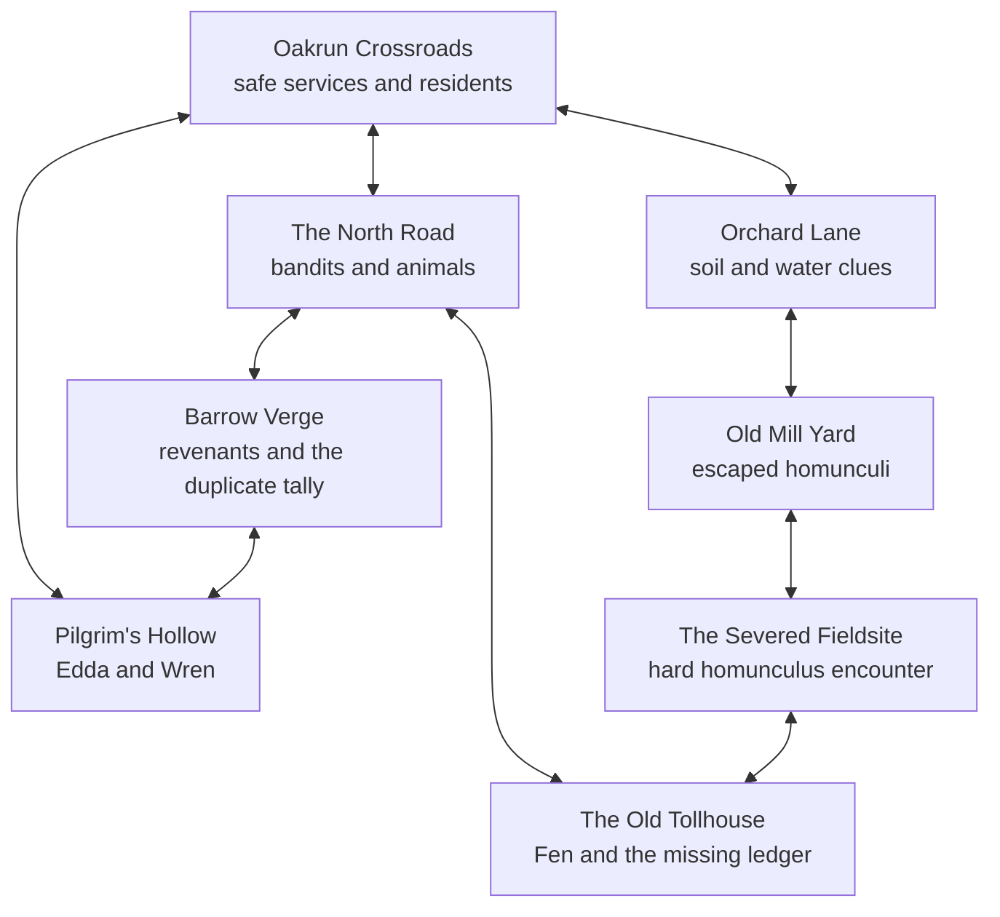

# Oakrun Starting Region

Oakrun is the first authored region and the player's emotional baseline:
ordinary people, comprehensible work, warm rooms, and roads that are only
beginning to contradict the maps. The mystery is delivered through repeated
details rather than a quest exposition.

## Room Graph

The graph deliberately contains two loops. Barrow Verge reconnects the north
road to Pilgrim's Hollow; the mill and fieldsite reconnect the quiet orchard
route to the tollhouse. Exploration can therefore reveal a shortcut and a new
interpretation of a familiar road rather than only unlocking the next room.

## Evidence Threads

Four threads cross rooms and NPC testimony:

1. **The impossible carriage.** Fen counted a sealed carriage that never
   passed the previous toll. Rowan finds the chronology impossible, Hester
   knows the route was closed, and Alys notices the ledger thief left silver.
2. **The erased eastern road.** Broken waystones, Edda's map, the mill track,
   and Draznan road knowledge establish that a politically erased route still
   functions.
3. **Black water.** Maud's roots, the cider press, mill silt, fieldsite
   cistern, Tom's road mud, and Basil's unusually effective treatment form one
   physical chain.
4. **Wren's missing history.** Wren remembers Draznan phrases and fieldsite
   machinery. Basil saved their life but appears to have erased useful memory.

No single speaker owns the answer. NPC persona documents contain explicit
`knowledge` and `relationships`, so dialogue can compare known people and
events without inventing omniscient world facts.

## Cast Shape

- **Anchors:** Elowen, Hester, Alys, Maud, and Tom make Oakrun feel inhabited
  and worth returning to.
- **Chronology witnesses:** Rowan and Fen hold complementary pieces of the
  impossible-carriage record.
- **Distant-world bridge:** Edda makes Drazna and the erased eastern route
  concrete before the player can reach either.
- **Mystery witness:** Wren embodies the human cost of the fieldsite and
  Basil's cure.
- **Hidden contradiction:** Basil remains a genuinely helpful neighbour whose
  knowledge and evasions read differently once other evidence accumulates.

Edda and Wren grant `join_party`. Their policies are intentionally generous
once the player is friendly and treats their goals seriously. Owned living
followers now cross authored room boundaries with their player and persist
their new room immediately.

## Content Ownership

`content/world/oakrun/region.json` owns topology. Each room lives under
`content/world/oakrun/rooms/`. The database receives validated synchronized
copies; combat state and individual history remain runtime-owned.
