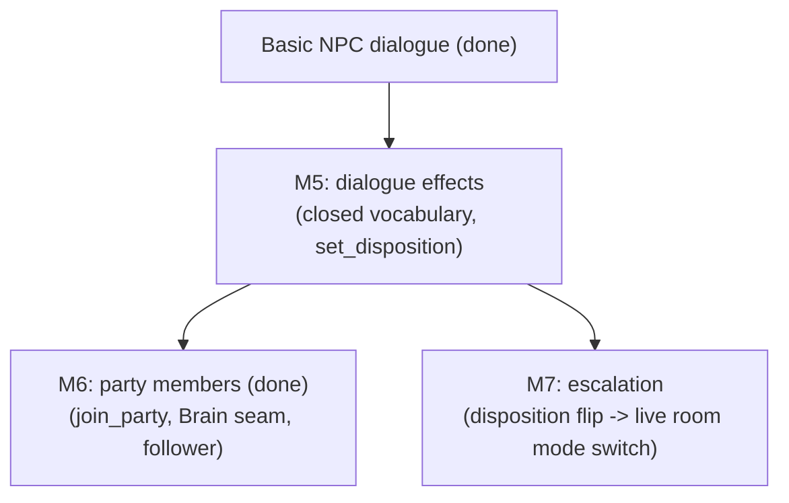

# Roadmap

This roadmap keeps three ideas separate:

- **Now**: what exists or is being cleaned up.
- **Next**: the next MVP milestone to build.
- **Later**: important ideas that should not distract the next milestone.

## Now: Current Reality

The current system — room registry, door traversal, turn-based combat,
exploration mode, and their accepted limitations — is documented in one place:
[Current Architecture](ARCHITECTURE.md). In one line: multiple rooms can be
live in one process, combat rooms resolve in rounds, peaceful rooms move at
exploration speed, and everything is server-authoritative.

## Next: NPCs That Matter

Goal: what an NPC agrees to can actually happen — recruit a follower, or
talk your way into (and out of) a fight.

Milestones 1 (room runtime boundary), 2 (door/portal traversal), 3
(exploration mode), 4 (NPC dialogue + individual persistence), 5
(dialogue effects — the validated closed-vocabulary channel), and 6 (party
members — the `Brain` seam + `join_party`) are done and folded into Current
Reality above. The old "combat-room integration" milestone dissolved: its
static half (combat and exploration rooms coexisting, traversal between them)
shipped with M3–M4, and its dynamic half (a room *switching* modes live) is
exactly the escalation feature, now Milestone 7.

### Milestone 3: Exploration Mode (done)

Shipped against its definition of done:

- Non-combat rooms allow immediate movement without waiting for all players. ✔
- Combat rooms still use the existing turn-based loop. ✔
- The server owns movement validation in both modes (one shared handler
  path — the mode only chooses timing and allowed actions). ✔
- The client shows whether the room is exploration or combat. ✔

### Milestone 4: Basic NPC Dialogue (done)

Design source of truth: [NPC And Actor Design](NPCS.md) — actor axes (no
NPC/enemy taxonomy), the two-channel dialogue rule, and the follower/party
deferral.

Shipped against its definition of done:

- A room can contain a simple NPC definition. ✔ (NPC instance rows — the
  Antechamber's caretaker Gorrik; rooms never list NPCs, see NPCS.md
  Decision 9)
- The client can open a one-on-one dialogue panel. ✔
- The server sends player text plus NPC context to the dialogue layer. ✔
  (LLM via the `DialogueProvider` seam, canned fallback, hard timeout)
- The response is displayed to the player. ✔
- NPC dialogue cannot mutate game state directly. ✔ (text channel only;
  the effect channel is the next slice)

Beyond the floor: NPCs persist as individuals (eviction saves their row),
and dialogue memory survives restarts as a bounded transcript.

### Milestone 5: Dialogue Effects (done)

Design source of truth: NPCS.md "Dialogue: Two Channels". The LLM's reply
gains a second, structured channel: effect proposals drawn from a **closed
vocabulary**, validated by the engine in context, applied through the same
`apply_effect` path combat uses. AI proposes, the engine disposes — prompt
injection can only propose what the validator refuses.

Shipped against its definition of done:

- The dialogue provider returns `(text, effect proposals)` instead of text
  alone (`DialogueReply`); canned replies never propose. ✔ (`GridProvider`
  parses a `{"say", "effects"}` JSON envelope; a non-JSON completion degrades
  to text-only, never to canned — a real reply is never discarded.)
- `set_disposition` works end to end: a validated proposal flips the NPC's
  disposition field and emits a `disposition_changed` event players see. ✔
  (trusted engine effect `SetDisposition` in the `effects.py` union)
- Invalid/unknown/out-of-context proposals are dropped silently; the text
  still shows. Rejections are logged for tuning. ✔ (`dialogue_effects.py` —
  the pure, websocket-free validate→apply seam)
- The persona document tells the LLM what it is allowed to propose. ✔ (the
  closed vocabulary + JSON envelope live in `build_prompt`'s system framing;
  a per-NPC allowlist was deliberately deferred until a second effect makes
  per-NPC capability meaningful — M6's `join_party`)

Scope held tight: flipping to hostile only writes the field + emits the event
(the NPC recolors, a line logs). It does NOT switch room mode or start a
fight — that escalation is Milestone 7, which reads this same field.

Smallest slice on purpose: one effect proved the whole pipe (parse →
validate → apply → event). Every later effect is vocabulary, not machinery.

### Milestone 6: Party Members (done)

Design source of truth: NPCS.md "Followers / Party Members". Recruitment is
a dialogue effect, not a new system.

Shipped against its definition of done:

- `join_party` / `leave_party` entered the closed vocabulary, validated by
  engine rules (must be alive, willing via the persona `grants` allowlist,
  friendly, unattached, and the owner under `PARTY_SIZE_CAP`). Declining is
  just text. ✔ (`dialogue_effects.py`; the validator gained a `player`
  argument because party effects are genuinely per-player)
- `npcs.party_owner_id` landed (nullable String, not a FK — player ids are
  runtime strings until the `players`/identity table exists); membership
  survives room resets and restarts as data. ✔
- The `Brain` seam arrived — the second behavior justified the abstraction
  (NPCS.md "abstract at the second behavior"). The hardcoded enemy chase is
  now `ChaseBrain`, the follower's defend-my-owner is `FollowerBrain`, and
  `select_brain(actor)` picks the brain FROM the actor's disposition + party
  data each round, so "enemy" is just data. A brain proposes an `Intent`; the
  engine disposes it through the same rule primitives players obey. ✔
  (`brains.py`, `systems.resolve_actor_phase`)
- Followers remain room-bound (NPC traversal stays deferred): the loop is
  parley → recruit → your ally fights beside you in that room → still there
  when you return. Demonstrable now via Mara, a recruitable sellsword seeded
  into the combat hall. ✔

Deferred with a named revisit-trigger: **rebinding** a returning player to
its follower (party_owner_id persists as data, but reconnection-matching
needs the identity decision), a **global** party cap (the v1 cap counts a
room's loaded followers; a cross-room count needs the owner-centric
`players` query), and full unification of NPC actions onto the player
`HANDLERS` (revisit when a third brain or an NPC-initiated ability arrives —
today followers reuse the same rule *primitives*, not the same handler
objects).

### Milestone 7: Escalation (absorbs old combat-room integration)

Design source of truth: NPCS.md core model + [Future Ideas](FUTURE.md).
Room mode stops being a load-time inference and derives from live state:
"is a living actor hostile to players present?"

Definition of done:

- Insulting the caretaker (a `set_disposition` proposal to hostile) flips
  the room to combat: rounds, timers, the works.
- Hostile NPCs acting as enemies would and attacking the player on their turn.
- The last hostile dying — or a mid-combat parley flipping the last
  hostile's disposition back — returns the room to exploration.
- Clearing a seeded combat room makes it explorable without a reload.

## Later: Good Ideas To Defer

These belong in the project, but not before the exploration loop works. The
design thinking for all of them lives in [Future Ideas](FUTURE.md):

- Per-room locks and the fuller room runtime architecture.
- Persistent player accounts (`players` table — blocked on the identity
  decision: how a returning connection claims its row).
- Inventory that follows players between rooms.
- Object pickup, opening, destruction, and item effects.
- AI-generated room creation on first visit; generated personas through the
  existing persona gate.
- NPC traversal (followers crossing rooms) and per-player relationships.
- World clock and time pressure.
- Faction simulation.
- Hazards and random events with fair telegraphs.
- Event sourcing and replay.
- Postgres production database.
- Redis routing and pub/sub.
- Gateway/lobby service.
- Multiple room workers.

## Senior-Dev Rule Of Thumb

Build the smallest version that proves the gameplay loop, then harden the
architecture around the proven loop.

For this project, that means:

1. Keep the current combat engine. (holding)
2. Add room traversal in one process. (done)
3. Add exploration movement timing. (done)
4. Add simple exploration interactions — NPC dialogue. (done)
5. Let dialogue change the world through a validated effect channel, then
   spend that machinery twice: recruitment and escalation.
6. Only then decide what persistence, identity, and scale features have earned
   their complexity.
