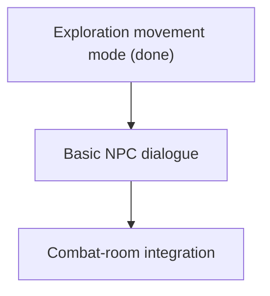

# Roadmap

This roadmap keeps three ideas separate:

- **Now**: what exists or is being cleaned up.
- **Next**: the next MVP milestone to build.
- **Later**: important ideas that should not distract the next milestone.

## Now: Current Reality

The project currently has:

- One FastAPI process.
- One WebSocket endpoint.
- A room registry: `active_rooms` maps room ids to live `RoomRuntime`s, each
  owning one `RoomEngine`/`RoomState`, its players' sockets, and its round timer.
  Rooms load lazily from the DB on first entry and are evicted when empty.
- Door/portal traversal: stepping onto a connected door emits a
  `PLAYER_ENTERED_DOOR` event; the server transfers the player (hp/id/name
  preserved) to a free spawn in the destination and sends `room_changed`.
- Room-scoped broadcasts — players only receive events for their own room.
- Turn-based combat with movement, attacks, wait, bombs, and enemy turns.
- Room modes (`backend/modes.py`): combat rooms buffer actions into rounds;
  exploration rooms resolve valid moves immediately, with no round timers and
  no waiting on other players. Both modes share the same handlers and
  validation. Mode is inferred at load time (enemies → combat, peaceful →
  exploration) and sent to the client, which shows it and hides combat-only
  controls in exploration rooms.
- Action handlers, effects, and events.
- SQLAlchemy models for rooms, room connections, and enemy definitions.
- Seeded room data stored in SQLite.
- Validation for room layouts, terrain, spawns, objects, enemies, and room
  connections.
- A loader that turns DB room rows (including their outgoing connections) into
  runtime `RoomTemplate`.
- Server state that includes room dimensions, room identity, and object
  summaries.
- Browser rendering for variable-size rooms, room transitions, room metadata,
  object markers, and first-pass object inspection.
- Tests covering DB setup, validation, seeding, loading, the room registry,
  and traversal (including a Hall/Antechamber round trip).

Known current limitations:

- Room mode is inferred from content (enemies present → combat); there is no
  authored `mode` column yet to override the inference.
- Evicted rooms have no memory — enemies respawn from the seed on the next
  visit (persistence is deliberately deferred).
- An enemy standing on a door tile blocks traversal until it moves.
- Objects can be inspected for text, but they cannot be opened, picked up, or
  used yet.
- NPCs and dialogue are not implemented.
- Disconnect removes a player from the live game.

## Next: Exploration MVP

Goal: a player can move through a small connected world, talk to a basic NPC,
and enter combat without rewriting the combat engine.

Milestones 1 (room runtime boundary), 2 (door/portal traversal), and 3
(exploration mode) are done and folded into Current Reality above. The
registry went slightly beyond the original "one active room" floor: multiple
rooms can be live at once, each broadcasting only to its own players — the
single-process seam that later maps onto the
[Future Backend](FUTURE_BACKEND.md) routing design.

### Milestone 3: Exploration Mode (done)

Shipped against its definition of done:

- Non-combat rooms allow immediate movement without waiting for all players. ✔
- Combat rooms still use the existing turn-based loop. ✔
- The server owns movement validation in both modes (one shared handler
  path — the mode only chooses timing and allowed actions). ✔
- The client shows whether the room is exploration or combat. ✔

### Milestone 4: Basic NPC Dialogue

Definition of done:

- A room can contain a simple NPC definition.
- The client can open a one-on-one dialogue panel.
- The server sends player text plus NPC context to the dialogue layer.
- The response is displayed to the player.
- NPC dialogue cannot mutate game state directly.

First NPC data can be hand-authored. Add AI after the shape is clear.

### Milestone 5: Combat-Room Integration

Definition of done:

- Some rooms are exploration rooms.
- Some rooms are combat rooms.
- Entering a combat room uses the current turn-based engine.
- Leaving or finishing combat returns the player to exploration.

The success condition is not "big MMO." It is "the game loop is real."

## Later: Good Ideas To Defer

These belong in the project, but not before the exploration loop works:

- Room runtime architecture from [World Architecture Proposal](WORLD.md).
- Persistent player accounts.
- Inventory that follows players between rooms.
- Object pickup, opening, destruction, and item effects.
- AI-generated room creation on first visit.
- NPC friendship and followers.
- NPC death/friendship state.
- World clock and time pressure.
- Faction simulation.
- Hazards and random events with fair telegraphs.
- Event sourcing and replay.
- Postgres production database.
- Redis routing and pub/sub.
- Gateway/lobby service.
- Multiple room workers.

## Senior-Dev Rule Of Thumb

Build the smallest version that proves the gameplay loop, then harden the
architecture around the proven loop.

For this project, that means:

1. Keep the current combat engine. (holding)
2. Add room traversal in one process. (done)
3. Add exploration movement timing. (done)
4. Add simple exploration interactions — NPC dialogue next.
5. Only then decide what persistence, identity, and scale features have earned
   their complexity.
