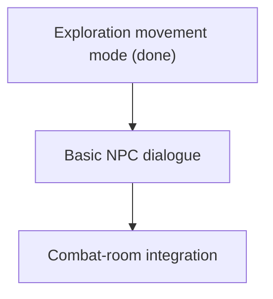

# Roadmap

This roadmap keeps three ideas separate:

- **Now**: what exists or is being cleaned up.
- **Next**: the next MVP milestone to build.
- **Later**: important ideas that should not distract the next milestone.

## Now: Current Reality

The current system — room registry, door traversal, turn-based combat,
exploration mode, and their accepted limitations — is documented in one place:
[Current Architecture](ARCHITECTURE.md). In one line: multiple rooms can be
live in one process, combat rooms resolve in rounds, peaceful rooms move at
exploration speed, and everything is server-authoritative.

## Next: Exploration MVP

Goal: a player can move through a small connected world, talk to a basic NPC,
and enter combat without rewriting the combat engine.

Milestones 1 (room runtime boundary), 2 (door/portal traversal), and 3
(exploration mode) are done and folded into Current Reality above. The
registry went slightly beyond the original "one active room" floor: multiple
rooms can be live at once, each broadcasting only to its own players — the
single-process seam that later maps onto the
[Future Ideas](FUTURE.md) routing design.

### Milestone 3: Exploration Mode (done)

Shipped against its definition of done:

- Non-combat rooms allow immediate movement without waiting for all players. ✔
- Combat rooms still use the existing turn-based loop. ✔
- The server owns movement validation in both modes (one shared handler
  path — the mode only chooses timing and allowed actions). ✔
- The client shows whether the room is exploration or combat. ✔

### Milestone 4: Basic NPC Dialogue

Design source of truth: [NPC And Actor Design](NPCS.md) — actor axes (no
NPC/enemy taxonomy), the two-channel dialogue rule, and the follower/party
deferral.

Definition of done:

- A room can contain a simple NPC definition.
- The client can open a one-on-one dialogue panel.
- The server sends player text plus NPC context to the dialogue layer.
- The response is displayed to the player.
- NPC dialogue cannot mutate game state directly.

First NPC data can be hand-authored. Add AI after the shape is clear.

### Milestone 5: Combat-Room Integration

Definition of done:

- Some rooms are exploration rooms.
- Some rooms are combat rooms.
- Entering a combat room uses the current turn-based engine.
- Leaving or finishing combat returns the player to exploration.

The success condition is not "big MMO." It is "the game loop is real."

## Later: Good Ideas To Defer

These belong in the project, but not before the exploration loop works. The
design thinking for all of them lives in [Future Ideas](FUTURE.md):

- Per-room locks and the fuller room runtime architecture.
- Persistent player accounts.
- Inventory that follows players between rooms.
- Object pickup, opening, destruction, and item effects.
- AI-generated room creation on first visit.
- NPC friendship and followers.
- NPC death/friendship state.
- World clock and time pressure.
- Faction simulation.
- Hazards and random events with fair telegraphs.
- Event sourcing and replay.
- Postgres production database.
- Redis routing and pub/sub.
- Gateway/lobby service.
- Multiple room workers.

## Senior-Dev Rule Of Thumb

Build the smallest version that proves the gameplay loop, then harden the
architecture around the proven loop.

For this project, that means:

1. Keep the current combat engine. (holding)
2. Add room traversal in one process. (done)
3. Add exploration movement timing. (done)
4. Add simple exploration interactions — NPC dialogue next.
5. Only then decide what persistence, identity, and scale features have earned
   their complexity.
