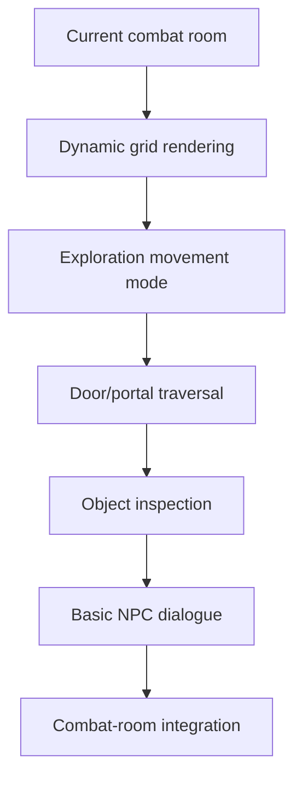

# Roadmap

This roadmap keeps three ideas separate:

- **Now**: what exists or is being cleaned up.
- **Next**: the next MVP milestone to build.
- **Later**: important ideas that should not distract the next milestone.

## Now: Current Reality

The project currently has:

- One FastAPI process.
- One WebSocket endpoint.
- One global `Game`.
- One in-memory `WorldState`.
- Turn-based combat with movement, attacks, wait, bombs, and enemy turns.
- Action handlers, effects, and events.
- SQLAlchemy models for rooms, room connections, and enemy definitions.
- Seeded room data stored in SQLite.
- Validation for room layouts, terrain, spawns, objects, enemies, and room
  connections.
- A loader that turns DB room rows into runtime `LevelData`.
- Tests covering DB setup, validation, seeding, and loading.

Known current limitations:

- The frontend grid is hardcoded to 10x10.
- The backend can load variable-size rooms, but the UI cannot render them yet.
- Room connections exist in the DB, but players cannot traverse them.
- Objects exist in room data, but players cannot inspect or use them.
- NPCs and dialogue are not implemented.
- Disconnect removes a player from the live game.

## Next: Exploration MVP

Goal: a player can move through a small connected world, inspect simple objects,
talk to a basic NPC, and enter combat without rewriting the combat engine.

### Milestone 1: Dynamic Room Rendering

Definition of done:

- Backend state includes room width and height.
- Frontend builds the grid from backend dimensions.
- Existing 10x10 combat still works.
- The seeded 7x5 antechamber can render correctly once loaded.

Why first: the backend already supports variable rooms, but the UI does not.
Traversal work will feel broken until this mismatch is fixed.

### Milestone 2: Room Runtime Boundary

Definition of done:

- The current `Game` still runs one room.
- Room identity is explicit in runtime state.
- The code has a small place to ask, "what room is this session running?"
- No multi-worker architecture is introduced.

Likely shape:

- Keep `Game` for now.
- Add only the smallest room/session seam needed for traversal.
- Avoid a big `RoomManager` until multiple active rooms truly need it.

### Milestone 3: Door And Portal Traversal

Definition of done:

- A player can step onto a door/portal tile.
- The server finds the matching `room_connections` row.
- The destination room loads from the DB.
- The player appears at a sensible destination spawn.
- The client receives and renders the new room state.

First version can be simple:

- One player transitions.
- One active room at a time is acceptable.
- No cross-process routing.
- No procedural generation yet.

### Milestone 4: Exploration Mode

Definition of done:

- Non-combat rooms allow immediate movement without waiting for all players.
- Combat rooms still use the existing turn-based loop.
- The server owns movement validation in both modes.
- The client can show whether the room is exploration or combat.

Senior-dev habit: do not duplicate movement rules. Share the grid and position
model; let the room mode decide timing and allowed actions.

### Milestone 5: Object Inspection

Definition of done:

- Room objects are sent to the client.
- Clicking or selecting an object can request an inspection.
- The server returns a description.
- A chest may optionally reveal a simple item, but inventory can stay minimal or
  mocked until the item model is ready.

Keep this boring on purpose. Examination proves interaction without exploding
scope into crafting, puzzles, keys, and complex item use.

### Milestone 6: Basic NPC Dialogue

Definition of done:

- A room can contain a simple NPC definition.
- The client can open a one-on-one dialogue panel.
- The server sends player text plus NPC context to the dialogue layer.
- The response is displayed to the player.
- NPC dialogue cannot mutate game state directly.

First NPC data can be hand-authored. Add AI after the shape is clear.

### Milestone 7: Combat-Room Integration

Definition of done:

- Some rooms are exploration rooms.
- Some rooms are combat rooms.
- Entering a combat room uses the current turn-based engine.
- Leaving or finishing combat returns the player to exploration.

The success condition is not "big MMO." It is "the game loop is real."

## Later: Good Ideas To Defer

These belong in the project, but not before the exploration loop works:

- Room runtime architecture from [World Architecture Proposal](WORLD.md).
- Persistent player accounts.
- Inventory that follows players between rooms.
- AI-generated room creation on first visit.
- NPC friendship and followers.
- NPC death/friendship state.
- World clock and time pressure.
- Faction simulation.
- Hazards and random events with fair telegraphs.
- Event sourcing and replay.
- Postgres production database.
- Redis routing and pub/sub.
- Gateway/lobby service.
- Multiple room workers.

## Senior-Dev Rule Of Thumb

Build the smallest version that proves the gameplay loop, then harden the
architecture around the proven loop.

For this project, that means:

1. Keep the current combat engine.
2. Add room traversal in one process.
3. Add simple exploration interactions.
4. Only then decide what persistence, identity, and scale features have earned
   their complexity.
