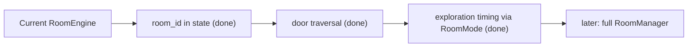
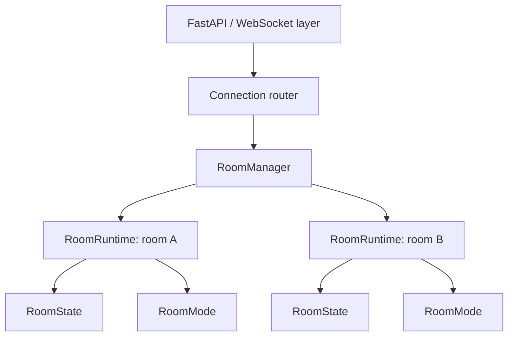
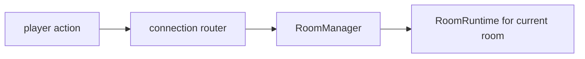
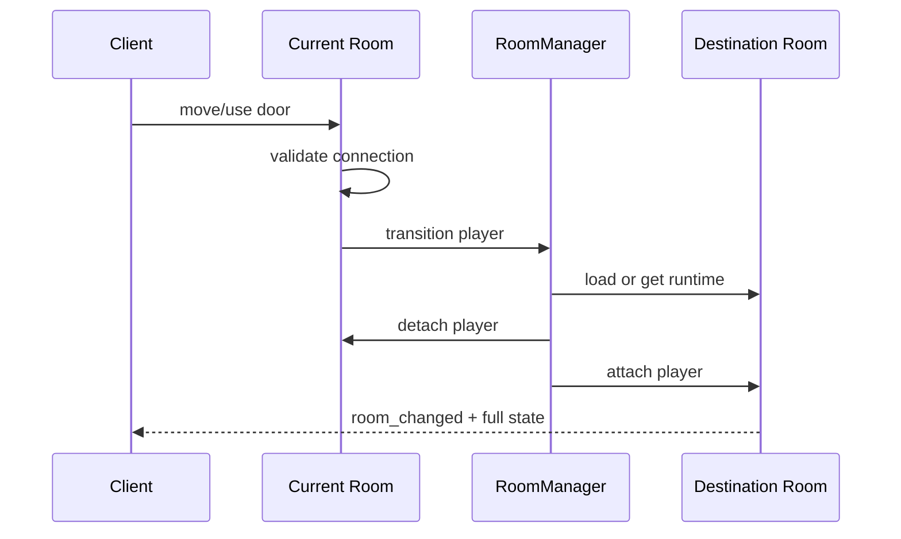
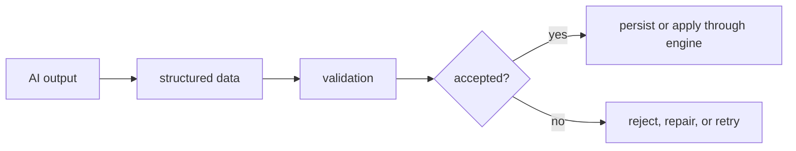
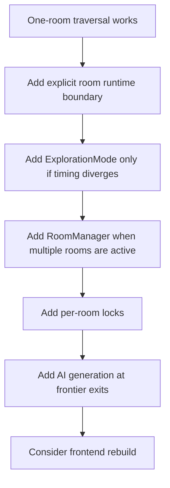

# World Architecture Proposal

This document keeps the larger open-world architecture ideas in one place:
`RoomMode`, `RoomManager`, per-room locks, traversal, AI seams, and a possible
future frontend structure.

## Status

Proposal, kept for design thinking.

Use this document when asking, "What should the architecture become if the
exploration loop works?" Do not treat it as a checklist to implement all at
once.

## Fit With Current Architecture

The proposal matches the direction of the project, but it is ahead of the code.

| Topic | Current code | This proposal |
|---|---|---|
| Runtime owner | `RoomRuntime` per active room in an `active_rooms` registry | many room runtimes ✔ (single process) |
| Live state | one `RoomState` per active room | one `RoomState` per active room ✔ |
| Locking | one global `asyncio.Lock` | one lock per active room (deferred) |
| Room loading | on demand via `get_or_load_room`, evict-on-empty | load rooms on demand ✔ |
| Room traversal | done: door event → detach/attach transfer | first-class transition flow ✔ |
| Modes | done: `TurnBasedMode` / `ExplorationMode` in `backend/modes.py` | combat and exploration modes ✔ |
| Client | static HTML/JS | possible React/TypeScript/Vite DOM app later |
| AI | not in runtime yet | validated generation and NPC action seams |

The registry (`active_rooms` + `player_room` in `backend/main.py`) is the
small in-process version of `RoomManager` + connection router below — the
same contract, so scaling later swaps the wiring, not the game rules.

The near-term plan should still stay smaller:



## Core Principles

1. **One grid model, two timing models.** Exploration and combat should share
   terrain, entities, validation habits, effects, and events. They differ in
   when actions resolve.
2. **Room is the unit of runtime ownership.** A room is the natural boundary for
   locking, loading, dormancy, generation, and future worker ownership.
3. **AI proposes data, the engine validates.** AI may generate rooms, NPC
   definitions, dialogue, item effects, and action proposals. It must not mutate
   live state directly.
4. **Do not simulate empty rooms by default.** A room with no players should be
   dormant unless a specific persisted scheduled event exists.
5. **Build the small version first.** Room traversal in one process comes before
   a full room runtime framework.

## Proposed Runtime Shape

Eventually, today's `RoomEngine` can become a room runtime rather than the whole
application.



Suggested concepts:

- `RoomRuntime`: owns one active room's `RoomState`, lock, connections, timers,
  and broadcast behavior.
- `RoomMode`: decides how submitted actions are accepted and resolved.
- `RoomManager`: loads, caches, and evicts active room runtimes.
- Connection router: maps `player_id -> room_id` inside the current process.

Do not introduce all of this before one-room traversal works. The first
implementation can keep `RoomEngine` and add only explicit room identity.

## RoomMode

`RoomMode` is the main abstraction in this proposal. It now exists
(`backend/modes.py`) — Milestone 3 was the moment the code truly needed both
immediate exploration actions and batched combat actions. The built version
matches the sketch below, minus `RoomRuntime` coupling: `RoomEngine` delegates
`submit_action` to its mode.

Conceptual interface:

```python
class RoomMode(ABC):
    @abstractmethod
    def submit(
        self,
        room: RoomRuntime,
        player_id: str,
        action: Action,
    ) -> list[GameEvent]:
        """Accept player intent and return events to broadcast."""
```

Two likely modes:

| Mode | Resolution | Good for |
|---|---|---|
| `TurnBasedMode` | buffer actions, resolve when all submit or timeout fires | combat |
| `ExplorationMode` | validate and resolve immediately | walking, examining, talking |

The important rule: modes may change scheduling, but they should not fork the
core rules engine. Movement validation, effects, and events should stay shared
where practical.

### Tripwire

If `ExplorationMode` requires many special cases inside combat handlers or
effects, the abstraction is wrong. Stop and redesign the boundary before adding
more features.

## RoomManager

`RoomManager` becomes useful when more than one room can be active at the same
time.

Potential responsibilities:

- `get_or_load(room_id)`.
- Create a `RoomRuntime` from DB template data.
- Keep `dict[room_id, RoomRuntime]`.
- Evict dormant rooms.
- Route player actions to the current room.
- Move a player from one room runtime to another.

First version can be single-process only:



Later, this maps naturally to the multi-worker design in
[Future Backend](FUTURE_BACKEND.md), where Redis replaces the in-process routing
dictionary.

## Per-Room Locks

The current global lock is fine at this scale, even with several rooms live —
it also guarantees a room can never be double-loaded, since all registry
reads and writes happen under it.

Once multiple rooms are active, each room should own its own lock:

- Combat in room A should not block exploration in room B.
- A room's state should still mutate serially.
- Timed work for a room should acquire that room's lock.

Do not add distributed locks for the one-process milestone. A distributed lock
is a future scaling smell unless there is a proven multi-process ownership
problem.

## Traversal

Traversal is the first feature that points toward the room architecture.

The near-term version is built, following exactly this shape:

1. Player moves onto a door/portal tile. ✔
2. Server validates the move. ✔
3. Server looks up the connection (preloaded into `RoomTemplate.connections`). ✔
4. Server loads the destination room if dormant. ✔
5. Server places the player at the first free arrival spawn. ✔
6. Server sends the traveler `room_changed` with full room state. ✔

Longer-term traversal can become a formal `Transition` effect:



The current schema only stores the origin tile. For robust traversal, add:

- `to_x`
- `to_y`
- `kind` such as `door`, `portal`, `stairs`, or `path`

Until those exist, the first destination spawn point is acceptable.

## Timed Work

There should be no global heartbeat just to make the world feel alive.

Prefer lazy, room-owned scheduling:

```python
def schedule(self, delay: float, callback) -> asyncio.Task:
    """Run callback later under this room's lock."""
```

Examples:

- Combat timeout.
- NPC chooses to act after a delay.
- A scripted room event fires while players are present.

Rules:

- Timed work belongs to a room.
- Dormant rooms cancel in-memory timers.
- Timer callbacks re-enter the same validated action/effect/event path.
- Durable scheduled events need database support later; do not fake that with
  in-memory timers.

## AI Seams

AI should appear at content boundaries first.

| Seam | Trigger | Output | Validation |
|---|---|---|---|
| Room generation | reaching an ungenerated exit | terrain, objects, spawns, lore, connections | room validation |
| NPC dialogue | player talks to NPC | text response, memory summary | dialogue policy and state rules |
| NPC action | NPC decides to act | normal `Action` | same action validation as players |
| Item generation | loot/reward creation | item definition and effect data | closed effect vocabulary |

AI output should become structured data before it affects mechanics.

Good rule:



## NPC Brains

NPC behavior can eventually use a strategy-like interface:

```python
class Brain(ABC):
    def decide(self, view: WorldView) -> Action | None:
        ...
```

Recommended order:

1. Static NPC descriptions.
2. One-on-one dialogue.
3. Scripted behavior.
4. LLM-assisted dialogue.
5. LLM-assisted action proposals.
6. NPC-to-NPC behavior only after cost and debugging are understood.

An LLM-driven NPC should still be "just another action submitter" from the
engine's perspective.

## Client Direction

The current client is static HTML/JS. That is fine while traversal and
exploration timing are being proven.

A future React/TypeScript/Vite DOM client may become useful when:

- UI state becomes hard to reason about.
- Dialogue, inventory, map, journal, and inspection panels grow.
- The grid needs better diffing instead of rebuilding.
- Tests or type safety would clearly reduce bugs.

Do not rebuild the frontend before traversal works. The current DOM client can
already render backend-provided room dimensions, room metadata, object markers,
and first-pass object inspection.

Possible future structure:

```text
frontend/
  net/      socket and message routing
  store/    server-state mirror plus local UI state
  grid/     grid renderer and grid input
  ui/       panels for dialogue, inventory, lore, events
  main.ts
```

Keep the renderer DOM-based. Canvas is a "millionaire-budget exception": only
reconsider it with dedicated rendering time, a much larger budget, and a proven
DOM performance problem. It would make layout, hit testing, accessibility, text,
and ordinary UI panels more custom than this grid-first game needs.

For the frontend source of truth, see [Frontend Design](FRONTEND_DESIGN.md).

## Adoption Plan

Use this order if the simple exploration plan starts to strain:



## Things To Avoid

- Rewriting combat just to make the names prettier.
- Adding `RoomManager` before there are multiple active rooms.
- Adding React/TypeScript/Vite before the existing client blocks progress.
- Calling LLMs while holding a room lock.
- Letting AI output bypass validation.
- Writing live session changes back into `rooms`.
- Adding Redis before there is more than one process.

## Open Questions

- ~~Should the first exploration movement reuse `Action`, or have a smaller
  message shape that later becomes an `Action`?~~ Answered: it reuses
  `Action` — same parse, same handler validation, only the timing differs.
- ~~Should room mode be stored in the `rooms` table, inferred from content, or
  configured in code until it earns a column?~~ Answered for now: inferred
  from content in `load_room` (enemies → combat). It earns a column when
  authored content needs to override the inference.
- ~~When a player traverses alone, does the old room remain active for other
  players?~~ Answered: yes — the registry keeps every room with players in it
  live, each broadcasting only to its own players. Empty rooms are evicted.
- Should object effects open the inventory path immediately, or stay as
  descriptive interactions until traversal and dialogue work?
- How much NPC memory is needed before dialogue feels coherent?

## Recommendation

Keep this document as the ambitious architecture target. Build from
[World Exploration Plan](WORLD_EXPLORATION_PLAN.md) first.

The correct next move is still small: traversal and exploration timing are
built; next comes hand-authored NPC dialogue.
