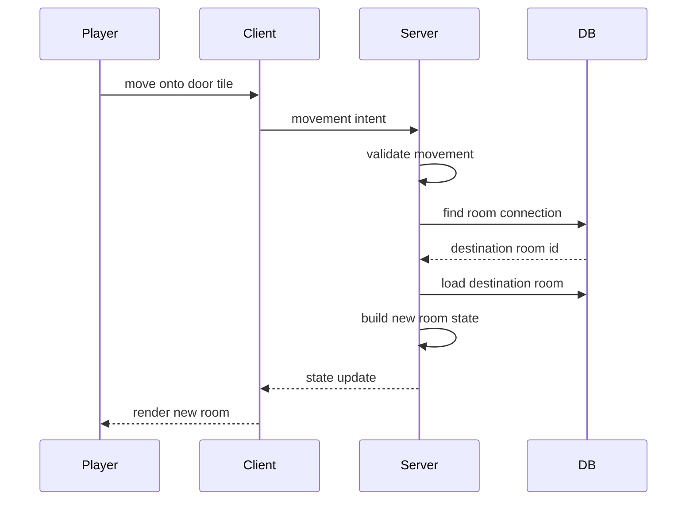
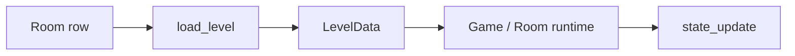

# World Exploration Plan

This is the practical bridge between the current combat prototype and the next
coding milestone. It intentionally avoids Redis, multi-worker routing, full
auth, and autonomous NPC simulation.

For the larger architecture that may come after this simple loop works, see
[World Architecture Proposal](WORLD.md).

## Goal

Let a player explore connected rooms in the browser:



## Design Constraints

- Server remains authoritative.
- One process is fine.
- One active room at a time is acceptable for the first traversal version.
- Do not rewrite combat.
- Do not build a distributed room service yet.
- Keep AI out of the first traversal path; hand-authored room data is enough.

## Current Foundation

Already available:

- `Room`, `RoomConnection`, and `EnemyDef` models.
- Seeded default room and antechamber.
- Door tiles in terrain.
- Validation for door/portal connection origins.
- `load_level(session, room_id)` for turning a DB room into runtime data.
- `Game(level)` for running combat from `LevelData`.
- Server state includes room identity, width, height, and object summaries.
- The browser renders variable-size room grids and room metadata.
- The browser can inspect visible room objects through the server.

Missing:

- Runtime use of current `room_id` for traversal.
- Destination arrival coordinates.
- An exploration movement path that does not wait for a combat round.

## Proposed Implementation Order

### 1. Represent Room Mode

Add a room mode concept before adding many actions:

```text
exploration: immediate movement and interaction
combat: turn-based action submission
```

At first, the mode can come from room metadata or a simple default. If metadata
is not in the schema yet, start with a conservative server-side rule and promote
it to persisted data once the behavior is understood.

### 2. Add A Minimal Room Runtime Seam

Keep the shape small:



Possible first step:

- Store the current `room_id` next to `Game`.
- When traversal happens, load a new `LevelData`.
- Replace or rebuild the runtime for that destination room.

This is not the final MMO shape, but it proves traversal without inventing a
large room orchestration layer too early.

### 3. Support Door Traversal

Add server logic:

- Detect when a player enters a door/portal tile.
- Query `RoomConnection` by `from_room_id`, `from_x`, and `from_y`.
- Load the destination room.
- Place the player at a destination spawn.
- Broadcast the new state.

The current schema only stores the origin tile. Soon after traversal works, add:

- `to_x`
- `to_y`
- possibly `kind` such as `door`, `portal`, or `path`

Until then, using the first destination spawn is acceptable.

### 4. Add Exploration Movement

Exploration movement should not wait for every player to submit a turn.

Keep the same validation instincts:

- Is the player alive/present?
- Is the target in bounds?
- Is the tile passable?
- Is the tile occupied?
- Does the tile trigger traversal?

The difference is timing: apply movement immediately in exploration rooms.

### 5. Add Basic NPC Dialogue

Dialogue adds UI and server state, so it should stay small and hand-authored at
first.

First NPC shape:

- `id`
- `name`
- `position`
- `description`
- `personality`
- `dialogue_context`

Dialogue state should be scoped to a player and NPC. The NPC response may come
from a model, but any gameplay effects must still become validated data before
they affect the world.

### 6. Add Object Effects When They Earn It

Object inspection exists. Opening chests, damaging barrels, rewards, and
inventory should come later through the same validated action/effect/event path
used by combat.

## What Not To Build Yet

- Multiple active room workers.
- Redis pub/sub.
- Reconnect routing.
- Account auth.
- Persistent inventory.
- Procedural generation during traversal.
- NPC autonomous schedules.
- Complex traps or hazards.

## First Exploration Definition Of Done

The first satisfying milestone is:

- Player starts in the pillared hall.
- Player can move to a door.
- Server loads the antechamber.
- Frontend renders the antechamber correctly.
- Player can move back.
- Object markers and inspection still work after the room changes.
- Existing combat still works.

That is the point where the project stops being only a combat prototype and
becomes the beginning of an explorable world.
