# The Three Crown Roads

This is the authored regional foundation for the living world. It keeps the
black rot confusing on purpose: Drazna owns the first *verified public record*,
but no surviving evidence proves that Drazna is where the rot began. By the
time that distinction reaches Oakrun, most tellings have collapsed it into
“the rot came from Drazna.”

The regional content contains no tracked quests, objectives, or canonical
correct order. People have schedules, needs, beliefs, private desires, and
finite opportunities. They continue living when players are absent. A player
may witness, influence, interrupt, misunderstand, or miss what those people do.

## Geography

```mermaid
flowchart LR
    O["Oakrun<br/>Amberfall waystation"]
    A["Alderwick<br/>Amberfall capital"]
    H["Hollowmere Post<br/>last eastern toll"]
    D["Drazna Lantern Quays<br/>first verified rot record"]
    C["Drazna High Crown<br/>sluices and court"]
    P["Hollow Bells Post<br/>Rouvrain border"]
    B["Bellifont<br/>Rouvray capital"]
    F["Orison Fields<br/>southern coach road"]

    O -- "Oak and Crown · 12h" --> A
    O -- "Unharvested Miles · 9h" --> H
    H -- "Glasswater Causeway · 18h" --> D
    D -- "Lantern Climb · 45m" --> C
    C -- "Hollow Bells Pass · 21h" --> P
    P -- "Bell Road · 7h" --> B
    B -- "Orison Road · 1h50" --> F
    F -- "Long Penance · 24h" --> A
```

The playable regional gateways use stable room identities:

| Kingdom | Gateway | Stable id | Purpose |
|---|---|---|---|
| Amberfall | Oakrun Crossroads | `oakrun_crossroads` | Starting home, inn, market, stable, and shared carriage exchange |
| Drazna | Lantern Quays | `drazna_lantern_quays` | Arrival among ferries, refugees, salvage crews, and visible black-water damage |
| Rouvray | Hollow Bells Post | `hollow_bells_post` | Border arrival through a damaged high pass |

### Amberfall

Amberfall is the safe-distance kingdom: orchard shires, hedges, wool roads,
warm inns, and institutions that receive eastern news weeks late. Oakrun is
small enough that every arrival changes the local story. Its blackened roots
and mill silt are physical facts, but residents still lack a shared name for
them.

People travel through Amberfall because the roads still offer food, work,
replacement horses, and believable normality. People travel out because each
new Draznan account makes the eastern confusion harder to ignore.

### The Draznan Crown

Drazna is a lake kingdom rebuilt upward after old floods. Its inhabited wards
stand on palace heights, slate slopes, timber bridges, quays, and the roofs of
older streets. The House of Names preserves the oldest widely accepted
black-rot account. It also preserves fragments that make the clean “Drazna was
the beginning” story doubtful.

Drazna is not a ruin waiting for heroes. It has work shifts, ferry arguments,
rent, salvage claims, court disputes, maintenance failures, missing relatives,
and people who cannot agree whether public truth or immediate survival comes
first.

The complete playable chapter, including its nineteen-room graph, dedicated
interiors, living situations, and Gate Seven outcomes, is documented in
[Drazna Kingdom Chapter](DRAZNA.md).

Its first resident web is deliberately interdependent:

- Mara Vey needs the sluices and the city to survive disclosure.
- Alin Vey wants testimony heard while witnesses still live.
- Ilya Sorn can repair the lower pressure station but has implicated himself.
- Nera Bell restores people omitted from the flood memorial.
- Olek Var controls crews and sells access without owning every route.
- Pava Mirek keeps the Walking Ward standing while searching for Vasko.
- Vasko Mirek is alive below the declared floodline for only a finite window.
- Vesna Korr protects local dry routes from both the Crown and opportunists.
- Drina Sable protects an uncensored arrival book above the quay.
- Teo Latch balances the Crown against the Low Lantern until a sold list
  exposes both sides.
- Rada Velic keeps Gate Seven stable while hiding what the old closure cost.
- Sima Dren braces Walking Ward and may carry a rescue line below.
- Luka Nen remembers all fourteen closure workers.
- Odran Third-Bell holds the deepest gate and can be killed, contained, or
  reached through the surviving cadence.

### Rouvray

Rouvray is a limestone country of cathedrals, physic gardens, vineyards,
hospices, and bell roads. It has seen the rot in patients and cargo without
living inside Drazna's daily water crisis. That middle distance produces
competing certainties. Hospice staff burn contaminated belongings; roadside
penitents turn those fires into a rumor that Rouvray burns refugees.

Sabine Vauclair leaves its best-equipped hospice for Drazna because samples
and testimony no longer agree. Matthieu Orne drives the long southern coach
and may abandon a paid run rather than deliver passengers to an inspection
mob.

## Roads Are Gameplay

Travel is deterministic. An NPC may decide “seek Drazna,” “return to
Bellifont,” or “avoid the crossroads,” but code selects a legal route, pays
travel time, respects carriage hours, and resolves danger.

The first hostile passages are:

| Passage | Route | Pressure | Readable warning |
|---|---|---:|---|
| Barrow Turn | Oakrun north road | 58 | Horses sweat before the crowned stones are visible |
| Scentless Runoff | Orchard to old mill | 52 | Birds stop where wet soil loses its smell |
| Fieldsite Cut | Old mill to fieldsite | 76 | Grass lies outward from apparently shallow pits |
| Briarwash Verge | Oakrun to Alderwick | 36 | Fresh-cut briar appears beside idle milestones |
| Unharvested Miles | Oakrun to Hollowmere | 68 | Gold rye stands black at the base beside cold farms |
| Glasswater Black Mile | Hollowmere to Drazna | 86 | White causeway stones turn mirror-black |
| Undertide Mouth | Drazna low-water descent | 81 | Yesterday's safe chalk ends below today's water |
| Hollow Bells Pass | Drazna to Rouvray | 79 | Cracked bells ring upslope in still air |
| Penitent Mile | Rouvray to Amberfall | 63 | Unlicensed shrines demand that eastern goods be burned |

Pressure is an input to movement and encounters, not a prose suggestion.
Local guides, low water, weather, guards, or a paid toll may provide an
authored bypass. None guarantees safety.

## Shared Carriage Network

Carriages are public world infrastructure. They are not private unlock lists.
An operating stop and its public name are shared by every player; individual
players may still know different rumors about the road.

| Service | Stops | Scheduled travel | Frontier service |
|---|---|---:|---|
| Oak and Crown | Oakrun ↔ Alderwick | 12 hours | No |
| Grey Heron | Pilgrim's Hollow ↔ Hollowmere ↔ Drazna | 27 hours before layover | Yes |
| Bell and Reed | Alderwick ↔ Orison Fields | 24 hours | Yes |
| Mudwheel | Lantern Quays ↔ High Crown ↔ Birch Heights | 80 minutes | No |

Each service has weekday operating windows, departure minutes, capacity,
fare, layover, route-risk cancellation rules, and an NPC operator with their
own safety threshold. Fast travel advances world time, moves the party
together, and resolves route pressure. It is a compressed journey, not
teleportation.

Generated frontier rooms may gain a carriage waystop when they:

- use `amberfall_fields`, `drazna_marches`, `rouvray_lowlands`, or
  `deep_frontier`;
- are at least depth two and have a road connection;
- contain caravan remains, or pass the smaller deterministic eligibility roll.

A new stop begins as **Unnamed Waystop**. The first player who physically
arrives may paint a unique 2–32 character name. That name becomes public and
the operating stop joins the shared network. Generated services depart at
world minutes 360, 720, and 1080.

## Living Opportunities

NPCs deliberate only three to six times per world day. A deliberation can
change a general intention; it does not grant free movement. Schedule anchors,
need pressure, risk tolerance, relationships, beliefs, and private desires
compete at those windows.

Conversation is different. When two people meet, an authored conversation
trigger may continue for several exchanges and may lead directly into another
trigger without charging another deliberation. This allows an inn argument,
roadside warning, or family confrontation to feel continuous while keeping the
simulation inexpensive.

Finite opportunities are intentionally unforgiving:

- Fen has a limited span in which fear, carriage timing, and confidence may
  align long enough for him to board the Grey Heron.
- Edda and Wren can miss their one affordable shared departure; Edda refuses
  to abandon Wren, and both retain memories and physical traces of the choice.
- Vasko's low-water exit closes as the Undertide changes.
- Matthieu may fail to turn his coach away from the Penitent Mile.
- Ilya may descend alone if Mara never comes below the safe waterline.

Missing one does not create a hidden failed task. It changes where people go,
what they remember, whom they trust, and what physical traces remain. Cold
fires, split cases, chalk marks, abandoned maps, wheel tracks, and unlit
memorial ribbons allow players to reconstruct an absence after the fact.

Edda and Wren are deliberately anchored at their Pilgrim's Hollow shelter
until either a player takes them on the road or the authored Grey Heron
departure fires. Hester, Tom, and Maud make short deterministic visits there,
so waiting does not sever their Oakrun relationships. Once the shared carriage
departure carries Edda and Wren to Lantern Quays, ordinary Oakrun routine
anchors cannot silently drag them home the following night.

## Rumor Discipline

Every rumor separates:

- **truth**: the authored world account, including uncertainty;
- **belief**: one person's current claim and confidence;
- **source**: firsthand place, named person and source chain, document,
  official notice, or anonymous report.

No one receives the truth field as dialogue knowledge. They receive their
belief and may pass a distorted version when its confidence and social context
allow. The same carriage therefore moves people, contamination, dates, and
misinformation at the same physical speed.

The fifteen initial rumors cover Drazna's first record, the supposedly closed east
road, carriage contamination, lost names, the old Draznan flood, Undertide
survivors, Rouvrain gate fires, shared dreams, low-water danger, and Basil's
remedy, plus the salt barge, palace drain, sold passenger list, Mudwheel
testimony, and Gate Seven's fourteen-person closure roll.

## Authored Data

- `content/living_world/world.json`: kingdoms, locations, routes, hostile
  passages, carriage timetables, and generated-stop policy.
- `content/living_world/npc_profiles.json`: sixteen persistent core people
  plus twelve additional residents and travellers.
- `content/living_world/rumors.json`: truth, individual beliefs, sources, and
  transmission behavior.
- `content/living_world/triggers.json`: conversation and story triggers,
  deterministic effects, finite windows, and discoverable aftermath.
- `backend/living_world_content.py`: closed-schema and semantic validation for
  all cross-file references.

Unknown fields, unknown executable verbs, dangling people or places, malformed
source chains, invalid timetables, and tracked task-state structures fail
validation before runtime.
