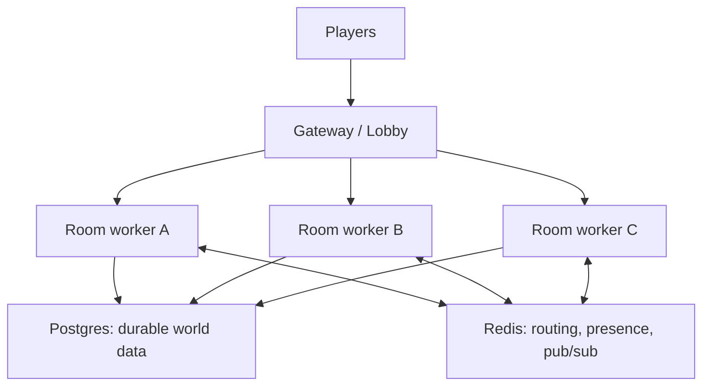
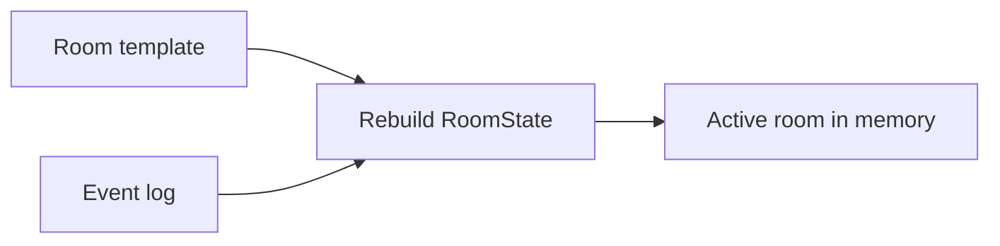

# Future Backend

> **ARCHIVED 2026-07-14.** Merged into [Future Ideas](../FUTURE.md) as the
> scale-out parking lot section.

This document is the parking lot for scale architecture. It is important, but it
is not the next milestone.

Do not implement this before the one-process exploration loop works.

## When This Becomes Relevant

Move toward this architecture when one or more of these are true:

- Multiple rooms need to be active at the same time.
- A single process cannot handle the number of connected players.
- Players need stable accounts, inventory, and reconnect support.
- Generated rooms/items/NPCs become real data worth preserving.
- Deploys or crashes must not wipe active play.

Until then, the current one-process design is a better learning and development
environment.

## Target Shape

Long term, the world can be split by room. Each active room is owned by one
worker, while durable data lives in Postgres and cross-process coordination uses
Redis.

## Storage Tiers

| Tier | Data | Access Pattern | Likely Tool |
|---|---|---|---|
| Durable source of truth | rooms, generated items, players, inventory, event log | low-frequency writes, read-many, must survive restart | Postgres |
| Live room state | active `RoomState` for one room | frequent mutation, deterministic, short-lived | worker memory |
| Coordination | room-to-worker routing, presence, pub/sub | high-frequency, ephemeral, shared across workers | Redis |

## Postgres

Postgres is the likely production database once many processes or real player
data exist.

Use it for:

- Canonical generated rooms.
- Generated item definitions.
- Player identity.
- Inventory.
- Durable event logs.
- World graph edges.

Do not put the per-round combat hot loop in Postgres. Combat should run from
memory and persist important outcomes at the edges.

## Worker Memory

An active room should be owned by exactly one worker at a time. That worker keeps
the room's live `RoomState` in memory and resolves actions locally.

This preserves the current good property:

- Simple in-process lock.
- Deterministic resolution.
- No distributed lock in the combat loop.

## Redis

Redis becomes useful only once there is more than one process.

Use it for:

- Finding which worker owns a room.
- Finding where a connected player currently lives.
- Publishing messages between workers.
- Presence and short-lived routing state.

Avoid using Redis as the durable source of truth. If data must survive a restart,
it belongs in Postgres.

## Gateway / Lobby

The gateway gives players one stable endpoint. It can:

- Authenticate or identify a player.
- Find the player's current room.
- Route the WebSocket to the worker that owns that room.
- Handle reconnects within a grace window.

This is useful later, but it is too much ceremony for the next exploration pass.

## Event Sourcing

An append-only event log can eventually let a worker rebuild a room after a
crash:

Snapshots can speed up replay, but the event log should remain the durable
history.

## Migration Path

The sensible path is incremental:

1. Prove one-process room traversal.
2. Persist the minimum data that players care about.
3. Add account identity when inventory/progression needs an owner.
4. Move from SQLite to Postgres when real durable data exists.
5. Add multiple room runtimes inside one process if needed.
6. Split room workers across processes only after one process is a real limit.
7. Add Redis and gateway routing when cross-worker messaging is unavoidable.

## Main Risk

Distributed systems create bugs that look nothing like game bugs: stale routing,
split ownership, duplicated messages, dropped presence, and reconnect edge cases.

That complexity is worth paying for later. It is not worth paying before the
core exploration loop is fun.
