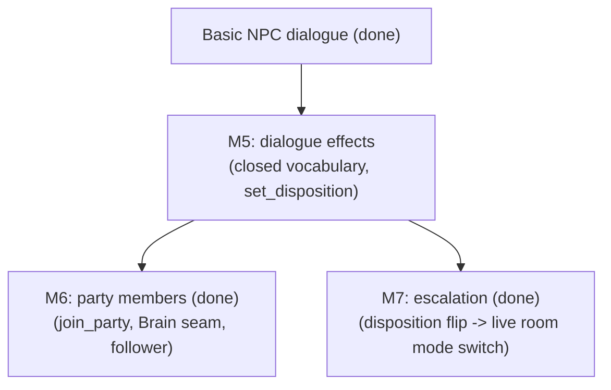

# NPC Arc Milestones (M3–M7) — Completed

> Archived 2026-07-16. These are the detailed definition-of-done write-ups for
> the "NPCs That Matter" arc, moved out of [ROADMAP.md](../ROADMAP.md) when the
> arc closed. The living description of what these milestones built is in
> [Current Architecture](../ARCHITECTURE.md); the design sources of truth
> remain [NPCS.md](../NPCS.md) and [GAME_DESIGN.md](../GAME_DESIGN.md).

Goal of the arc: what an NPC agrees to can actually happen — recruit a
follower, or talk your way into (and out of) a fight.

Milestones 1 (room runtime boundary), 2 (door/portal traversal), 3
(exploration mode), 4 (NPC dialogue + individual persistence), 5
(dialogue effects — the validated closed-vocabulary channel), 6 (party
members — the `Brain` seam + `join_party`), and 7 (escalation — live derived
room mode) are done. The old "combat-room integration" milestone dissolved:
its static half (combat and exploration rooms coexisting, traversal between
them) shipped with M3–M4, and its dynamic half (a room *switching* modes live)
shipped as M7's escalation. With M7, the goal above closed: you can recruit a
follower, and talk your way into — and out of — a fight.

## Milestone 3: Exploration Mode (done)

Shipped against its definition of done:

- Non-combat rooms allow immediate movement without waiting for all players. ✔
- Combat rooms still use the existing turn-based loop. ✔
- The server owns movement validation in both modes (one shared handler
  path — the mode only chooses timing and allowed actions). ✔
- The client shows whether the room is exploration or combat. ✔

## Milestone 4: Basic NPC Dialogue (done)

Design source of truth: [NPC And Actor Design](../NPCS.md) — actor axes (no
NPC/enemy taxonomy), the two-channel dialogue rule, and the follower/party
deferral.

Shipped against its definition of done:

- A room can contain a simple NPC definition. ✔ (NPC instance rows — the
  Antechamber's caretaker Gorrik; rooms never list NPCs, see NPCS.md
  Decision 9)
- The client can open a one-on-one dialogue panel. ✔
- The server sends player text plus NPC context to the dialogue layer. ✔
  (LLM via the `DialogueProvider` seam, canned fallback, hard timeout)
- The response is displayed to the player. ✔
- NPC dialogue cannot mutate game state directly. ✔ (text channel only;
  the effect channel is the next slice)

Beyond the floor: NPCs persist as individuals (eviction saves their row),
and dialogue memory survives restarts as a bounded transcript.

## Milestone 5: Dialogue Effects (done)

Design source of truth: NPCS.md "Dialogue: Two Channels". The LLM's reply
gains a second, structured channel: effect proposals drawn from a **closed
vocabulary**, validated by the engine in context, applied through the same
`apply_effect` path combat uses. AI proposes, the engine disposes — prompt
injection can only propose what the validator refuses.

Shipped against its definition of done:

- The dialogue provider returns `(text, effect proposals)` instead of text
  alone (`DialogueReply`); canned replies never propose. ✔ (`GridProvider`
  parses a `{"say", "effects"}` JSON envelope; a non-JSON completion degrades
  to text-only, never to canned — a real reply is never discarded.)
- `set_disposition` works end to end: a validated proposal flips the NPC's
  disposition field and emits a `disposition_changed` event players see. ✔
  (trusted engine effect `SetDisposition` in the `effects.py` union)
- Invalid/unknown/out-of-context proposals are dropped silently; the text
  still shows. Rejections are logged for tuning. ✔ (`dialogue_effects.py` —
  the pure, websocket-free validate→apply seam)
- The persona document tells the LLM what it is allowed to propose. ✔ (the
  closed vocabulary + JSON envelope live in `build_prompt`'s system framing;
  a per-NPC allowlist was deliberately deferred until a second effect makes
  per-NPC capability meaningful — M6's `join_party`)

Scope held tight: flipping to hostile only writes the field + emits the event
(the NPC recolors, a line logs). It does NOT switch room mode or start a
fight — that escalation is Milestone 7, which reads this same field.

Smallest slice on purpose: one effect proved the whole pipe (parse →
validate → apply → event). Every later effect is vocabulary, not machinery.

## Milestone 6: Party Members (done)

Design source of truth: NPCS.md "Followers / Party Members". Recruitment is
a dialogue effect, not a new system.

Shipped against its definition of done:

- `join_party` / `leave_party` entered the closed vocabulary, validated by
  engine rules (must be alive, willing via the persona `grants` allowlist,
  friendly, unattached, and the owner under `PARTY_SIZE_CAP`). Declining is
  just text. ✔ (`dialogue_effects.py`; the validator gained a `player`
  argument because party effects are genuinely per-player)
- `npcs.party_owner_id` landed (nullable String, not a FK — player ids are
  runtime strings until the `players`/identity table exists); membership
  survives room resets and restarts as data. ✔
- The `Brain` seam arrived — the second behavior justified the abstraction
  (NPCS.md "abstract at the second behavior"). The hardcoded enemy chase is
  now `ChaseBrain`, the follower's defend-my-owner is `FollowerBrain`, and
  `select_brain(actor)` picks the brain FROM the actor's disposition + party
  data each round, so "enemy" is just data. A brain proposes an `Intent`; the
  engine disposes it through the same rule primitives players obey. ✔
  (`brains.py`, `systems.resolve_actor_phase`)
- Followers remain room-bound (NPC traversal stays deferred): the loop is
  parley → recruit → your ally fights beside you in that room → still there
  when you return. Demonstrable now via Mara, a recruitable sellsword seeded
  into the combat hall. ✔

Deferred with a named revisit-trigger: **rebinding** a returning player to
its follower (party_owner_id persists as data, but reconnection-matching
needs the identity decision), a **global** party cap (the v1 cap counts a
room's loaded followers; a cross-room count needs the owner-centric
`players` query), and full unification of NPC actions onto the player
`HANDLERS` (revisit when a third brain or an NPC-initiated ability arrives —
today followers reuse the same rule *primitives*, not the same handler
objects).

## Milestone 7: Escalation (done — absorbed old combat-room integration)

Design source of truth: NPCS.md core model + [Future Ideas](../FUTURE.md).
Room mode stopped being a load-time inference and became a **live, derived
property**: `combat` iff a living actor hostile to the players is present,
`exploration` otherwise.

That one predicate subsumes every case. A seeded combat room is "combat"
*because its enemies are hostile*; an insulted caretaker makes his room
"combat" the instant his disposition flips; the last hostile falling — to a
blade or a parley — makes it "exploration" again. The old `enemies → combat`
inference (`room_loader`) was just this predicate evaluated once at load; M7
keeps evaluating it.

The mechanism: one derivation function (`modes.derive_mode`), re-checked at
every resolution point via `RoomEngine.refresh_mode` — after a round resolves
and after dialogue effects land. When its answer changes the engine swaps
timing models live and emits the transition. Efficiency, asked and answered:
the predicate is O(actors-in-room) with an early exit on the first hostile,
and it runs only at resolution points (a round, a dialogue effect, a load) —
never per websocket message — so it can't drag the hot loop. `template.mode`
went past "demoted to a default" and was **removed**: derivation is
authoritative from construction, and a dead field would only invite drift.

Shipped against its definition of done:

- **One predicate, evaluated live.** `derive_mode` is the only source of a
  room's mode; nothing reads a static `mode` after load (the field no longer
  exists). Its result decides whether the room buffers rounds or resolves
  immediately. ✔
- **Escalate.** A `set_disposition`-to-hostile flips the room to combat —
  `refresh_mode` swaps the timing model, announces the mode, and starts the
  first round; the soured NPC already carries the `ChaseBrain` (M6) and
  attacks on its turn. Talk is out-of-band, so the flip lands between
  rounds. ✔
- **De-escalate.** The last hostile dying (checked after every round) or a
  mid-combat parley (checked after every dialogue effect) returns the room to
  exploration: pending actions clear, the round timer is cancelled
  (`main.handle_talk` + a de-escalation guard in the timeout task), immediate
  movement resumes. Clearing a seeded combat room makes it explorable without
  a reload — verified live over the websocket. ✔
- **Tell the client.** `room_mode_changed` announces every transition; the
  client already re-reads `state.room.mode` (now the live value) on every
  state update, so the UI swaps automatically, and a log line telegraphs the
  flip (GAME_DESIGN's fairness rule). ✔
- **Doors stay open.** Nothing in escalation touches doors: mid-combat door
  traversal is covered by a test. "Into and out of a fight" cuts both ways. ✔

Fell out for free, now pinned by tests so we notice if it breaks:

- **Escalation persists.** Disposition lives on the NPC row; the loader calls
  `refresh_mode` after individuals load, so a room you soured is combat again
  on your return.
- **The pieces compose.** A follower is friendly by invariant, so the predicate
  never counts it: your ally fights through the escalation and stands down when
  it ends, with no follower-specific code.
