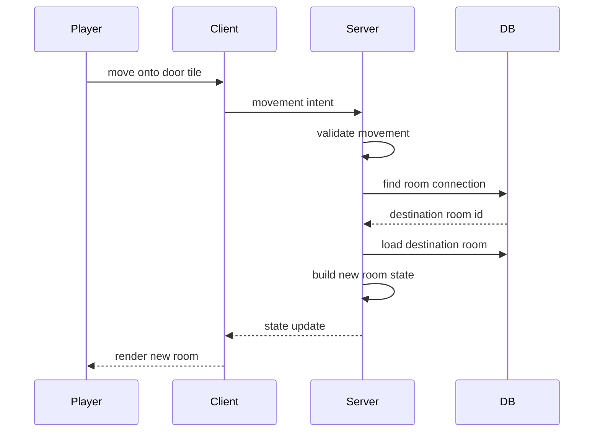
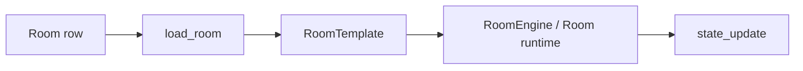

# World Exploration Plan

> **ARCHIVED 2026-07-14.** This plan is complete through step 4 (exploration
> mode shipped as Milestone 3). Remaining work is tracked in
> [Roadmap](../ROADMAP.md) Milestone 4. Kept for the history of the decisions.

This is the practical bridge between the current combat prototype and the next
coding milestone. It intentionally avoids Redis, multi-worker routing, full
auth, and autonomous NPC simulation.

For the larger architecture that may come after this simple loop works, see
[World Architecture Proposal](WORLD.md).

## Goal

Let a player explore connected rooms in the browser:



## Design Constraints

- Server remains authoritative.
- One process is fine.
- One active room at a time is acceptable for the first traversal version.
- Do not rewrite combat.
- Do not build a distributed room service yet.
- Keep AI out of the first traversal path; hand-authored room data is enough.

## Current Foundation

Already available:

- `Room`, `RoomConnection`, and `EnemyDef` models.
- Seeded default room and antechamber.
- Door tiles in terrain.
- Validation for door/portal connection origins.
- `load_room(session, room_id)` for turning a DB room (including its
  outgoing connections) into runtime data.
- `RoomEngine(template)` for running combat from `RoomTemplate`.
- Server state includes room identity, width, height, and object summaries.
- **Door traversal (steps 2-3 below, done):** a room registry of live
  `RoomRuntime`s, `PLAYER_ENTERED_DOOR` domain events, player transfer with
  hp/id preserved, `room_changed` client message, evict-on-empty.
- The browser renders variable-size room grids, room transitions, and room
  metadata.
- The browser can inspect visible room objects through the server.
- **Room modes (steps 1 and 4 below, done):** `backend/modes.py` holds the
  `RoomMode` seam — combat rooms buffer actions into rounds, exploration
  rooms resolve valid moves immediately through the same handlers. Mode is
  inferred at load time (enemies → combat) and shown by the client.

Missing:

- Destination arrival coordinates (`to_x`/`to_y`; arrivals use the first free
  spawn for now).
- An authored `mode` column to override the content-based inference.

## Proposed Implementation Order

### 1. Represent Room Mode (done)

Built as: `RoomTemplate.mode` ("exploration" or "combat"), inferred in
`load_room` with the conservative server-side rule — a room with enemy
spawns is combat, a peaceful room is exploration. Promote to a persisted
`rooms` column once authored content needs to override the inference.

```text
exploration: immediate movement and interaction
combat: turn-based action submission
```

### 2. Add A Minimal Room Runtime Seam (done)

Keep the shape small:



Built as: `RoomRuntime` (a room's `RoomEngine`, sockets, and round timer) in an
`active_rooms` registry, with `player_room` answering "what room is this
session in?". Rooms load lazily and evict when empty. This went slightly
past the minimal "replace the runtime in place" idea so that players in
different rooms can play simultaneously — still one process, one lock.

### 3. Support Door Traversal (done)

Built as: `load_room` preloads a room's connections; `MoveHandler` emits a
`PLAYER_ENTERED_DOOR` event when a move lands on a connected tile; the async
edge validates the destination (capacity, free spawn), transfers the player,
and sends `room_changed`. Denied traversal leaves the player on the door
tile with an error message.

The current schema only stores the origin tile. Soon after traversal works, add:

- `to_x`
- `to_y`
- possibly `kind` such as `door`, `portal`, or `path`

Until then, using the first destination spawn is acceptable.

### 4. Add Exploration Movement (done)

Built as: the `RoomMode` seam in `backend/modes.py`. `RoomEngine.submit_action`
delegates to the room's mode — `TurnBasedMode` keeps the existing buffering
loop, `ExplorationMode` validates through the same handler and resolves the
move immediately, so nobody waits for anybody. Door traversal still works
(the `PLAYER_ENTERED_DOOR` event path is shared); non-move actions are
rejected in exploration rooms; `waiting_for` and round timers never fire
there.

### 5. Add Basic NPC Dialogue

Dialogue adds UI and server state, so it should stay small and hand-authored at
first.

First NPC shape:

- `id`
- `name`
- `position`
- `description`
- `personality`
- `dialogue_context`

Dialogue state should be scoped to a player and NPC. The NPC response may come
from a model, but any gameplay effects must still become validated data before
they affect the world.

### 6. Add Object Effects When They Earn It

Object inspection exists. Opening chests, damaging barrels, rewards, and
inventory should come later through the same validated action/effect/event path
used by combat.

## What Not To Build Yet

- Multiple active room workers.
- Redis pub/sub.
- Reconnect routing.
- Account auth.
- Persistent inventory.
- Procedural generation during traversal.
- NPC autonomous schedules.
- Complex traps or hazards.

## First Exploration Definition Of Done (achieved)

The first satisfying milestone was:

- Player starts in the pillared hall. ✔
- Player can move to a door. ✔
- Server loads the antechamber. ✔
- Frontend renders the antechamber correctly. ✔
- Player can move back. ✔
- Object markers and inspection still work after the room changes. ✔
- Existing combat still works. ✔

The project is no longer only a combat prototype — the world is explorable,
and peaceful rooms now move at exploration speed (Milestone 3, done). The
next step is [Roadmap](../ROADMAP.md) Milestone 4: basic hand-authored NPC
dialogue.
